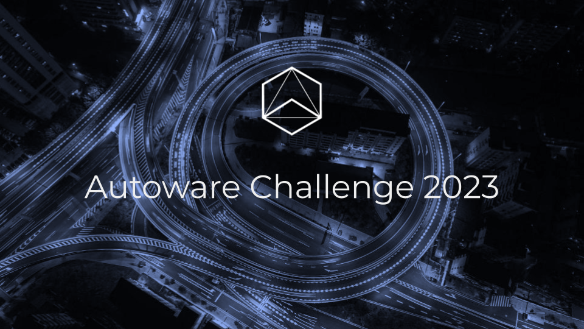
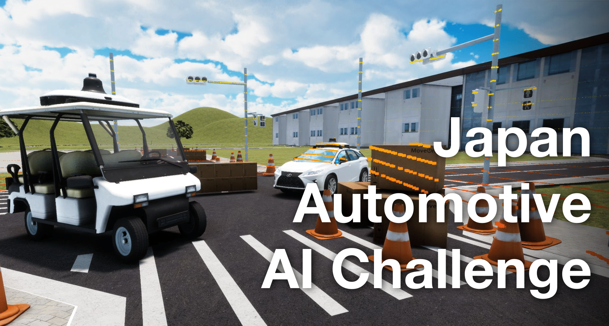
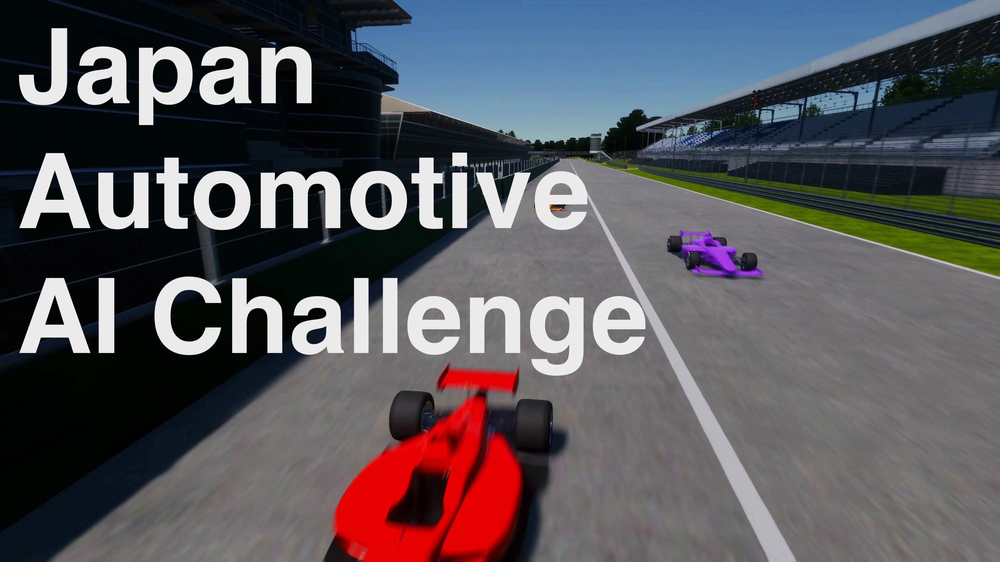

# Autoware Competitions

This page is a collection of the links to the competitions that are related to the Autoware Foundation.

|                             Title                             |  Status  | Description                                                                                                                                                                                                                                                                                                                                                                                                                                                                                                                                                                                                                                                                                                               |
| :-----------------------------------------------------------: | :------: | ------------------------------------------------------------------------------------------------------------------------------------------------------------------------------------------------------------------------------------------------------------------------------------------------------------------------------------------------------------------------------------------------------------------------------------------------------------------------------------------------------------------------------------------------------------------------------------------------------------------------------------------------------------------------------------------------------------------------- |
|  | Ongoing  | **[Autoware / TIER IV Challenge 2023](https://autoware.org/autoware-challenge-2023)**   **Date:** May 15, 2023 - Nov. 1st, 2023    As one of the main contributors of Autoware, TIER IV has been facing many difficult challenges through development, and TIER IV would like to sponsor a challenge to solve such engineering challenges. Any researchers, students, individuals or organizations are welcome to participate and submit their solution to any of the challenges we propose.                                                                                                                                                                                                                     |
|        | Finished | **[Japan Automotive AI Challenge 2023 (Integration)](https://www.jsae.or.jp/jaaic/2023_summary.php)**   **Registration:** June 5, 2023 - July 14, 2023  **Qualifiers:** July 3, 2023 - Aug. 31, 2023  **Finals:** Nov. 12, 2023   In this competition, we focus on challenging tasks posed by autonomous driving in factory environments and aim to develop Autoware-based AD software that can overcome them. The qualifiers use the [digital twin autonomous driving simulator AWSIM](https://tier4.github.io/AWSIM/) to complete specific tasks within a virtual environment. Teams that make it to the finals have the opportunity to run their software on actual vehicles in a test course in Japan. |
|  | Ongoing  | **[Japan Automotive AI Challenge 2023 (Simulation)](https://www.jsae.or.jp/jaaic/2023_simulation.php)**   **Registration:** Nov 6, 2023 - Dec 28, 2023  **Date:** Dec 4, 2023 - Jan. 31, 2024    This contest is a software development contest with a motorsports theme. Participants will develop autonomous driving software based on [Autoware.Universe](https://github.com/autowarefoundation/autoware_universe), and integrate it into a racing car that runs in the End to End simulation space (AWSIM). The goal is simple, win the race while driving safely!                                                                                                                                        |

## Proposing New Competition

If you want add a new competition to this page, please propose it in a TSC meeting and get confirmation from the AWF.
