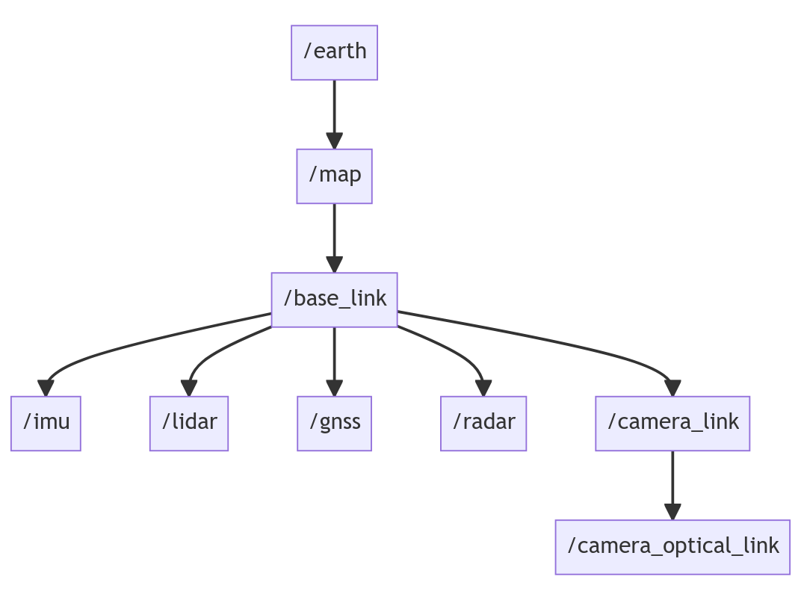

# Coordinate system

## Overview

The commonly used coordinate systems include the world coordinate system, the vehicle coordinate system, and the sensor coordinate system. 

- The world coordinate system is a fixed coordinate system that defines the physical space in the environment where the vehicle is located. 
- The vehicle coordinate system is the vehicle's own coordinate system, which defines the vehicle's position and orientation in the world coordinate system.
- The sensor coordinate system is the sensor's own coordinate system, which is used to define the sensor's position and orientation in the vehicle's coordinate system.

## How coordinates are used in Autoware

In Autoware, coordinate systems are typically used to represent the position and movement of vehicles and obstacles in space. Coordinate systems are commonly used for path planning, perception and control, can help the vehicle decide how to avoid obstacles and to plan a safe and efficient path of travel.

1. Transformation of sensor data

   In Autoware, each sensor has a unique coordinate system and their data is expressed in terms of the coordinates. In order to correlate the independent datas between different sensors, we need to find the position relationship between each sensor and the vehicle body. Once the installation position of the sensor on the vehicle body is determined, it will remain fixed during running, so the offline calibration method can be used to determine the precise position of each sensor relative to the vehicle body.

2. ROS TF2

   The `TF2` system maintains a tree of coordinate transformations to represent the relationships between different coordinate systems. Each coordinate system is given a unique name and they are connected by coordinate transformations. How to use `TF2`, refer to the [TF2 tutorial](http://docs.ros.org/en/galactic/Concepts/About-Tf2.html).

## TF tree

In Autoware, a common coordinate system structure is shown below:

- earth: `earth` coordinate system describe the position of any point on the earth in terms of geodetic longitude, latitude, and altitude.
- map: `map` coordinate system is used to represent the location of points on a local map. Geographical coordinate system are mapped into plane rectangular coordinate system using UTM or MGRS.
- base_link: vehicle coordinate system, the origin of the coordinate system is the center of the rear axle of the vehicle
- lidar: `lidar` coordinate system is converted to the vehicle coordinate system through the mounting relationship
- camera_link: `camera_link` is ROS standard camera coordinate system 
- camera_optical_link: `camera_optical_link` is image standard camera coordinate system
- imu: the `imu` coordinate system is converted to the vehicle coordinate system through the mounting relationship

## How they can be created

1. Calibration of sensor

   The conversion relationship between every sensor coordinate system  and `base_link` can be obtained through sensor calibration technology. 

2. Localization

   The relationship between the `base_link` coordinate system and the `map` coordinate system is determined by the position and orientation of the vehicle, and can be obtained from the vehicle localization result.

3. Georeferencing of map data

   The georeferencing information can get the transformation relationship of `earth` coordinate system to  local `map` coordinate system.
