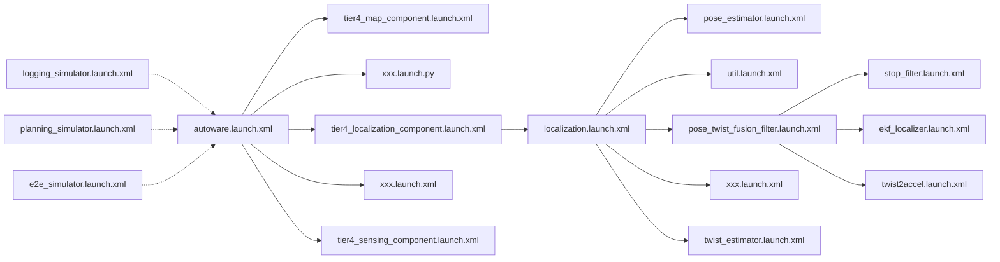

# Launch files

## Overview

Autoware use ROS2 launch system to startup the software. Please see the [official documentation](https://docs.ros.org/en/humble/Tutorials/Intermediate/Launch/Launch-Main.html) to get a basic understanding about ROS 2 Launch system if you are not familiar with it.

## Guideline

### The organization of launch files in Autoware

Autoware mainly has two repositories related to launch file organization: the [autoware.universe](https://github.com/autowarefoundation/autoware.universe) and the [autoware_launch](https://github.com/autowarefoundation/autoware_launch).

#### autoware.universe

the `autoware.universe` contains the code of the main Autoware modules, and its `launch` directory is responsible for launching the nodes of each module. Autoware software stack is organized based on the [architecture](https://autowarefoundation.github.io/autoware-documentation/main/design/autoware-architecture/#high-level-architecture-design), so you may find that we try to match the launch structure similar to the architecture (splitting of files, namespace). For example, the `tier4_map_launch` subdirectory corresponds to the map module, so do the other `tier4_*_launch` subdirectories.

#### autoware_launch

The `autoware_launch` is a repository referring to `autoware.universe`. The mainly purpose of introducing this repository is to provide the general entrance to start the Autoware software stacks, i.e, calling the launch file of each module.

- The `autoware.launch.xml` is the basic launch file for road driving scenarios.

  As can be seen from the content, the entire launch file is divided into several different modules, including _Vehicle_, _System_, _Map_, _Sensing_, _Localization_, _Perception_, _Planning_, _Control_, etc. By setting the `launch_*` argument equals to `true` or `false` , we can determine which modules to be loaded.

- The `logging_simulator.launch.xml` is often used together with the recorded ROS bag to debug if the target module (e.g, _Sensing_, _Localization_ or _Perception_) functions normally.

- The `planning_simulator.launch.xml` is based on the Planning Simulator tool, mainly used for testing/validation of _Planning_ module by simulating traffic rules, interactions with dynamic objects and control commands to the ego vehicle.

- The `e2e_simulator.launch.xml` is the launcher for digital twin simulation environment.

### Add a new package in Autoware

If a newly created package has executable node, we expect sample launch file and configuration within the package, just like the recommended structure shown in previous [directory structure](https://autowarefoundation.github.io/autoware-documentation/main/contributing/coding-guidelines/ros-nodes/directory-structure/) page.

In order to automatically load the newly added package when starting Autoware, you need to make some necessary changes to the corresponding launch file. For example, if using ICP instead of NDT as the pointcloud registration algorithm, you can modify the `autoware.universe/launch/tier4_localization_launch/launch/pose_estimator/pose_estimator.launch.xml` file to load the newly added ICP package.

## Parameter management

Another purpose of introducing the `autoware_launch` repository is to facilitate the parameter management of Autoware. Thinking about this situation: if we want to integrate Autoware to a specific vehicle and modify parameters, we have to fork `autoware.universe` which also has a lot of code other than parameters and is frequently updated by developers. By intergrating these parameters in `autoware_launch`, we can customize the Autoware parameters just by forking `autoware_launch` repository. Taking the localization module as an examples:

1. all the “launch parameters” for localization component is listed in the files under `autoware_launch/autoware_launch/config/localization`.
2. the "launch parameters" file paths are set in the `autoware_launch/autoware_launch/launch/components/tier4_localization_component.launch.xml` file.
3. in `autoware.universe/launch/tier4_localization_launch/launch`, the launch files loads the “launch parameters” if the argument is given in the parameter configuration file. You can still use the default parameters in each packages to launch `tier4_localization_launch` within `autoware.universe`.
