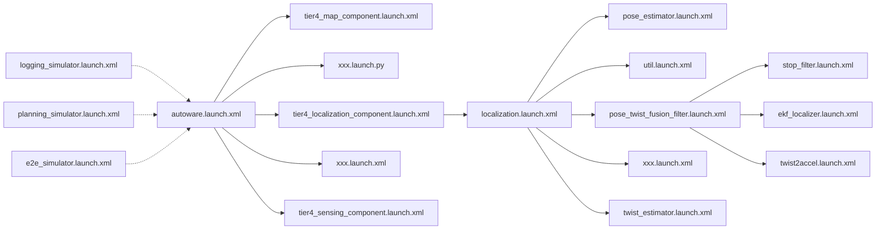

# Launch files

## Overview

Autoware use ROS 2 launch system to startup the software. Please see the [official documentation](https://docs.ros.org/en/humble/Tutorials/Intermediate/Launch/Launch-Main.html) to get a basic understanding about ROS 2 Launch system if you are not familiar with it.

## Guideline

### The organization of launch files in Autoware

Autoware distinguishes between the reusable node implementations and their example integration, including system-specific configurations, pipelines, and system topologies.

- reusable node implementations can be found in [`autoware_core`](https://github.com/autowarefoundation/autoware_core) and [`autoware_universe`](https://github.com/autowarefoundation/autoware_universe)
  - `autoware_core` repository itself provides a minimal integration in the package named `autoware_core`.
- an integrated system example orchestrated from these nodes can be found in [`autoware_launch`](https://github.com/autowarefoundation/autoware_launch).
  - There are many possible ways to construct a full autonomous driving system, so `autoware_launch` provides one reference integration.

The package `autoware_launch` itself provides the general entrypoint to call other modularized launch files and start the Autoware nodes.

- The `autoware.launch.xml` is the basic launch file for road driving scenarios.

  This launch file loads other launch files for different modules, including _Vehicle_, _System_, _Map_, _Sensing_, _Localization_, _Perception_, _Planning_, _Control_, etc. By setting the `launch_*` argument to either `true` or `false` , the users can selectively load a subset of the system.

- The `logging_simulator.launch.xml` is often used together with the recorded ROS bag to debug if the target module (e.g, _Sensing_, _Localization_ or _Perception_) functions normally.

- The `planning_simulator.launch.xml` is based on the Planning Simulator tool, mainly used for testing/validation of _Planning_ module by simulating traffic rules, interactions with dynamic objects and control commands to the ego vehicle.

- The `e2e_simulator.launch.xml` is the launcher for digital twin simulation environment.

```mermaid
graph LR
A11[logging_simulator.launch.xml]-.->A10[autoware.launch.xml]
A12[planning_simulator.launch.xml]-.->A10[autoware.launch.xml]
A13[e2e_simulator.launch.xml]-.->A10[autoware.launch.xml]

A10-->A21[tier4_map_component.launch.xml]
A10-->A22[xxx.launch.py]
A10-->A23[tier4_localization_component.launch.xml]
A10-->A24[xxx.launch.xml]
A10-->A25[tier4_sensing_component.launch.xml]

A23-->A30[localization.launch.xml]
A30-->A31[pose_estimator.launch.xml]
A30-->A32[util.launch.xml]
A30-->A33[pose_twist_fusion_filter.launch.xml]
A30-->A34[xxx.launch.xml]
A30-->A35[twist_estimator.launch.xml]

A33-->A41[stop_filter.launch.xml]
A33-->A42[ekf_localizer.launch.xml]
A33-->A43[twist2accel.launch.xml]
```

### Add a new package in Autoware

If a newly created package has executable node, we expect example launch files and configurations within the package, just like the recommended structure shown in the previous [directory structure](../../../contributing/coding-guidelines/ros-nodes/directory-structure.md) page.

### Integrate a new package in `autoware_launch`

In order to automatically load the newly added package (in `autoware_core` or `autoware_universe`) when starting Autoware, you need to make some necessary changes to the corresponding launch file.
For example, if you want to use ICP instead of NDT as the pointcloud registration algorithm, you can go to `autoware_launch` repository and modify the `tier4_universe_launch/tier4_localization_launch/launch/pose_twist_estimator/pose_twist_estimator.launch.xml` file to load the newly added ICP package.

## Parameter and system topology management

Another purpose of introducing the `autoware_launch` repository is to facilitate the parameter and system topology management of Autoware.

Suppose that we want to integrate Autoware based on `autoware_launch` to a specific vehicle, and that we are only interested in different parameters and possibly different node configurations, without rewriting the existing node implementations.
In such case, we can reuse the official `autoware_universe` and fork only `autoware_launch` to customize the parameters or the pipelines.

Taking the localization module as an example, in the `autoware_launch` repository:

1. all the launch parameter files for the localization component are listed in the files under `autoware_launch/config/localization`.
2. the launch parameter file paths are set in the `autoware_launch/launch/components/tier4_localization_component.launch.xml`.
3. in `tier4_universe_launch/tier4_localization_launch/launch`, the launch files loads the launch parameter files if the argument is given in the parameter configuration file. You can still use the default parameters in each packages to launch `tier4_localization_launch`.

See [sync-params](../../../contributing/coding-guidelines/ros-nodes/parameters.md#sync-params) to learn how these launch parameter files can be updated.
