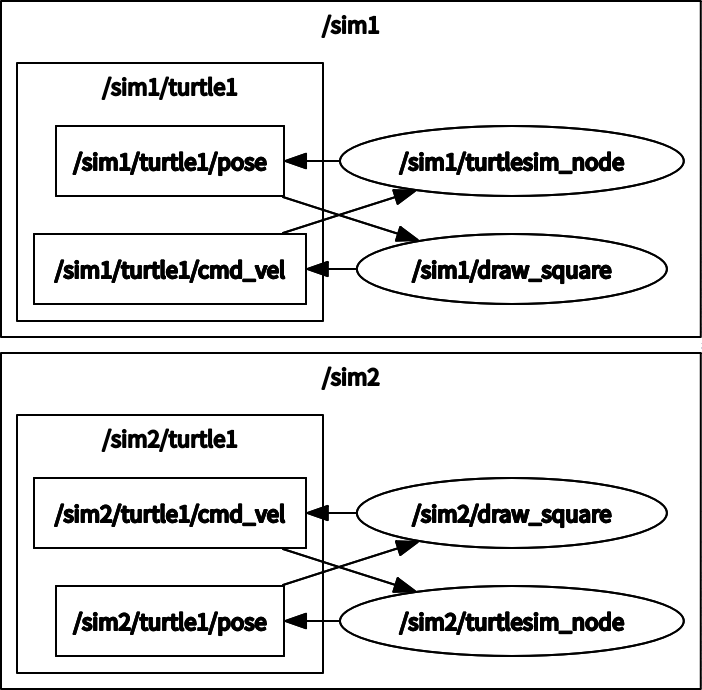

# Topic namespaces

## Description

A namespace can be viewed as a directory which contents are items of different names. These items can be nodes, topics, or even other namespaces. Namespaces are the best option to deal with name collision which is quite often in robotics, especially when the system is going bigger and more complex.

This page focuses on topic namespaces and shows some useful examples in practice.
For detailed information, see [Topic and Service name mapping to DDS](https://design.ros2.org/articles/topic_and_service_names.html), [ROS2 Launch System](https://design.ros2.org/articles/roslaunch.html).

## ROS2 namespaces

Topic and service names:

- may be split into tokens using a forward slash (/) as a delimiter
- must not end with a forward slash (/)

The last token is the topic or service base name, and any preceding tokens make up the namespace of the topic or service.
For example, the topic name /foo/bar/baz is composed of a topic or service with the base name baz in the /foo/bar namespace. In another example, the name /foo splits into one token, such that it is composed of a topic or service with the base name foo in the / namespace (the root namespace).

Topic and service names:

- may be specified as absolute or relative
- must start with a forward slash (/) if they are absolute

An absolute name begins with a forward slash (/) and does not respect namespaces, i.e. it can be considered “global”. A relative name does not begin with a forward slash (/) and does respect the namespace of the node which created them.

Relative names are appended to the namespace of the node which creates them. For example, if the node is put into a namespace /ping/pong and the topic or service name is foo/bar, then the absolute name will become /ping/pong/foo/bar. However, if the topic or service name is /foo/bar, then the absolute name will stay just /foo/bar, ignoring the node’s namespace.

## How to use namespace in ROS2

The renaming facility provided by ros2 run does allow to avoid collisions. However, it result into multiple long command lines. A better solution is use ros2 launch. It requires writing a XML file that contains all information about nodes to launch and their namespaces. THe XML listing below allows running side by side two turtle simulation nodes driven by two different draw_square nodes.

```xml
<launch>
    <group>
      <push-ros-namespace namespace="sim1"/>
        <node pkg="turtlesim" name="turtlesim_node" exec="turtlesim_node"/>
        <node pkg="turtlesim" name="draw_square" exec="draw_square"/>
    </group>
    <group>
      <push-ros-namespace namespace="sim2"/>
        <node pkg="turtlesim" name="turtlesim_node" exec="turtlesim_node"/>
        <node pkg="turtlesim" name="draw_square" exec="draw_square"/>
    </group>
</launch>
```

The XML format launch file provides tags for defining nodes. By changing the namespace argument we can have different instances of the same node type of a given package running side by side. In our example, we kept the names identical, but we wrapped nodes inside group tags, each group is mapped to a different namespace by setting the namespace argument.

Launch the above defined XML file with the ros2 launch command, use rqt to display the set of nodes and connexions.


## Tips

- The purpose of namespaces is to avoid name conflicts
- The group tag can be used in the launch file to add namespaces for nodes or parameters via the namespace argument
- The remap argument can also change the name and namespace of the topic
- More flexible use of relative namespaces

## Refererence

- <http://docs.ros.org/en/galactic/Tutorials/Intermediate/Launch/Creating-Launch-Files.html>
- <https://robots.nootrix.com/diy-tutos/ros-namespaces/>
