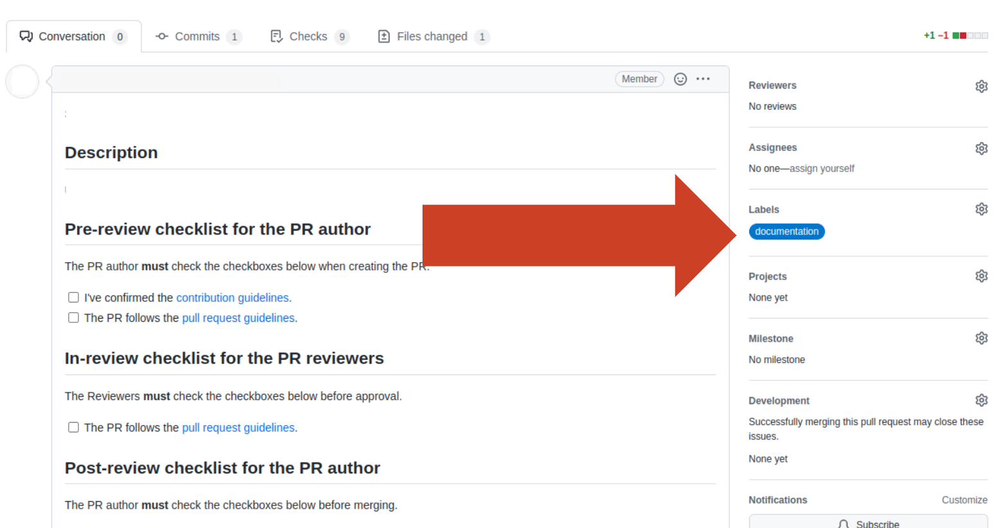

# Documentation guidelines

## Workflow

Contributions to Autoware's documentation are welcome, and the same principles [described in the contribution guidelines](../index.md#pull-requests) should be followed. Small, limited changes can be made by forking this repository and submitting a pull request, but larger changes should be discussed with the community and Autoware maintainers via GitHub Discussion first.

Examples of small changes include:

- Fixing spelling or grammatical mistakes
- Fixing broken links
- Making an addition to an existing, well-defined page, such as the [Troubleshooting](../../support/troubleshooting.md) guide.

Examples of larger changes include:

- Adding new pages with a large amount of detail, such as a tutorial
- Re-organization of the existing documentation structure

## Style guide
You should refer to the [Google developer documentation style guide](https://developers.google.com/style) as much as possible. Reading the [Highlights page](https://developers.google.com/style/highlights) of that guide is recommended, but if not then the key points below should be noted.

- [Use standard American English spelling](https://developers.google.com/style/spelling) and punctuation.
- [Use sentence case](https://developers.google.com/style/capitalization) for document titles and section headings.
- [Use descriptive link text](https://developers.google.com/style/link-text).
- [Write short sentences](https://developers.google.com/style/translation#write-short,-clear,-and-precise-sentences) that are easy to understand and translate.

## Tips
### How to preview your modification

There are two ways to preview your modification on a documentation website.

#### 1. Using GitHub Actions workflow

Follow the steps below.

1. Create a pull request to the repository.
2. Add the `documentation` label from the sidebar (See below figure).
3. Wait for a couple of minutes, and the `github-actions` bot will notify the URL for the pull request's preview.

{ width="800" }

#### 2. Running an MkDocs server in your local environment

Instead of creating a PR, you can use the `mkdocs` command to build Autoware's documentation websites on your local computer.
Assuming that you are using Ubuntu OS, run the following to install the required libraries.

```bash
python3 -m pip install -U $(curl -fsSL \
  https://raw.githubusercontent.com/autowarefoundation/autoware-github-actions/main/deploy-docs/mkdocs-requirements.txt)
```

Then, run `mkdocs serve` on your documentation directory.

```bash
cd /PATH/TO/YOUR-autoware-documentation
mkdocs serve
```

It will launch the MkDocs server. Access [http://127.0.0.1:8000/](http://127.0.0.1:8000/) to see the preview of the website.
