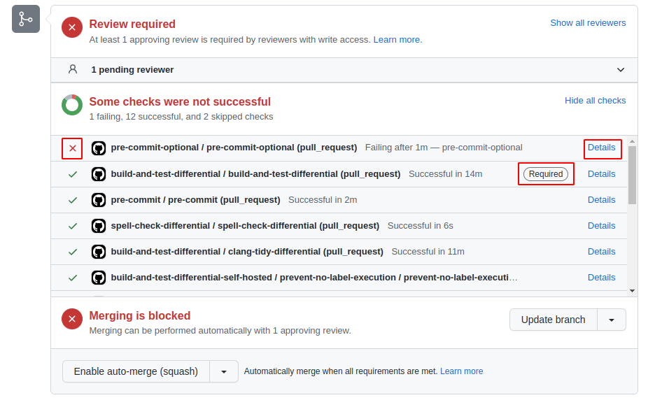

# CI checks

Autoware has several checks for a pull request.
The results are shown at the bottom of the pull request page as below.



If the ❌ mark is shown, click the `Details` button and investigate the failure reason.

If the `Required` mark is shown, you cannot merge the pull request unless you resolve the error.
If not, it is optional, but preferably it should be fixed.

The following sections explain about common CI checks in Autoware.  
Note that some repositories may have different settings.

## DCO

The Developer Certificate of Origin (DCO) is a lightweight way for contributors to certify that they wrote or otherwise have the right to submit the code they are contributing to the project.

This workflow checks whether the pull request fulfills `DCO`.  
You need to confirm the [required items](https://developercertificate.org/) and commit with `git commit -s`.

For more information, refer to the [GitHub App page](https://github.com/apps/dco).

## semantic-pull-request

This workflow checks whether the pull request follows [Conventional Commits](https://www.conventionalcommits.org/en/v1.0.0/).

For the detailed rules, see the [pull request rules](index.md#pull-request-rules).

## pre-commit

[pre-commit](https://pre-commit.com/) is a tool to run formatters or linters when you commit.

This workflow checks whether the pull request has no error with `pre-commit`.

In the workflow `pre-commit.ci - pr` is enabled in the repository, it will automatically fix errors by [pre-commit.ci](https://pre-commit.ci/) as many as possible.  
If there are some errors remain, fix them manually.

You can run `pre-commit` in your local environment by the following command:

```bash
pre-commit run -a
```

Or you can install `pre-commit` to the repository and automatically run it before committing:

```bash
pre-commit install
```

Since it is difficult to detect errors with no false positives, some jobs are split into another config file and marked as optional.  
To check them, use the `--config` option:

```bash
pre-commit run -a --config .pre-commit-config-optional.yaml
```

## spell-check-differential

This workflow detects spelling mistakes using [CSpell](https://github.com/streetsidesoftware/cspell) with [our dictionary file](https://github.com/tier4/autoware-spell-check-dict/blob/main/.cspell.json).
Since it is difficult to detect errors with no false positives, it is an optional workflow, but it is preferable to remove spelling mistakes as many as possible.

You have the following options if you need to use a word that is not registered in the dictionary.

- If the word is only used in a few files, you can use [inline document settings "cspell:ignore"](https://cspell.org/configuration/document-settings/) to suppress the check.
- If the word is widely used in the repository, you can create a local cspell json and pass it to the [spell-check action](https://github.com/autowarefoundation/autoware-github-actions/tree/main/spell-check).
- If the word is common and may be used in many repositories, you can submit pull requests to [tier4/autoware-spell-check-dict](https://github.com/tier4/autoware-spell-check-dict) to update the dictionary.

## build-and-test-differential

This workflow checks `colcon build` and `colcon test` for the pull request.  
To make the CI faster, it doesn't check all packages but only modified packages and the dependencies.

## build-and-test-differential-self-hosted

This workflow is the `ARM64` version of `build-and-test-differential`.  
You need to add the `ARM64` label to run this workflow.

For reference information, since ARM machines are not supported by GitHub-hosted runners, we use self-hosted runners prepared by the AWF.  
For the details about self-hosted runners, refer to [GitHub Docs](https://docs.github.com/en/actions/hosting-your-own-runners/about-self-hosted-runners).

## deploy-docs

This workflow deploys the preview documentation site for the pull request.  
You need to add the `deploy-docs` label to run this workflow.
