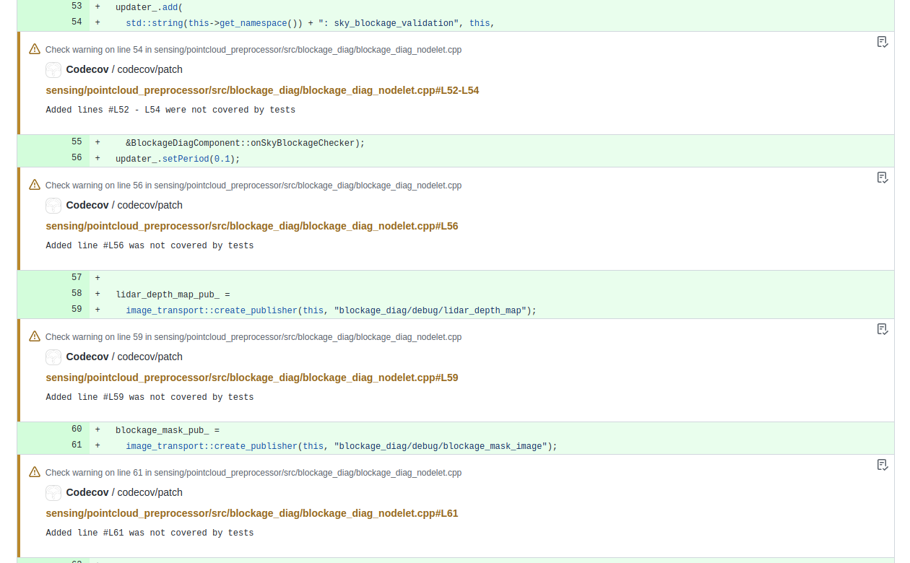
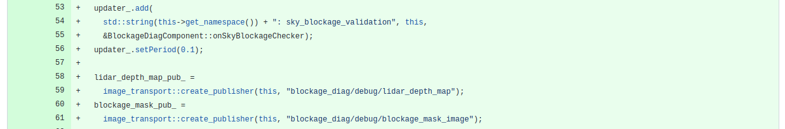
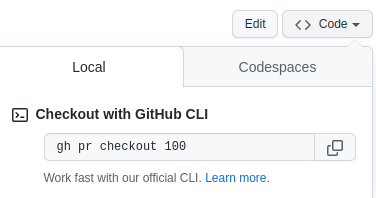

# Review tips

## Toggle annotations or review comments in the diff view

There might be some annotations or review comments in the diff view during your review.

To toggle annotations, press the `A` key.

Before:



After:



To toggle review comments, press the `I` key.

For other keyboard shortcuts, refer to [GitHub Docs](https://docs.github.com/en/get-started/using-github/keyboard-shortcuts).

## View code in the web-based Visual Studio Code

You can open `Visual Studio Code` from your browser to view code in a rich UI.
To use it, press the `.` key on any repository or pull request.

For more detailed usage, refer to [github/dev](https://github.com/github/dev).

## Check out the branch of a pull request quickly

If you want to check out the branch of a pull request, it's generally troublesome with the fork-and-pull model.

```bash
# Copy the user name and the fork URL.
git remote add {user-name} {fork-url}
git checkout {user-name}/{branch-name}
git remote rm {user-name} # To clean up
```

Instead, you can use [GitHub CLI](https://cli.github.com/) to simplify the steps, just run `gh pr checkout {pr-number}`.

You can copy the command from the top right of the pull request page.


