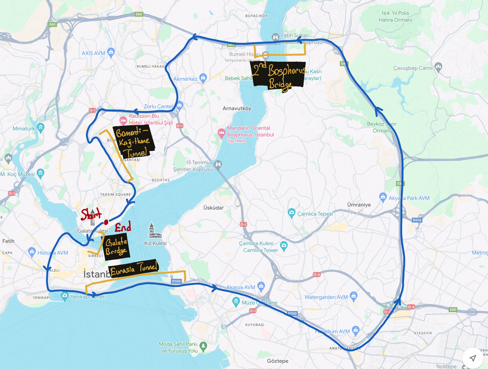

# Datasets

Autoware partners provide datasets for testing and development. These datasets are available for download here.

## Istanbul Open Dataset

The dataset is collected in the following route. Tunnels and bridges are annotated on the image.
The included specific areas into the dataset are:

- Galata Bridge (Small Bridge)
- Eurasia Tunnel (Long Tunnel with High Elevation Changes)
- 2nd Bosphorus Bridge (Long Bridge)
- Kagithane-Bomonti Tunnel (Small Tunnel)
- Viaducts, road junctions, highways, dense urban areas...

<p align='center'>
    
</p>

### Leo Drive - Mapping Kit Sensor Data

This dataset contains data from the portable mapping kit used for general mapping purposes.

The data contains data from the following sensors:

- 1 x Applanix POS LVX GNSS/INS System
- 1 x Hesai Pandar XT32 LiDAR

**For sensor calibrations, `/tf_static` topic is added.**

### Data Links

- You can find the produced full point cloud map, corner feature point cloud map and
  surface feature point cloud map here:

  - [https://drive.google.com/drive/folders/1_jiQod4lO6-V2NDEr3d-M3XF_Nqmc0Xf?usp=drive_link](https://drive.google.com/drive/folders/1_jiQod4lO6-V2NDEr3d-M3XF_Nqmc0Xf?usp=drive_link)
  - Exported point clouds are exported via downsampling with 0.2 meters and 0.5 meters voxel grids.

- You can find the ROS 2 bag which is collected simultaneously with the mapping data:

  - [https://drive.google.com/drive/folders/17zXiBeYlM90gQ5hV6EAWaoBTnNFoVPML?usp=drive_link](https://drive.google.com/drive/folders/17zXiBeYlM90gQ5hV6EAWaoBTnNFoVPML?usp=drive_link)
  - Due to the simultaneous data collection, we can assume that the point cloud maps and GNSS/INS
    data are the ground truth data for this rosbag.

- Additionally, you can find the raw data used for mapping at the below link:
  - [https://drive.google.com/drive/folders/1HmWYkxF5XvVCR27R8W7ZqO7An4HlJ6lD?usp=drive_link](https://drive.google.com/drive/folders/1HmWYkxF5XvVCR27R8W7ZqO7An4HlJ6lD?usp=drive_link)
  - Point clouds are collected as PCAP and feature-matched GNSS/INS data exported to a txt file.

### Localization Performance Evaluation with Autoware

The report of the performance evaluation of the current Autoware with the collected data can be found in the link below.

> The report documented at **2024-08-28**.

- [https://github.com/orgs/autowarefoundation/discussions/5135](https://github.com/orgs/autowarefoundation/discussions/5135)

### Topic list

For collecting the GNSS/INS data, [this](https://github.com/autowarefoundation/applanix) repository is used.

For collecting the LiDAR data,
[nebula](https://github.com/tier4/nebula/tree/6d55141ef3cf39d5612e34f2646834d6cd4a7ae3)
repository is used.

| Topic Name                                            | Message Type                                          |
| ----------------------------------------------------- | ----------------------------------------------------- |
| `/applanix/lvx_client/autoware_orientation`           | `autoware_sensing_msgs/msg/GnssInsOrientationStamped` |
| `/applanix/lvx_client/imu_raw`                        | `sensor_msgs/msg/Imu`                                 |
| `/localization/twist_estimator/twist_with_covariance` | `geometry_msgs/msg/TwistWithCovarianceStamped`        |
| `/applanix/lvx_client/odom`                           | `nav_msgs/msg/Odometry`                               |
| `/applanix/lvx_client/gnss/fix`                       | `sensor_msgs/msg/NavSatFix`                           |
| `/clock`                                              | `rosgraph_msgs/msg/Clock`                             |
| `/pandar_points`                                      | `sensor_msgs/msg/PointCloud2`                         |
| `/tf_static`                                          | `tf2_msgs/msg/TFMessage`                              |

#### Message Explanations

Used drivers for sensors give output in default ROS 2 message types and their own ROS 2 message
types for additional information. Following topics are the default ROS 2 message types:

- `/applanix/lvx_client/imu_raw`

  - Gives the output of INS system in ENU. Due to the 9-axis IMU, `yaw` value demonstrates the
    heading value of the sensor.

- `/applanix/lvx_client/twist_with_covariance`

  - Gives the twist output of the sensor.

- `/applanix/lvx_client/odom`

  - Gives the position and orientation of the sensor from the starting point of the ROS 2 driver.
    Implemented with `GeographicLib::LocalCartesian`.

    **This topic is not related to the wheel odometry.**

- `/applanix/lvx_client/gnss/fix`

  - Gives the latitude, longitude and height values of the sensors.

    **Ellipsoidal height of WGS84 ellipsoid is given as height value.**

- `/pandar_points`

  - Gives the point cloud from the LiDAR sensor.

## Bus-ODD (Operational Design Domain) datasets

### Leo Drive - ISUZU sensor data

This dataset contains data from the Isuzu bus used in the Bus ODD project.

The data contains data from following sensors:

- 1 x VLP16
- 2 x VLP32C
- 1 x Applanix POS LV 120 GNSS/INS
- 3 x Lucid Vision Triton 5.4MP cameras (left, right, front)
- Vehicle status report

It also contains `/tf` topic for static transformations between sensors.

#### Required message types

The GNSS data is available in `sensor_msgs/msg/NavSatFix` message type.

But also the Applanix raw messages are also included in `applanix_msgs/msg/NavigationPerformanceGsof50` and `applanix_msgs/msg/NavigationSolutionGsof49` message types.
In order to be able to play back these messages, you need to build and source the `applanix_msgs` package.

```bash
# Create a workspace and clone the repository
mkdir -p ~/applanix_ws/src && cd "$_"
git clone https://github.com/autowarefoundation/applanix.git
cd ..

# Build the workspace
colcon build --symlink-install --packages-select applanix_msgs

# Source the workspace
source ~/applanix_ws/install/setup.bash

# Now you can play back the messages
```

Also make sure to source Autoware Universe workspace too.

#### Download instructions

```console
# Install awscli
$ sudo apt update && sudo apt install awscli -y

# This will download the entire dataset to the current directory.
# (About 10.9GB of data)
$ aws s3 sync s3://autoware-files/collected_data/2022-08-22_leo_drive_isuzu_bags/ ./2022-08-22_leo_drive_isuzu_bags  --no-sign-request

# Optionally,
# If you instead want to download a single bag file, you can get a list of the available files with following:
$ aws s3 ls s3://autoware-files/collected_data/2022-08-22_leo_drive_isuzu_bags/ --no-sign-request
   PRE all-sensors-bag1_compressed/
   PRE all-sensors-bag2_compressed/
   PRE all-sensors-bag3_compressed/
   PRE all-sensors-bag4_compressed/
   PRE all-sensors-bag5_compressed/
   PRE all-sensors-bag6_compressed/
   PRE driving_20_kmh_2022_06_10-16_01_55_compressed/
   PRE driving_30_kmh_2022_06_10-15_47_42_compressed/

# Then you can download a single bag file with the following:
aws s3 sync s3://autoware-files/collected_data/2022-08-22_leo_drive_isuzu_bags/all-sensors-bag1_compressed/ ./all-sensors-bag1_compressed  --no-sign-request
```

### AutoCore.ai - lidar ROS 2 bag file and pcap

This dataset contains pcap files and ros2 bag files from Ouster OS1-64 Lidar.
The pcap file and ros2 bag file is recorded in the same time with slight difference in duration.

[Click here to download (~553MB)](https://autoware-files.s3.us-west-2.amazonaws.com/collected_data/2022-04-14_autocore-lidar-bag-pcap/Lidar_Data_220414_bag_pcap.zip)

[Reference Issue](https://github.com/autowarefoundation/autoware.universe/issues/562#issuecomment-1102662448)
