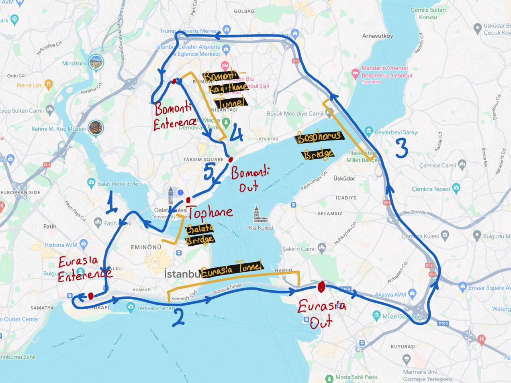

# Datasets

Autoware partners provide datasets for testing and development. These datasets are available for download here.

## Istanbul Open Dataset

The dataset is collected in the following route. Tunnels and bridges are annotated on the image.
At the right bottom part of the route, extra roads are traversed.

<p align='center'>
    
</p>

### Leo Drive - Mapping Kit Sensor Data

This dataset contains data from the portable mapping kit used for general mapping purposes.

The data contains data from the following sensors:

- 1 x Applanix POS LVX GNSS/INS System
- 1 x Hesai Pandar XT32 LiDAR

**For sensor calibrations, `/tf_static` topic is added.**

### Data Links

- You can find the produced full point cloud map, corner feature point cloud map and
  surface feature point cloud map here:

  - [https://drive.google.com/file/d/1wQJVjrVt47ScWDgYlOiClIUKCbNvarub/view?usp=drive_link](https://drive.google.com/file/d/1wQJVjrVt47ScWDgYlOiClIUKCbNvarub/view?usp=drive_link)
  - Exported point clouds are exported via downsampling with 0.2 voxel grids.

- You can find the ROS2 bag which is collected simultaneously with the mapping data:

  - [https://drive.google.com/drive/folders/1gI1HDEZzTL2HZngrumjb5sLJ3SzuLJGD?usp=drive_link](https://drive.google.com/drive/folders/1gI1HDEZzTL2HZngrumjb5sLJ3SzuLJGD?usp=drive_link)
  - Due to the simultaneous data collection, we can assume that the point cloud maps and GNSS/INS
    data are the ground truth data for this rosbag.

- Additionally, you can find the raw data used for mapping at the below link:
  - [https://drive.google.com/drive/folders/1Mf5FwUN5TxZIeKQKB1EBQyn_c2cxdE02?usp=drive_link](https://drive.google.com/drive/folders/1Mf5FwUN5TxZIeKQKB1EBQyn_c2cxdE02?usp=drive_link)
  - Point clouds are collected as PCAP and feature-matched GNSS/INS data exported to a txt file.

### Topic list

For collecting the GNSS/INS data, [this](https://github.com/autowarefoundation/applanix) repository is used.

For collecting the LiDAR data,
[this](https://github.com/HesaiTechnology/HesaiLidar_ROS_2.0/tree/6a834ecb2830f466b63452c072fb44433046edb4)
repository is used.

| Topic Name                                      | Message Type                                          |
| ----------------------------------------------- | ----------------------------------------------------- |
| `/applanix/lvx_client/autoware_orientation`     | `autoware_sensing_msgs/msg/GnssInsOrientationStamped` |
| `/applanix/lvx_client/imu_raw`                  | `sensor_msgs/msg/Imu`                                 |
| `/applanix/lvx_client/twist_with_covariance`    | `geometry_msgs/msg/TwistWithCovarianceStamped`        |
| `/applanix/lvx_client/odom`                     | `nav_msgs/msg/Odometry`                               |
| `/applanix/lvx_client/gnss/fix`                 | `sensor_msgs/msg/NavSatFix`                           |
| `/applanix/lvx_client/gsof/ins_solution_49`     | `applanix_msgs/msg/NavigationSolutionGsof49`          |
| `/applanix/lvx_client/gsof/ins_solution_rms_50` | `applanix_msgs/msg/NavigationPerformanceGsof50`       |
| `/lidar_packets`                                | `hesai_ros_driver/msg/UdpFrame`                       |
| `/lidar_packets_loss`                           | `hesai_ros_driver/msg/LossPacket`                     |
| `/lidar_points`                                 | `sensor_msgs/msg/PointCloud2`                         |
| `/tf_static`                                    | `tf2_msgs/msg/TFMessage`                              |
| `/rosout`                                       | `rcl_interfaces/msg/Log`                              |
| `/events/write_split`                           | `rosbag2_interfaces/msg/WriteSplitEvent`              |
| `/parameter_events`                             | `rcl_interfaces/msg/ParameterEvent`                   |

#### Message Explanations

Used drivers for sensors give output in default ROS2 message types and their own ROS2 message
types for additional informations. Following topics are the default ROS2 message types:

- `/applanix/lvx_client/imu_raw`

  - Gives the output of INS system in ENU. Due to the 9-axis IMU, `yaw` value demonstrates the
    heading value of the sensor.

- `/applanix/lvx_client/twist_with_covariance`

  - Gives the twist output of the sensor.

- `/applanix/lvx_client/odom`

  - Gives the position and orientation of the sensor from the starting point of the ROS2 driver.
    Implemented with `GeographicLib::LocalCartesian`.

    **This topic is not related to the wheel odometry.**

- `/applanix/lvx_client/gnss/fix`

  - Gives the latitude, longitude and height values of the sensors.

    **Ellipsoidal height of WGS84 ellipsoid is given as height value.**

- `/lidar_points`

  - Gives the point cloud from the LiDAR sensor.

- `/lidar_packets`
  - Gives the LiDAR packets.

Also the Applanix raw messages are also included in the rosbag.
In order to be able to play back these messages, you need to build and source
the `applanix_msgs` package.

```bash
# Create a workspace and clone the repository
mkdir -p ~/applanix_ws/src && cd "$_"
git clone https://github.com/autowarefoundation/applanix.git
cd ..

# Build the workspace
colcon build --symlink-install --packages-select applanix_msgs

# Source the workspace
source ~/applanix_ws/install/setup.bash

# Now you can play back the messages
```

Also make sure to source Autoware Universe workspace too.

## Bus-ODD (Operational Design Domain) datasets

### Leo Drive - ISUZU sensor data

This dataset contains data from the Isuzu bus used in the Bus ODD project.

The data contains data from following sensors:

- 1 x VLP16
- 2 x VLP32C
- 1 x Applanix POS LV 120 GNSS/INS
- 3 x Lucid Vision Triton 5.4MP cameras (left, right, front)
- Vehicle status report

It also contains `/tf` topic for static transformations between sensors.

#### Required message types

The GNSS data is available in `sensor_msgs/msg/NavSatFix` message type.

But also the Applanix raw messages are also included in `applanix_msgs/msg/NavigationPerformanceGsof50` and `applanix_msgs/msg/NavigationSolutionGsof49` message types.
In order to be able to play back these messages, you need to build and source the `applanix_msgs` package.

```bash
# Create a workspace and clone the repository
mkdir -p ~/applanix_ws/src && cd "$_"
git clone https://github.com/autowarefoundation/applanix.git
cd ..

# Build the workspace
colcon build --symlink-install --packages-select applanix_msgs

# Source the workspace
source ~/applanix_ws/install/setup.bash

# Now you can play back the messages
```

Also make sure to source Autoware Universe workspace too.

#### Download instructions

```console
# Install awscli
$ sudo apt update && sudo apt install awscli -y

# This will download the entire dataset to the current directory.
# (About 10.9GB of data)
$ aws s3 sync s3://autoware-files/collected_data/2022-08-22_leo_drive_isuzu_bags/ ./2022-08-22_leo_drive_isuzu_bags  --no-sign-request

# Optionally,
# If you instead want to download a single bag file, you can get a list of the available files with following:
$ aws s3 ls s3://autoware-files/collected_data/2022-08-22_leo_drive_isuzu_bags/ --no-sign-request
   PRE all-sensors-bag1_compressed/
   PRE all-sensors-bag2_compressed/
   PRE all-sensors-bag3_compressed/
   PRE all-sensors-bag4_compressed/
   PRE all-sensors-bag5_compressed/
   PRE all-sensors-bag6_compressed/
   PRE driving_20_kmh_2022_06_10-16_01_55_compressed/
   PRE driving_30_kmh_2022_06_10-15_47_42_compressed/

# Then you can download a single bag file with the following:
aws s3 sync s3://autoware-files/collected_data/2022-08-22_leo_drive_isuzu_bags/all-sensors-bag1_compressed/ ./all-sensors-bag1_compressed  --no-sign-request
```

### AutoCore.ai - lidar ROS 2 bag file and pcap

This dataset contains pcap files and ros2 bag files from Ouster OS1-64 Lidar.
The pcap file and ros2 bag file is recorded in the same time with slight difference in duration.

[Click here to download (~553MB)](https://autoware-files.s3.us-west-2.amazonaws.com/collected_data/2022-04-14_autocore-lidar-bag-pcap/Lidar_Data_220414_bag_pcap.zip)

[Reference Issue](https://github.com/autowarefoundation/autoware.universe/issues/562#issuecomment-1102662448)
