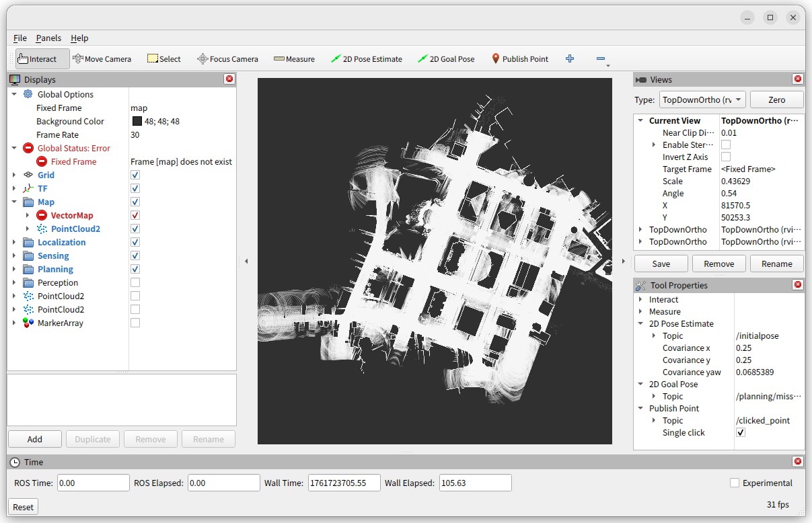
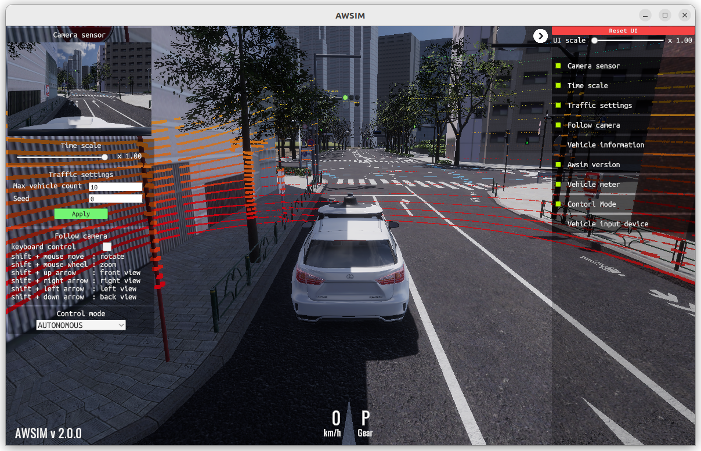
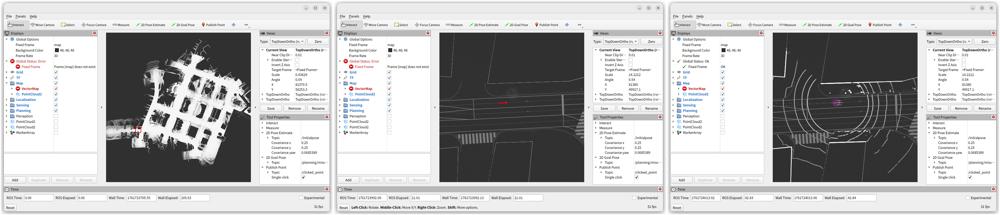
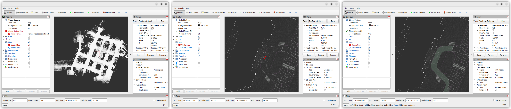

# Autoware Core digital twin simulation with AWSIM

## Installing Autoware

This page describes the procedure for an environment where Autoware Core is already installed.
If you have not yet installed Autoware, please refer to the [Installation](../../../installation/index.md).

## Download AWSIM

1. Download following files from [this page](https://tier4.github.io/AWSIM/Downloads/).
   - AWSIM-Demo.zip
   - Shinjuku-Map.zip

2. Extract the downloaded files. This page assumes the files are placed in the following paths.
   - $HOME/Downloads/AWSIM-Demo
   - $HOME/Downloads/Shinjuku-Map

## Start simulation

1. Launch Autoware according to the section below depending on your installation type.
   - Launch Autoware for Docker installation
   - Launch Autoware for source installation
   - Launch Autoware for Debian Package installation

   The map will be displayed in Rviz as shown below.
   

2. Launch AWSIM.

   ```bash
   cd $HOME/Downloads/AWSIM-Demo
   ./AWSIM-Demo.x86_64
   ```

   The AWSIM will be displayed as shown below.
   

3. Initialize pose. Select "2D Pose Estimate" and drag the mouse as shown by the arrow.

   

4. Set goal pose. Select "2D Goal Pose" and drag the mouse as shown by the arrow.

   

5. Start autonomous driving.

   ```bash
   source $HOME/autoware_launch_workspace/install/setup.bash

   ros2 topic pub /system/operation_mode/state autoware_adapi_v1_msgs/msg/OperationModeState \
     "{mode: 2, is_autoware_control_enabled: true, is_autonomous_mode_available: true}" \
     --once --qos-durability transient_local

   ros2 topic pub /control/command/gear_cmd autoware_vehicle_msgs/msg/GearCommand "command: 2" \
     --once --qos-durability transient_local
   ```

## Launch Autoware for Docker installation

1. Run the following command.

   ```bash
   xhost +local:
   docker run --rm -it --net host -e DISPLAY=$DISPLAY -v $HOME/Downloads/Shinjuku-Map/map:/home/aw/autoware_map ghcr.io/autowarefoundation/autoware:core-humble
   ```

2. Run the following command in the docker container.

   ```bash
   ros2 launch autoware_core autoware_core.launch.xml use_sim_time:=true map_path:=/home/aw/autoware_map vehicle_model:=autoware_sample_vehicle sensor_model:=autoware_awsim_sensor_kit
   ```

## Launch Autoware for source installation

1. Run the following command.

   ```bash
   cd $HOME/autoware_core_workspace
   source install/setup.bash
   ros2 launch autoware_core autoware_core.launch.xml use_sim_time:=true map_path:=$HOME/Downloads/Shinjuku-Map/map vehicle_model:=autoware_sample_vehicle sensor_model:=autoware_awsim_sensor_kit
   ```

## Launch Autoware for Debian Package installation

1. Run the following command.

   ```bash
   source /opt/ros/humble/setup.bash
   ros2 launch autoware_core autoware_core.launch.xml use_sim_time:=true map_path:=$HOME/Downloads/Shinjuku-Map/map vehicle_model:=autoware_sample_vehicle sensor_model:=autoware_awsim_sensor_kit
   ```
