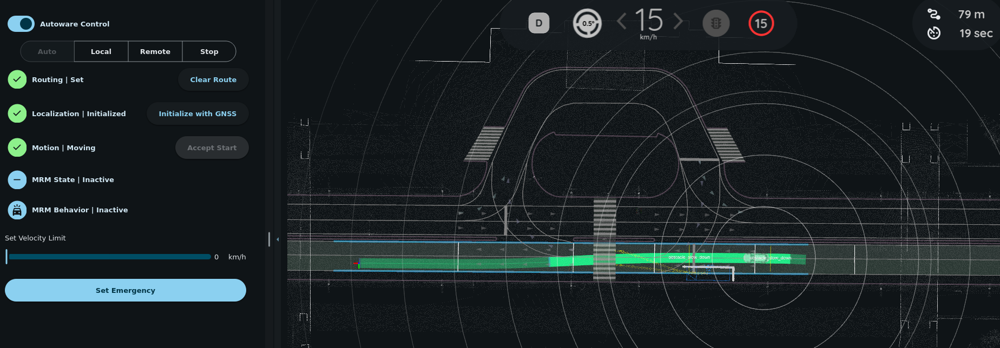

# Avoidance scenario

1. Set an initial pose and a goal pose in the same lane. A path will be planned.

   

2. Set a "2D Dummy Bus" on the roadside. A new path will be planned.

   

3. Engage the ego vehicle. It will avoid the obstacle along the newly planned path.

   
