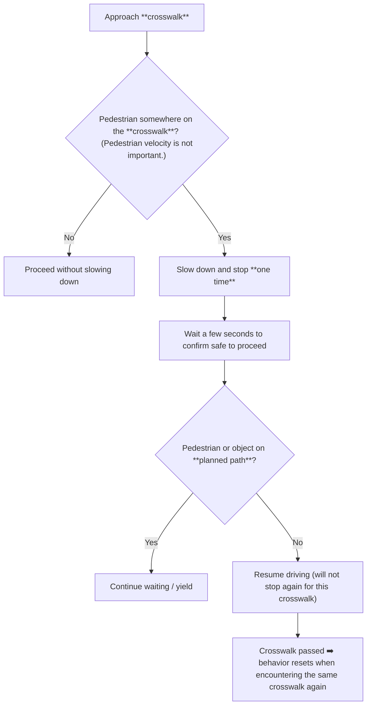
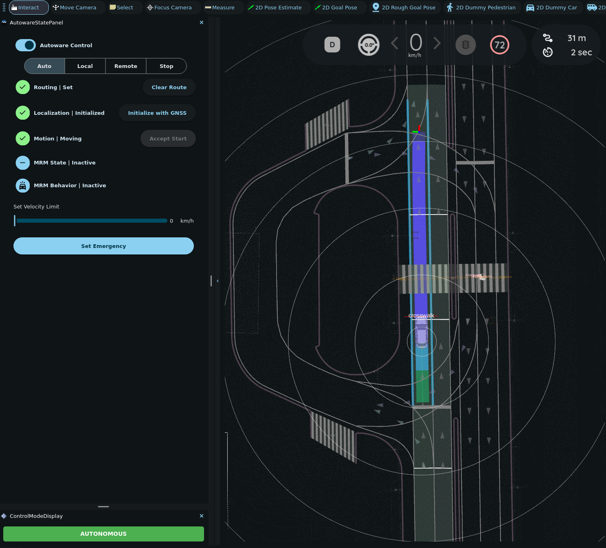

# Driving through a crosswalk

When driving through a crosswalk, the ego vehicle evaluates **both** the presence of pedestrians/objects **and** the state of any associated traffic lights.

!!! info

    For more technical details, refer to the [**autoware_behavior_velocity_crosswalk_module** documentation](https://autowarefoundation.github.io/autoware_universe/main/planning/behavior_velocity_planner/autoware_behavior_velocity_crosswalk_module/).

!!! info

    These examples use the **Nishishinjuku** map, the same one used in the [lane change scenario](lane-change.md).

!!! tip

    For these tutorials, it is easier to use **interactive dummy pedestrians** (see [Placing interactive dummy objects](placing-objects.md) above).

    This way you can quickly add, move, and delete dummy pedestrians as needed.

## Non-signalized crosswalk (no traffic light)

### Behavior logic

!!! example "Experiment"

    We will test the expected “single stop then go” behavior:

    1. Place a still dummy pedestrian on the crosswalk. (Not on the planned path, just on the crosswalk.)

    2. The ego vehicle will decelerate and stop before the crosswalk.

    3. After waiting for a few seconds, the ego vehicle will start driving again as usual.

1. Set an initial pose and a goal pose for the ego vehicle to drive through a non-signalized crosswalk. A path will be planned.

   

2. Place an interactive dummy pedestrian on the crosswalk and set its pose as if it is crossing the street. It doesn't matter whether the dummy pedestrian is moving or not, as long as it is on the crosswalk.

   

3. Engage the ego vehicle by clicking on `Auto`. The ego vehicle will decelerate and stop before the crosswalk. The marked **crosswalk** in the figure indicates that the stopping behavior is caused by the objects on the **crosswalk**.

   

4. The ego vehicle will wait for about a few seconds. Then it will start moving again and pass the crosswalk.

   

## Signalized crosswalk (with traffic light)

<figure markdown="span">
  
  <figcaption>Location for signalized crosswalk experiments</figcaption>
</figure>

!!! example "Experiment 1: Pedestrian Present While Traffic Light Is GREEN"

    This experiment mirrors the previous one but at a signalized crosswalk.

With the pedestrian near the path and the traffic light **GREEN**, the ego behaves **the same as at a non-signalized crosswalk**:
it slows, stops, waits, then continues.

!!! example "Experiment 2: Interaction of Pedestrians and a RED Traffic Light"

    1. Stop before the crosswalk when the traffic light is set to `RED`. (Without pedestrians.)

    2. Add a dummy pedestrian on the crosswalk while the traffic light is `RED`. (Both the traffic light and the crosswalk should affect the stopping behavior.)

    3. Finally, set the traffic light to `GREEN` again and the vehicle will pass normally.

1. **Stop at red (no pedestrians).**
   Remove any existing dummy pedestrians and set the traffic light to **RED**.
   The ego vehicle will stop before the crosswalk and wait solely because of the **traffic_light** reason.

   

2. **Add a pedestrian while the light is RED.**
   The ego remains stopped, now influenced by **both** the traffic light and the crosswalk object.

   

3. **Observe how the stop reasons update.**
   After a short period, only **traffic_light** may remain displayed.
   Moving the pedestrian slightly (with ++shift+"🖱️ Right Click"++ drag) reintroduces both markers, but the system stabilizes back to the traffic-light reason during the wait.

   

4. **Switch the light to GREEN.**
   When set to green and `Auto` mode is engaged, the ego vehicle proceeds normally.

   

