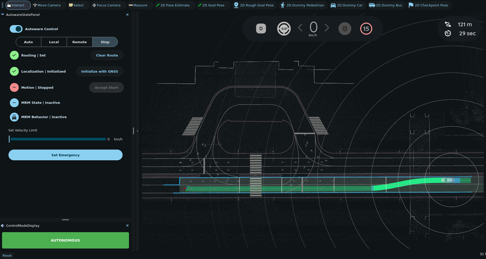

# Lane change scenario

1. Download and unpack Nishishinjuku map.

   ```bash
   gdown -O ~/autoware_map/ 'https://github.com/tier4/AWSIM/releases/download/v1.1.0/nishishinjuku_autoware_map.zip'
   unzip -d ~/autoware_map ~/autoware_map/nishishinjuku_autoware_map.zip
   ```

2. Launch autoware with Nishishinjuku map with following command:

   ```bash
   source ~/autoware/install/setup.bash
   ros2 launch autoware_launch planning_simulator.launch.xml map_path:=$HOME/autoware_map/nishishinjuku_autoware_map vehicle_model:=sample_vehicle sensor_model:=sample_sensor_kit
   ```

   

3. Set an initial pose and a goal pose in adjacent lanes.

   

4. Engage the ego vehicle. It will make a lane change along the planned path.

   
