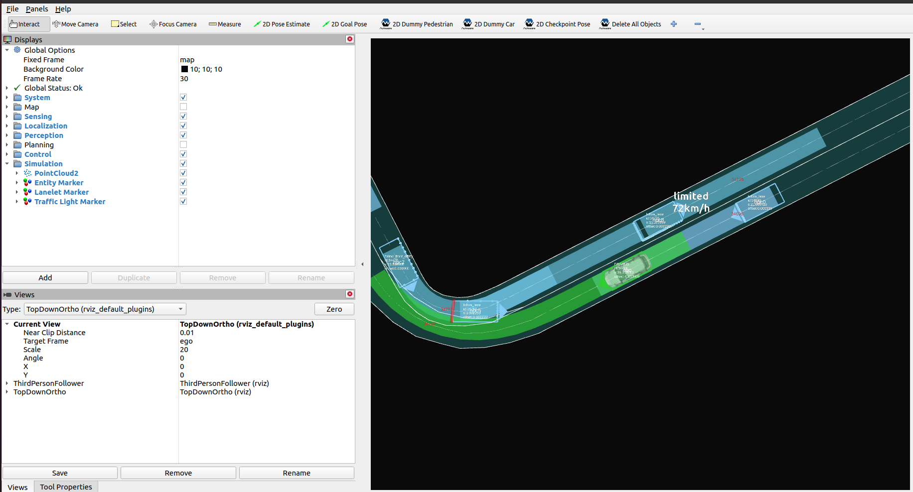

# Random test simulation

!!! note

    Running the Scenario Simulator requires some additional steps on top of building and installing Autoware, so make sure that [Scenario Simulator installation](installation.md) has been completed first before proceeding.

## Running steps

1. Move to the workspace directory where Autoware and the Scenario Simulator have been built.

2. Source the workspace setup script:

   ```bash
   source install/setup.bash
   ```

3. Run the simulation:

   ```bash
   ros2 launch random_test_runner random_test.launch.py \
     architecture_type:=awf/universe/20250130 \
     sensor_model:=autoware_sample_sensor_kit \
     vehicle_model:=autoware_sample_vehicle
   ```



For more information about supported parameters, refer to the [random_test_runner documentation](https://tier4.github.io/scenario_simulator_v2-docs/user_guide/random_test_runner/Usage/#node-parameters).
