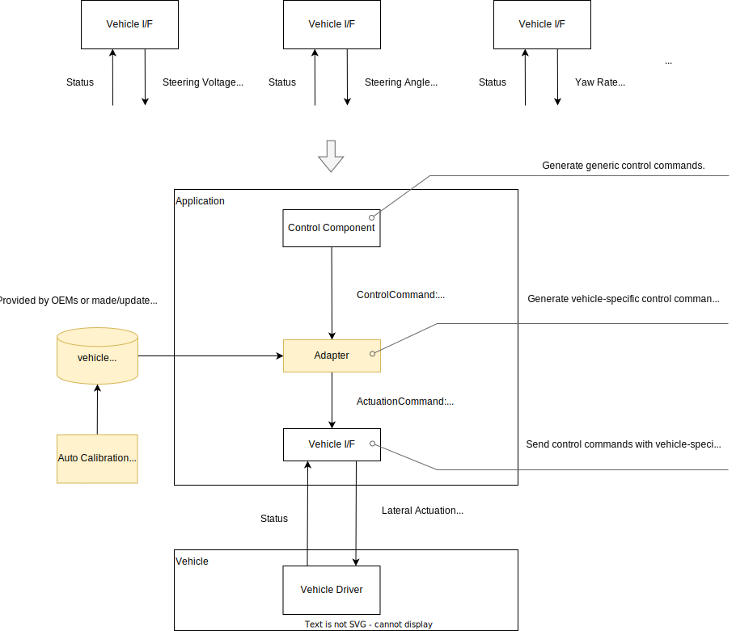

# Control component design

## Abstract

This document presents the design concept of the Control Component. The content is as follows:

- [Autoware Control Design](#autoware-control-design)
  - Outlining the policy for Autoware's control, which deals with only general information for autonomous driving systems and provides generic control commands to the vehicle.
- [Vehicle Adaptation Design](#vehicle-adaptation-design)
  - Describing the policy for vehicle adaptation, which utilizes adapter mechanisms to standardize the characteristics of the vehicle's drive system and integrate it with Autoware.
- [Control Feature Design](#control-feature-design)
  - Demonstrating the features provided by Autoware's control.
  - Presenting the approach towards the functions installed in the vehicle such as ABS.

## Autoware Control Design

The Control Component generates the control signal to which the Vehicle Component subscribes. The generated control signals are computed based on the reference trajectories from the Planning Component.


The Control Component consists of two modules. The `trajectory_follower` module generates a vehicle control command to follow the reference trajectory received from the planning module. The command includes, for example, the desired steering angle and target speed. The `vehicle_command_gate` is responsible for filtering the control command to prevent abnormal values and then sending it to the vehicle. This gate also allows switching between multiple sources such as the MRM (minimal risk maneuver) module or some remote control module, in addition to the trajectory follower.

The Autoware control system is designed as a platform for automated driving systems that can be compatible with a diverse range of vehicles.

The control process in Autoware uses general information (such as target acceleration and deceleration) and no vehicle-specific information (such as brake pressure) is used. Hence it can be adjusted independently of the vehicle's drive interface enabling easy integration or performance tuning.

Furthermore, significant differences that affect vehicle motion constraints, such as two-wheel steering or four-wheel steering, are addressed by switching the control vehicle model, achieving control specialized for each characteristic.

Autoware's control module outputs the necessary information to control the vehicle as a substitute for a human driver. For example, the control command from the control module looks like the following:

```msg
- Target steering angle
- Target steering torque
- Target speed
- Target acceleration
```

Note that vehicle-specific values such as pedal positions and low-level information such as individual wheel rotation speeds are excluded from the command.

## Vehicle Adaptation Design

### Vehicle interface adapter

Autoware is designed to be an autonomous driving platform able to accommodate vehicles with various drivetrain types.

This is an explanation of how Autoware handles the standardization of systems with different vehicle drivetrains. The interfaces for vehicle drivetrains are diverse, including steering angle, steering angular velocity, steering torque, speed, accel/brake pedals, and brake pressure. To accommodate these differences, Autoware adds an adapter module between the control component and the vehicle interface. This module performs the conversion between the proprietary message types used by the vehicle (such as brake pressure) and the generic types used by Autoware (such as desired acceleration). By providing this conversion information, the differences in vehicle drivetrain can be accommodated.

If the information is not known in advance, an automatic calibration tool can be used. Calibration will occur within limited degrees of freedom, generating the information necessary for the drivetrain conversion automatically.

This configuration is summarized in the following diagram.



### Examples of several vehicle interfaces

This is an example of the several drivetrain types in the vehicle interface.

| Vehicle      | Lateral interface    | Longitudinal interface                                            | Note                                                                                                                                               |
| ------------ | -------------------- | ----------------------------------------------------------------- | -------------------------------------------------------------------------------------------------------------------------------------------------- |
| Lexus        | Steering angle       | Accel/brake pedal position                                        | Acceleration lookup table conversion for longitudinal                                                                                              |
| JPN TAXI     | Steering angle       | Accel/brake pedal position                                        | Acceleration lookup table conversion for longitudinal                                                                                              |
| GSM8         | Steering EPS voltage | Acceleration motor voltage, Deceleration brake hydraulic pressure | lookup table and PID conversion for lateral and longitudinal                                                                                       |
| YMC Golfcart | Steering angle       | Velocity                                                          |                                                                                                                                                    |
| Logiees      | yaw rate             | Velocity                                                          |                                                                                                                                                    |
| F1 TENTH     | Steering angle       | Motor RPM                                                         | [interface code](https://gitlab.com/autowarefoundation/autoware.auto/AutowareAuto/-/blob/master/src/drivers/vesc_interface/src/vesc_interface.cpp) |

## Control Feature Design

The following lists the features provided by Autoware's Control/Vehicle component, as well as the conditions and assumptions required to utilize them effectively.

The proper operation of the ODD is limited by factors such as whether the functions are enabled, delay time, calibration accuracy and degradation rate, and sensor accuracy.

| Feature                                         | Description　                                                                                                                                                            | Requirements/Assumptions                                                          | Note                                                                                                                                                                                                                           | 　Limitation for now                                                                                                                                                       |
| ----------------------------------------------- | ------------------------------------------------------------------------------------------------------------------------------------------------------------------------ | --------------------------------------------------------------------------------- | ------------------------------------------------------------------------------------------------------------------------------------------------------------------------------------------------------------------------------ | -------------------------------------------------------------------------------------------------------------------------------------------------------------------------- |
| Lateral Control                                 | Control the drivetrain system related to lateral vehicle motion                                                                                                          |                                                                                   | Trying to increase the number of vehicle types that can be supported in the future.                                                                                                                                            | Only front-steering type is supported.                                                                                                                                     |
| Longitudinal Control                            | Control the drivetrain system related to longitudinal vehicle motion                                                                                                     |                                                                                   |                                                                                                                                                                                                                                |                                                                                                                                                                            |
| Slope Compensation                              | Supports precise vehicle motion control on slopes                                                                                                                        | Gradient information can be obtained from maps or sensors attached to the chassis | If gradient information is not available, the gradient is estimated from the vehicle's pitch angle.                                                                                                                            |                                                                                                                                                                            |
| Delay Compensation                              | Controls the drivetrain system appropriately in the presence of time delays                                                                                              | The drivetrain delay information is provided in advance                           | If there is no delay information, the drivetrain delay is estimated automatically (automatic calibration). However, the effect of delay cannot be completely eliminated, especially in scenarios with sudden changes in speed. | Only fixed delay times can be set for longitudinal and lateral drivetrain systems separately. It does not accommodate different delay times for the accelerator and brake. |
| Drivetrain IF Conversion (Lateral Control)      | Converts the drivetrain-specific information of the vehicle into the drivetrain information used by Autoware (e.g., target steering angular velocity → steering torque)  | The conversion information is provided in advance                                 | If there is no conversion information, the conversion map is estimated automatically (automatic calibration).                                                                                                                  | The degree of freedom for conversion is limited (2D lookup table + PID FB).                                                                                                |
| Drivetrain IF Conversion (Longitudinal Control) | Converts the drivetrain-specific information of the vehicle into the drivetrain information used by Autoware (e.g., target acceleration → accelerator/brake pedal value) | The conversion information is provided in advance                                 | If there is no conversion information, the conversion map is estimated automatically (automatic calibration).                                                                                                                  | The degree of freedom for conversion is limited (2D lookup table + PID FB).                                                                                                |
| Automatic Calibration                           | Automatically estimates and applies values such as drivetrain IF conversion map and delay time.                                                                          | The drivetrain status can be obtained (must)                                      |                                                                                                                                                                                                                                |                                                                                                                                                                            |
| Anomaly Detection                               | Notifies when there is a discrepancy in the calibration or unexpected drivetrain behavior                                                                                | The drivetrain status can be obtained (must)                                      |                                                                                                                                                                                                                                |                                                                                                                                                                            |
| Steering Zero Point Correction                  | Corrects the midpoint of the steering to achieve appropriate steering control                                                                                            | The drivetrain status can be obtained (must)                                      |                                                                                                                                                                                                                                |                                                                                                                                                                            |
| Steering Deadzone Correction                    | Corrects the deadzone of the steering to achieve appropriate steering control                                                                                            | The steering deadzone parameter is provided in advance                            | If the parameter is unknown, the deadzone parameter is estimated from driving information                                                                                                                                      | Not available now                                                                                                                                                          |
| Steering Deadzone Estimation                    | Dynamically estimates the steering deadzone from driving data                                                                                                            |                                                                                   |                                                                                                                                                                                                                                | Not available now                                                                                                                                                          |
| Weight Compensation                             | Performs appropriate vehicle control according to weight                                                                                                                 | Weight information can be obtained from sensors                                   | If there is no weight sensor, estimate the weight from driving information.                                                                                                                                                    | Currently not available                                                                                                                                                    |
| Weight Estimation                               | Dynamically estimates weight from driving data                                                                                                                           |                                                                                   |                                                                                                                                                                                                                                | Currently not available                                                                                                                                                    |

The list above does not cover wheel control systems such as ABS commonly used in vehicles. Regarding these features, the following considerations are taken into account.

### Integration with vehicle-side functions

As functions related to vehicle motion, the following functions are typically installed on the vehicle side:

- ABS（Anti-lock Brake System）
- ESC（Electric Stability Control）

Generally, it is difficult for an autonomous driving system to replace these ABS or ESC functions in terms of control cycles or obtainable information, and it is assumed that these functions are provided on the vehicle side. However, as an AD system, it models and controls the entire vehicle system, including these functions, regardless of whether they exist or not. Therefore, in the case of a vehicle without ABS installed, the autonomous driving system will generate a brake command while understanding that the deceleration rate will decrease during sudden braking.

It should be noted that regarding these functions, there is a trade-off with the corresponding ODD. In an ODD such as slow-speed driving in a well-maintained indoor environment, it is not necessary for these functions to be installed on the vehicle.

Also, note that this statement does not negate the development of ABS functionality in autonomous driving systems.

### Autoware Capabilities and Vehicle Requirements

As an alternative to human driving, autonomous driving systems essentially aim to handle tasks that humans can perform. This includes not only controlling the steering wheel, accel, and brake, but also automatically detecting issues such as poor brake response or a misaligned steering angle. However, this is a trade-off, as better vehicle performance will lead to superior system behavior, ultimately affecting the design of ODD.

On the other hand, for tasks that are not typically anticipated or cannot be handled by a human driver, processing in the vehicle ECU is expected. Examples of such scenarios include cases where the brake response is clearly delayed or when the vehicle rotates due to a single-side tire slipping. These tasks are typically handled by ABS or ESC.
