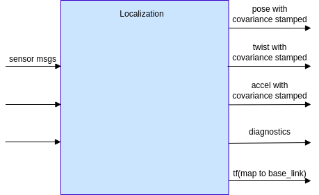
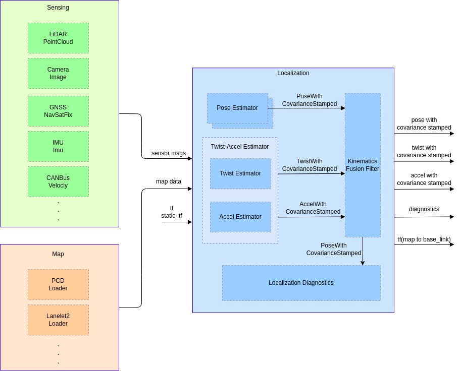
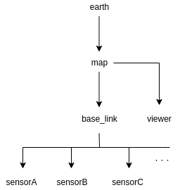

LOCALIZATION COMPONENT DESIGN DOC

## Abstract

## 1. Requirements

Localization aims to estimate vehicle pose, velocity, and acceleration.

Goals:

- Proposition of a system that can estimate the vehicle pose, velocity, and acceleration as long as possible
- Proposition of a system that can diagnose the stability of estimation and send a warning message to the error-monitoring system if the estimation result is unreliable
- Vehicle localization function can adequately work with various sensor configurations

Non-goals:

- We do not try to develop a localization system that
  - does not fail in any environment
  - works outside of the pre-defined ODD (Operational Design Domain)
  - has unnecessarily better performance than required in autonomous driving

## 2. Sensor Configuration Examples

This section shows example sensor configurations and their expected performances.
Each sensor has its own advantages and disadvantages, but overall performance can be improved by fusing multiple sensors.

### 3D-LiDAR + PointCloud Map

#### Expected situation

- The vehicle is located in a structure-rich environment, such as an urban area

#### Situations that can make the system unstable

- The vehicle is placed in a structure-less environment, such as a rural landscape, highway, or tunnel
- Environment changes from when the map is created. e.g., construction or destruction of buildings, snow cover
- Surrounding objects are occluded
- The car is surrounded by objects undetectable by LiDAR, e.g., glass windows, reflections, or absorption (dark objects)
- The environment contains laser beams at the same frequency as the car's LiDAR sensor(s)

#### Functionality

- The system can estimate the vehicle location on the point cloud map with the error of ~10cm.
- The system is operable at night.

### 3D-LiDAR or Camera + Vector Map

#### Expected situation

- Road with clear white lines and loose curvatures, such as a highway or an ordinary local road.

#### Situations that can make the system unstable

- White lines are scratchy or covered by rain or snow
- Tight curvature such as intersections
- Large reflection change of the road surface caused by rain or paint

#### Functionalities

- Correct vehicle positions along the lateral direction.
- Pose correction along the longitudinal can be inaccurate, but can be resolved by fusing with GNSS.

### GNSS

#### Expected situation

- The vehicle is placed in an open environment with few to no surrounding objects, such as a rural landscape.

#### Situation that can make the system unstable

- GNSS signals are blocked by surrounding objects, e.g., tunnels or buildings.

#### Functionality

- The system can estimate the vehicle position with an error of ~10m in the world coordinate
- With RTK attached, the accuracy can be improved to ~10cm
- The system with this configuration can work without environment maps

### Camera (Visual Odometry, Visual SLAM)

#### Expected situation

- The vehicle is placed in a texture-rich environment, such as urban areas

#### Situations that can make the system unstable

- The vehicle is placed in a Texture-less environment
- The vehicle is surrounded by other objects.
- The camera observes significant illumination changes, such as those caused by sunshine, headlights from other vehicles or when approaching the exit of a tunnel.
- The vehicle is placed in a dark environment.

#### Functionality

- The system can estimate odometry by tracking visual features.

### Wheel speed sensor

#### Expected situation

- The vehicle is running on an ordinary road

#### Situations that can make the system unstable

- The vehicle is running on a slippy or bumpy road
- The vehicle cannot observe the correct wheel speed because of poor road surface conditions such as bumps or slips

#### Functionality

- The system can acquire the vehicle velocity and estimate distance travelled.
- The system can estimate more accurate poses at a higher frequency by fusing with external sensors.

<!-- NOTE: Is the second item necessary? Because it is general for any other sensors -->

### IMU

#### Expected environments

- Ordinary roads

<!-- NOTE: The availability of IMU is highest among the sensors attached to vehicles. Therefore we should list more situations or say we can use the IMU almost anywhere -->

#### Situations that can make the system unstable

- IMUs have a bias that is dependent on the surrounding temperature. This can cause incorrect sensor observation or odometry drift

#### Functionality

- The system can observe acceleration and angular velocity.
- By integrating these observations, the system can estimate the local pose change and realize dead-reckoning
- By fusing with external sensors, it can estimate more accurate poses in a higher frequency

<!-- NOTE: The third item says "it can estimate more accurate poses in a higher frequency," but the IMU already has very frequent observation -->

### Geomagnetic sensor

#### Expected situation

- The vehicle is placed in an environment with low magnetic noise

#### Situations that can make the system unstable

- The vehicle is placed in an environment with high magnetic noise, such as buildings or structures with reinforced steel or materials that generate electromagnetic waves

#### Functionality

- The system can estimate the vehicle's direction in the world coordinate system.

### Magnetic markers

#### Expected situation

- The car is placed in an environment with magnetic markers installed.

#### Situations where the system becomes unstable

- The markers are not maintained.

#### Functionality

- Vehicle location can be obtained on the world coordinate by detecting the magnetic markers.
- The system can work even if the road is covered with snow.

## 3. Requirements

- By implementing different modules, various sensor configurations and algorithms can be used.
- The localization system can start pose estimation from an ambiguous initial location.
- The system can produce a reliable initial location estimation.
- The system can manage the state of the initial location estimation (uninitialized, initializable, or not) and can report to the error monitor

## 4. Architecture

### Abstract

We define two architectures: "Required" and "Recommended." Only input and output are defined in the "Required" architecture to accept various localization algorithms. Also, to improve the reusability of each module, we describe more detailed parts in the "Recommended" architecture.

### Required Architecture

#### Input

- Sensor message
  - e.g., LiDAR, camera, GNSS, IMU, CAN Bus, etc.
  - Data types should be ROS primitives for reusability
- Map data
  - e.g., point cloud map, lanelet2 map, feature map, etc.
  - The map format should be chosen based on use case and sensor configuration
  - Note that map data is not required for some specific cases (e.g., GNSS-only localization)
- tf, static_tf
  - map frame
  - base_link frame

#### Output

- Pose with covariance stamped
  - Vehicle pose, covariance, and timestamp on the map coordinate
  - 50Hz~ frequency (depending on the requirements of the Planning and Control components)
- Twist with covariance stamped
  - Vehicle velocity, covariance, and timestamp on the base_link coordinate
  - 50Hz~ frequency
- Accel with covariance stamped
  - Acceleration, covariance, and timestamp on the base_link coordinate
  - 50Hz~ frequency
- Diagnostics
  - Diagnostics information that indicates if the localization module works properly
- tf
  - tf of map to base_link

### Recommended Architecture

#### Pose Estimator

- Estimates the vehicle pose on the map coordinate by matching external sensor observation to the map
- Provides the obtained pose and its covariance to `PoseTwistFusionFilter`

#### Twist-Accel Estimator

- Produces the vehicle velocity, angular velocity, acceleration, angular acceleration, and their covariances
  - It is possible to create a single module for both twist and acceleration or to create two separate modules - the choice of architecture is up to the developer
- The twist estimator produces velocity and angular velocity from internal sensor observation
- The accel estimator produces acceleration and angular acceleration from internal sensor observations

#### Kinematics Fusion Filter

- Produces the likeliest pose, velocity, acceleration, and their covariances, computed by fusing two kinds of information:
  - The pose obtained from the pose estimator.
  - The velocity and acceleration obtained from the twist-accel estimator
- Produces tf of map to base_link according to the pose estimation result

#### Localization Diagnostics

- Monitors and guarantees the stability and reliability of pose estimation by fusing information obtained from multiple localization modules
- Reports error status to the error monitor

#### TF tree

|   frame   | meaning                                                                                        |
| :-------: | :--------------------------------------------------------------------------------------------- |
|   earth   | ECEF (Earth Centered Earth Fixed）                                                             |
|    map    | Origin of the map coordinate (ex. MGRS origin)                                                 |
|  viewer   | User-defined frame for rviz                                                                    |
| base_link | Reference pose of the ego-vehicle (projection of the rear-axle center onto the ground surface) |
|  sensor   | Reference pose of each sensor                                                                  |

Developers can optionally add other frames such as odom or base_footprint as long as the tf structure above is maintained.

### The localization module's ideal functionality

- The localization module should provide pose, velocity, and acceleration for control, planning, and perception.
- Latency and stagger should be sufficiently small or adjustable such that the estimated values can be used for control within the ODD (Operational Design Domain).
- The localization module should produce the pose on a fixed coordinate frame.
- Sensors should be independent of each other so that they can be easily replaced.
- The localization module should provide a status indicating whether or not the autonomous vehicle can operate with the self-contained function or map information.
- Tools or manuals should describe how to set proper parameters for the localization module <!-- TODO  原文にある「適切な位置推定」とはなんだ！！！ -->
- Valid calibration parameters should be provided to align different frame or pose coordinates and sensor timestamps.

### KPI

To maintain sufficient pose estimation performance for safe operation, the following metrics are considered:

- Safety
  - The percentage of distance which the pose estimation satisfies the required accuracy per the overall distances defined in ODD
  - The anomaly detection rate for situations where the localization module cannot estimate pose within the ODD
  - The accuracy of out-of-ODD detection
- Computational load
- Latency

## 5. Interface and Data Structure

## 6. Concerns, Assumptions, and Limitations

### Prerequisites of sensors and inputs

#### Sensor prerequisites

- Input data is not defective.
  - Internal sensor observation such as IMU continuously keeps the proper frequency.
- Input data has correct and exact time stamps.
  - Estimated poses can be inaccurate or unstable if the timestamps are not exact.
- Sensors are correctly mounted with exact positioning and accessible from TF.
  - If the sensor positions are inaccurate, estimation results may be incorrect or unstable.
  - A sensor calibration framework is required to properly obtain the sensor positions.

#### Map prerequisites

- Sufficient information is contained within the map.
  - Pose estimation might be unstable if there is insufficient information in the map.
  - A testing framework is necessary to check if the map has adequate information for pose estimation.
- Map does not differ greatly from the actual environment.
  - Pose estimation might be unstable if the actual environment has different objects from the map.
  - Maps need updates according to new objects and seasonal changes.
- Maps must be aligned to a uniform coordinate, or an alignment framework is in place.
  - If multiple maps with different coordinate systems are used, the misalignment between them can affect the localization performance.

#### Computational resources

- Sufficient computational resources should be provided to maintain accuracy and computation speed.
