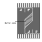
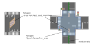
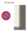
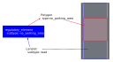
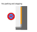
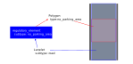
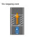
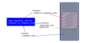
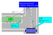

## Category:Area

---

### vm-06-01 Buffer Zone

#### Detail of requirements <!-- omit in toc -->

Create a Polygon (_type:hatched_road_markings_) when a Buffer Zone (also known as a zebra zone) is painted on the road surface.

- If the Buffer Zone is next to a Lanelet, share Points between them.
- Overlap the Buffer Zone's Polygon with the intersection's Polygon (intersection_area) if the Buffer Zone is located at an intersection.

##### Behavior of Autoware： <!-- omit in toc -->

In order to avoid obstacles, Autoware regards the Buffer Zone as a drivable area and proceeds through it.

!!! Caution
    - Vehicles are not allowed to pass through safety areas. It's important to differentiate between Buffer Zones and safety areas.
    - Do not create a Polygon for the Buffer Zone in areas where static objects like poles are present and vehicles cannot pass, even if a Buffer Zone is painted on the surface. Buffer Zones should be established only in areas where vehicle passage is feasible.

#### Preferred vector map <!-- omit in toc -->

#### Incorrect vector map <!-- omit in toc -->

None in particular.

#### Related Autoware module

- [Static Avoidance - Autoware Universe Documentation](https://autowarefoundation.github.io/autoware.universe/main/planning/behavior_path_planner/autoware_behavior_path_static_obstacle_avoidance_module/)
- [Dynamic Avoidance - Autoware Universe Documentation](https://autowarefoundation.github.io/autoware.universe/main/planning/behavior_path_planner/autoware_behavior_path_dynamic_obstacle_avoidance_module/)

---

### vm-06-02 No parking signs

#### Detail of requirements <!-- omit in toc -->

When creating a Vector Map, you can prohibit parking in specific areas, while temporary stops are permitted.

Create a reference from a Lanelet (_subtype:road_) to a Regulatory Element (_subtype:no_parking_area_), and have this Regulatory Element refer to a Polygon (_type:no_parking_area_).

Refer to [Web.Auto Documentation - Creation of No Parking Area](https://docs.web.auto/en/user-manuals/vector-map-builder/how-to-use/edit-maps#creation-of-no-parking-area) for the method of creation in Vector Map Builder.

##### Behavior of Autoware： <!-- omit in toc -->

Since _no_parking_area_ does not allow for setting a goal, Autoware cannot park the vehicle there.

#### Preferred vector map <!-- omit in toc -->

#### Incorrect vector map <!-- omit in toc -->

None in particular.

#### Related Autoware module

- [Goal Planner design - Autoware Universe Documentation](https://autowarefoundation.github.io/autoware.universe/main/planning/behavior_path_planner/autoware_behavior_path_goal_planner_module/)

---

### vm-06-03 No stopping signs

#### Detail of requirements <!-- omit in toc -->

When creating a Vector Map, you can prohibit stopping in specific areas, while temporary stops are permitted.

Create a reference from a Lanelet (_subtype:road_) to a Regulatory Element (_subtype:no_parking_area_), and have this Regulatory Element refer to a Polygon (_type:no_parking_area_).

Refer to [Web.Auto Documentation - Creation of No Parking Area](https://docs.web.auto/en/user-manuals/vector-map-builder/how-to-use/edit-maps#creation-of-no-parking-area) for the method of creation in Vector Map Builder.

##### Behavior of Autoware： <!-- omit in toc -->

Since _no_parking_area_ does not allow for setting a goal, Autoware cannot park the vehicle there.

#### Preferred vector map <!-- omit in toc -->

#### Incorrect vector map <!-- omit in toc -->

None in particular.

#### Related Autoware module

- [Goal Planner design - Autoware Universe Documentation](https://autowarefoundation.github.io/autoware.universe/main/planning/behavior_path_planner/autoware_behavior_path_goal_planner_module/)

---

### vm-06-04 No stopping sections

#### Detail of requirements <!-- omit in toc -->

While vehicles may stop on the road for signals or traffic congestion, you can prohibit any form of stopping (temporary stopping, parking, idling) in specific areas when creating a Vector Map.

Create a reference from a Lanelet (_subtype:road_) to a Regulatory Element (_subtype:no_stopping_area_), and have this Regulatory Element refer to a Polygon (_type:no_stopping_area_).

Refer to [Web.Auto Documentation - Creation of No Stopping Area](https://docs.web.auto/en/user-manuals/vector-map-builder/how-to-use/edit-maps#creation-of-no-stopping-area) for the method of creation in Vector Map Builder.

##### Behavior of Autoware： <!-- omit in toc -->

The vehicle does not make temporary stops in _no_stopping_area_. Since goals cannot be set in _no_stopping_area_, the vehicle cannot park there.

#### Preferred vector map <!-- omit in toc -->

#### Incorrect vector map <!-- omit in toc -->

None in particular.

#### Related Autoware module

- [No Stopping Area design - Autoware Universe Documentation](https://autowarefoundation.github.io/autoware.universe/main/planning/behavior_velocity_planner/autoware_behavior_velocity_no_stopping_area_module/)

---

### vm-06-05 Detection area

#### Detail of requirements <!-- omit in toc -->

Autoware identifies obstacles by detecting point clouds in the Detection Area, leading to a stop at the stop line and maintaining that stop until the obstacles move away. To enable this response, incorporate the Detection Area element into the Vector Map.

Create a reference from a Lanelet (_subtype:road_) to a Regulatory Element (_subtype:detection_area_), and have this Regulatory Element refer to a Polygon (_type:detection_area_) and a Linestring (_type:stop_line_).

Refer to [Web.Auto Documentation - Creation of Detection Area](https://docs.web.auto/en/user-manuals/vector-map-builder/how-to-use/edit-maps#creation-of-detection-area) for the method of creation in Vector Map Builder.

#### Preferred vector map <!-- omit in toc -->

#### Incorrect vector map <!-- omit in toc -->

None in particular.

#### Related Autoware module

- [Detection Area - Autoware Universe Documentation](https://autowarefoundation.github.io/autoware.universe/main/planning/behavior_velocity_planner/autoware_behavior_velocity_detection_area_module/)
