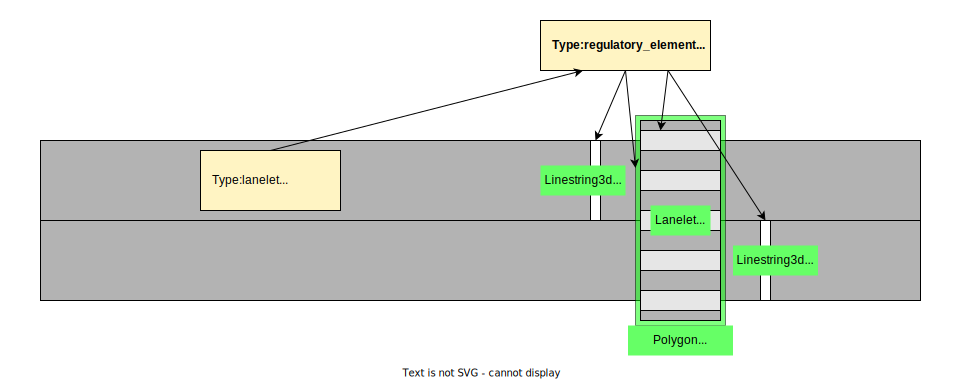

## Category:Crosswalk

There are two types of requirements for crosswalks, and they can both be applicable to a single crosswalk.

- [vm-05-01](./category_crosswalk.md#vm-05-01-crosswalks-across-the-road) : Crosswalks across the road
- [vm-05-02](./category_crosswalk.md#vm-05-02-crosswalks-with-pedestrian-signals) : Crosswalks with pedestrian signals

In the case of crosswalks at intersections, they must also meet the requirements of the intersection.

---

### vm-05-01 Crosswalks across the road

#### Detail of requirements <!-- omit in toc -->

Necessary requirements for creation:

1. Create a Lanelet for the crosswalk (_subtype:crosswalk_).
2. If there is a stop line before the crosswalk, create a Linestring (_type:stop_line_). Create stop lines for the opposing traffic lane in the same way.
3. Create a Polygon (_type:crosswalk_polygon_) to cover the crosswalk.
4. The Lanelet of the road refers to the regulatory element (_subtype:crosswalk_), and the regulatory element refers to the created Lanelet, Linestring, and Polygon.

##### Supplemental information

- Link the regulatory element to the lanelet(s) of the road that intersects with the crosswalk.
- The stop lines linked to the regulatory element do not necessarily have to exist on the road Lanelets linked with the regulatory element.

##### Behavior of Autoware： <!-- omit in toc -->

When pedestrians or cyclists are on the crosswalk, Autoware will come to a stop before the stop line and wait for them to pass. Once they have cleared the area, Autoware will begin to move forward.

#### Preferred vector map <!-- omit in toc -->

#### Incorrect vector map <!-- omit in toc -->

None in particular.

#### Related Autoware module

- [Crosswalk - Autoware Universe Documentation](https://autowarefoundation.github.io/autoware.universe/main/planning/behavior_velocity_planner/autoware_behavior_velocity_crosswalk_module/)

---

### vm-05-02 Crosswalks with pedestrian signals

#### Detail of requirements <!-- omit in toc -->

Necessary requirements for creation:

- Create a Lanelet (_subtype:crosswalk_, _participant:pedestrian_).
- Create a Traffic Light Linestring. If multiple traffic lights exist, create multiple Linestrings.
  - Linestring
    - _type:traffic_light_
    - _subtype:red_green_
    - _height_:value
- Ensure the crosswalk's Lanelet references a Regulatory Element (_subtype:traffic_light_). Also, ensure the Regulatory Element references Linestring (_type:traffic_light_).

Refer to [vm-04-02](./category_traffic_light.md#vm-04-02-traffic-light-position-and-size) for more about traffic light object.

#### Preferred vector map <!-- omit in toc -->

#### Incorrect vector map <!-- omit in toc -->

None in particular.

#### Related Autoware module

- [Crosswalk - Autoware Universe Documentation](https://autowarefoundation.github.io/autoware.universe/main/planning/behavior_velocity_planner/autoware_behavior_velocity_crosswalk_module/)

---

### vm-05-03 Deceleration for safety at crosswalks

#### Detail of requirements <!-- omit in toc -->

To ensure a constant deceleration to a safe speed when traversing a crosswalk, add the following tags to the crosswalk's Lanelet (_subtype:crosswalk_):

- _safety_slow_down_speed_ [m/s]: The maximum velocity while crossing.
- _safety_slow_down_distance_ [m]: The starting point of the area where the maximum speed applies, measured from the vehicle's front bumper to the crosswalk.

#### Preferred vector map <!-- omit in toc -->

#### Incorrect vector map <!-- omit in toc -->

None in particular.

#### Related Autoware module

- [Crosswalk - Autoware Universe Documentation](https://autowarefoundation.github.io/autoware.universe/main/planning/behavior_velocity_planner/autoware_behavior_velocity_crosswalk_module/)

---

### vm-05-04 Fences

#### Detail of requirements <!-- omit in toc -->

Autoware detects pedestrians and bicycles crossing the crosswalk, as well as those that might cross. However, areas near the crosswalk, such as fenced kindergartens, playgrounds, or parks, where many people are moving, can affect crosswalk detection due to predicted paths of people and bicycles from these areas.

Surround areas not connected to the crosswalk with Linestring (_type:fence_), which does not need to be linked to anything.

However, if there is a guardrail, wall, or fence between the road and sidewalk, with another fence behind it, the second fence may be omitted. Nevertheless, areas around crosswalks are not subject to this omission and must be created without exclusion.

#### Preferred vector map <!-- omit in toc -->

#### Incorrect vector map <!-- omit in toc -->

None in particular.

#### Related Autoware module

- [map_based_prediction - Autoware Universe Documentation](https://autowarefoundation.github.io/autoware.universe/main/perception/autoware_map_based_prediction/)