## Category:Intersection

---

### vm-03-01 Intersection criteria

#### Detail of requirements <!-- omit in toc -->

Essential criteria for the construction of an intersection:

- Encircle the drivable area at the intersection with a Polygon (_type:intersection_area_).
- Add _turn_direction_ to all Lanelets in the intersection.
- Ensure that all lanelets in the intersection are tagged:
  - _key:intersection_area_
  - _value: Polygon's ID_
- Attach _right_of_way_ to the necessary Lanelets.
- Also, it is necessary to appropriately create traffic lights, crosswalks, and stop lines.

For detailed information, refer to the respective requirements on this page.

##### Autoware modules <!-- omit in toc -->

- The requirements for _turn_direction_ and _right_of_way_ are related to the intersection module, which plans velocity to avoid collisions with other vehicles, taking traffic light instructions into account.
- The requirements for _intersection_area_ are related to the avoidance module, which plans routes that evade by veering out of lanes in the intersections.

#### Preferred vector map <!-- omit in toc -->

None in particular.

#### Incorrect vector map <!-- omit in toc -->

None in particular.

#### Related Autoware module

- [Intersection - Autoware Universe Documentation](https://autowarefoundation.github.io/autoware.universe/main/planning/behavior_velocity_planner/autoware_behavior_velocity_intersection_module/)
- [Blind Spot design - Autoware Universe Documentation](https://autowarefoundation.github.io/autoware.universe/main/planning/behavior_velocity_planner/autoware_behavior_velocity_blind_spot_module/)
- [Static Avoidance - Autoware Universe Documentation](https://autowarefoundation.github.io/autoware.universe/main/planning/behavior_path_planner/autoware_behavior_path_static_obstacle_avoidance_module/)
- [Dynamic Avoidance - Autoware Universe Documentation](https://autowarefoundation.github.io/autoware.universe/main/planning/behavior_path_planner/autoware_behavior_path_dynamic_obstacle_avoidance_module/)

---

### vm-03-02 Lanelet's turn direction and virtual linestring

#### Detail of requirements <!-- omit in toc -->

Add the following tag to the Lanelets in the intersection:

- turn_direction : straight
- turn_direction : left
- turn_direction : right

Also, if the left or right Linestrings of Lanelets at the intersection lack road paintings, designate these as _type:virtual_.

##### Behavior of Autoware： <!-- omit in toc -->

Autoware will start flashing the turn signals (blinkers) 30 meters as default before turn_direction-tagged Lanelet. If you change the blinking timing, add the following tags:

- key: _turn_signal_distance_
- value: numerical value (m)

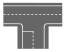

#### Preferred vector map <!-- omit in toc -->

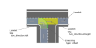

#### Incorrect vector map <!-- omit in toc -->

None in particular.

#### Related Autoware module

- [Intersection - Autoware Universe Documentation](https://autowarefoundation.github.io/autoware.universe/main/planning/behavior_velocity_planner/autoware_behavior_velocity_intersection_module/)
- [Blind Spot design - Autoware Universe Documentation](https://autowarefoundation.github.io/autoware.universe/main/planning/behavior_velocity_planner/autoware_behavior_velocity_blind_spot_module/)
- [virtual_traffic_light in behavior_velocity_planner - Autoware Universe Documentation](https://autowarefoundation.github.io/autoware.universe/main/planning/behavior_velocity_planner/autoware_behavior_velocity_virtual_traffic_light_module/)

---

### vm-03-03 Lanelet width in the intersection

#### Detail of requirements： <!-- omit in toc -->

Lanelets in the intersection should have a consistent width. Additionally, draw Linestrings with smooth curves.

The shape of this curve must be determined by the Vector Map creator.

#### Preferred vector map <!-- omit in toc -->

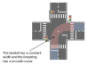

#### Incorrect vector map <!-- omit in toc -->

---

### vm-03-04 Lanelet creation in the intersection

#### Detail of requirements <!-- omit in toc -->

Create all Lanelets in the intersection, including lanelets not driven by the vehicle. Additionally, link stop lines and traffic lights to the Lanelets appropriately.

Refer also to the creation scope [vm-07-01](./category_others.md#vm-07-01-vector-map-creation-range)

##### Behavior of Autoware <!-- omit in toc -->

Autoware uses lanelets to predict the movements of other vehicles and plan the vehicle's velocity accordingly. Therefore, it is necessary to create all lanelets in the intersection.

#### Preferred vector map <!-- omit in toc -->

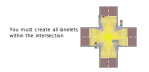

#### Incorrect vector map <!-- omit in toc -->

#### Related Autoware module

- [Intersection - Autoware Universe Documentation](https://autowarefoundation.github.io/autoware.universe/main/planning/behavior_velocity_planner/autoware_behavior_velocity_intersection_module/)

---

### vm-03-05 Lanelet division in the intersection

#### Detail of requirements <!-- omit in toc -->

Create the Lanelets in the intersection as a single object without dividing them.

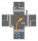

#### Preferred vector map <!-- omit in toc -->

#### Incorrect vector map <!-- omit in toc -->

#### Related Autoware module

- [Intersection - Autoware Universe Documentation](https://autowarefoundation.github.io/autoware.universe/main/planning/behavior_velocity_planner/autoware_behavior_velocity_intersection_module/)

---

### vm-03-06 Guide lines in the intersection

#### Detail of requirements <!-- omit in toc -->

If there are guide lines in the intersection, draw the Lanelet following them.

In cases where the Lanelets branches off, begin the branching at the end of the guide line. However, it is not necessary to share points or linestrings between Lanelets.

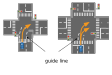

#### Preferred vector map <!-- omit in toc -->

#### Incorrect vector map <!-- omit in toc -->

None in particular.

#### Related Autoware module

- [Intersection - Autoware Universe Documentation](https://autowarefoundation.github.io/autoware.universe/main/planning/behavior_velocity_planner/autoware_behavior_velocity_intersection_module/)

---

### vm-03-07 Multiple lanelets in the intersection

#### Detail of requirements <!-- omit in toc -->

When connecting multiple lanes with Lanelets at an intersection, those Lanelets should be made adjacent to each other without crossing.

#### Preferred vector map <!-- omit in toc -->

#### Incorrect vector map <!-- omit in toc -->

#### Related Autoware module

- [Intersection - Autoware Universe Documentation](https://autowarefoundation.github.io/autoware.universe/main/planning/behavior_velocity_planner/autoware_behavior_velocity_intersection_module/)

---

### vm-03-08 Intersection area range

#### Detail of requirements <!-- omit in toc -->

Encircle the intersection's drivable area with a Polygon (_type:intersection_area_). The boundary of this intersection's Polygon should be defined by the objects below.

- Linestrings (_subtype:road_border_)
- Straight lines at the connection points of lanelets in the intersection."

#### Preferred vector map <!-- omit in toc -->

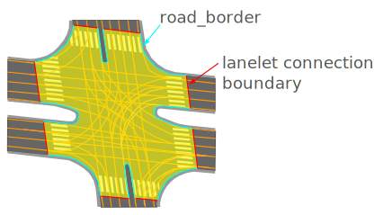

#### Incorrect vector map <!-- omit in toc -->

None in particular.

#### Related Autoware module

- [Intersection - Autoware Universe Documentation](https://autowarefoundation.github.io/autoware.universe/main/planning/behavior_velocity_planner/autoware_behavior_velocity_intersection_module/)
- [Blind Spot design - Autoware Universe Documentation](https://autowarefoundation.github.io/autoware.universe/main/planning/behavior_velocity_planner/autoware_behavior_velocity_blind_spot_module/)
- [Static Avoidance - Autoware Universe Documentation](https://autowarefoundation.github.io/autoware.universe/main/planning/behavior_path_planner/autoware_behavior_path_static_obstacle_avoidance_module/)
- [Dynamic Avoidance - Autoware Universe Documentation](https://autowarefoundation.github.io/autoware.universe/main/planning/behavior_path_planner/autoware_behavior_path_dynamic_obstacle_avoidance_module/)

---

### vm-03-09 Range of Lanelet in the intersection

#### Detail of requirements <!-- omit in toc -->

Determine the start and end positions of lanelets in the intersection (henceforth the boundaries of lanelet connections) based on the stop line's position.

- For cases with a painted stop line:
  - The stop line's linestring (_type:stop_line_) position must align with the lanelet's start.
  - Extend the lanelet's end to where the opposing lane's stop line would be.
- Without a painted stop line:
  - Use a drawn linestring (_type:stop_line_) to establish positions as if there were a painted stop line.

#### Preferred vector map <!-- omit in toc -->

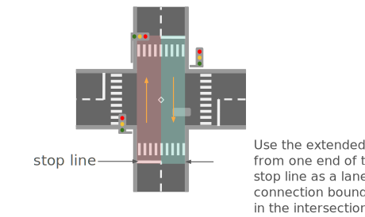

#### Incorrect vector map <!-- omit in toc -->

None in particular.

#### Related Autoware module

- [Intersection - Autoware Universe Documentation](https://autowarefoundation.github.io/autoware.universe/main/planning/behavior_velocity_planner/autoware_behavior_velocity_intersection_module/)

---

### vm-03-10 Right of way (with signal)

#### Detail of requirements <!-- omit in toc -->

Set the regulatory element 'right_of_way' for Lanelets that meet all of the following criteria:

- Lanelets in the intersection with a _turn_direction_ of _right_ or _left_.
- Lanelets that intersect with the vehicle's lanelet.
- There are traffic lights at the intersection.

Set to _yield_ those lanelets in the intersection that intersect the vehicle's lanelet, and set to _yield_ those lanelets that do not share the same signal change timing with the vehicle. Also, if the vehicle is turning left, set the opposing vehicle's right-turn lane to _yield_. There is no need to set _yield_ for lanelets where the vehicle goes straight (_turn_direction:straight_).

#### Preferred vector map <!-- omit in toc -->

##### The vehicle turns left <!-- omit in toc -->

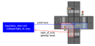

##### The vehicle turns right <!-- omit in toc -->

#### Incorrect vector map <!-- omit in toc -->

None in particular.

#### Related Autoware module

- [Intersection - Autoware Universe Documentation](https://autowarefoundation.github.io/autoware.universe/main/planning/behavior_velocity_planner/autoware_behavior_velocity_intersection_module/)

---

### vm-03-11 Right of way (without signal)

#### Detail of requirements <!-- omit in toc -->

Set the regulatory element 'right_of_way' for Lanelets that meet all of the following criteria:

- Lanelets in the intersection with a _turn_direction_ of _right_ or _left_.
- Lanelets that intersect with the vehicle's lanelet.
- There are **no** traffic lights at the intersection.

#### Preferred vector map <!-- omit in toc -->

##### ① The vehicle on the priority lane <!-- omit in toc -->

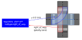

##### ② The vehicle on the non-priority lane <!-- omit in toc -->

A regulatory element is not necessary. However, when the vehicle goes straight, it has relative priority over other vehicles turning right from the opposing non-priority road. Therefore, settings for _right_of_way_ and _yield_ are required in this case.

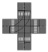

#### Incorrect vector map <!-- omit in toc -->

None in particular.

#### Related Autoware module

- [Intersection - Autoware Universe Documentation](https://autowarefoundation.github.io/autoware.universe/main/planning/behavior_velocity_planner/autoware_behavior_velocity_intersection_module/)

---

### vm-03-12 Right of way supplements

#### Detail of requirements <!-- omit in toc -->

##### Why it's necessary to configure 'right_of_way' <!-- omit in toc -->

Without the 'right_of_way' setting, Autoware interprets other lanes intersecting its path as having priority. Therefore, as long as there are other vehicles in the crossing lane, Autoware cannot enter the intersection regardless of signal indications.

An example of a problem: Even when our signal allows proceeding, our vehicle waits beforehand if other vehicles are waiting at a red light where the opposing lane intersects with a right-turn lane.

#### Preferred vector map <!-- omit in toc -->

None in particular.

#### Incorrect vector map <!-- omit in toc -->

None in particular.

#### Related Autoware module

- [Intersection - Autoware Universe Documentation](https://autowarefoundation.github.io/autoware.universe/main/planning/behavior_velocity_planner/autoware_behavior_velocity_intersection_module/)

---

### vm-03-13 Merging from private area, sidewalk

#### Detail of requirements <!-- omit in toc -->

Set _location=private_ for Lanelets within private property.

When a road, which enters or exits private property, intersects with a sidewalk, create a Lanelet for that sidewalk (_subtype:walkway_).

##### Behavior of Autoware： <!-- omit in toc -->

- The vehicle stops temporarily before entering the sidewalk.
- The vehicle comes to a stop before merging onto the public road.

#### Preferred vector map <!-- omit in toc -->

#### Incorrect vector map <!-- omit in toc -->

None in particular.

#### Related Autoware module

- [Intersection - Autoware Universe Documentation](https://autowarefoundation.github.io/autoware.universe/main/planning/behavior_velocity_planner/autoware_behavior_velocity_intersection_module/)

---

### vm-03-14 Road marking

#### Detail of requirements <!-- omit in toc -->

If there is a stop line ahead of the guide lines in the intersection, ensure the following:

- Create a Lanelet for the guide lines.
- The Lanelet for the guide lines references a Regulatory Element (_subtype:road_marking_).
- The Regulatory Element refers to the _stop_line_'s Linestring."

Refer to [Web.Auto Documentation - Creation of Regulatory Element](https://docs.web.auto/en/user-manuals/vector-map-builder/how-to-use/edit-maps#creation-of-regulatory-element) for the method of creation in Vector Map Builder.

#### Preferred vector map <!-- omit in toc -->

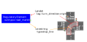

#### Incorrect vector map <!-- omit in toc -->

None in particular.

#### Related Autoware module

- [Intersection - Autoware Universe Documentation](https://autowarefoundation.github.io/autoware.universe/main/planning/behavior_velocity_planner/autoware_behavior_velocity_intersection_module/)

---

### vm-03-15 Exclusive bicycle lane

#### Detail of requirements <!-- omit in toc -->

If an exclusive bicycle lane exists, create a Lanelet (_subtype:road_). The section adjoining the road should share a Linestring. For bicycle lanes at intersections, assign a yield*lane designation beneath the \_right_of_way* for lanes that intersect with the vehicle's left-turn lane. (Refer to [vm-03-10](./category_intersection.md#vm-03-10-right-of-way-with-signal) and [vm-03-11](./category_intersection.md#vm-03-11-right-of-way-without-signal) for right_of_way).

In addition, set _lane_change = no_ as OptionalTags.

##### Behavior of Autoware： <!-- omit in toc -->

The blind spot (entanglement check) feature verifies the lanelet(subtype:road) and decides if the vehicle can proceed.

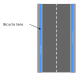

#### Preferred vector map <!-- omit in toc -->

#### Incorrect vector map <!-- omit in toc -->

None in particular.

#### Related Autoware module

- [Blind Spot design - Autoware Universe Documentation](https://autowarefoundation.github.io/autoware.universe/main/planning/behavior_velocity_planner/autoware_behavior_velocity_blind_spot_module/)
