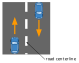
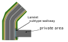

## Category:Lane

---

### vm-01-01 Lanelet basics

#### Detail of requirements <!-- omit in toc -->

The road's Lanelets must comply with the following requirements.

- _subtype:road_
- location:urban, for public roads
- Align the Lanelet's direction with the direction of vehicle move. (You can visualize lanelet direction as arrows with [Vector Map Builder](https://docs.web.auto/en/user-manuals/vector-map-builder/screen-layout#project-tab))
- Set lane change is allowed or not, according to [vm-01-02](#vm-01-02-allowance-for-lane-changes).
- Set the Linestring IDs for Lanelet's left_bound and right_bound respectively. See [vm-01-03](#vm-01-03-linestring-sharing).
- tag : _one_way=yes_. Autoware currently does not support no.
- Connect the Lanelet to another Lanelet, except if it's at the start or end.
- Position the points (x, y, z) within the Lanelet to align with the PCD Map, ensuring accuracy not only laterally but also in elevation. The height of a Point should be based on the ellipsoidal height (WGS84). Refer to [vm-07-04](./category_others.md#vm-07-04-ellipsoidal-height).

#### Preferred vector map <!-- omit in toc -->

---

### vm-01-02 Allowance for lane changes

#### Detail of requirements <!-- omit in toc -->

Add a tag to the Lanelet's Linestring indicating lane change permission or prohibition.

- Permit _lane_change=yes_
- Prohibit _lane_change=no_

Set the Linestring _subtype_ according to the type of line.

- _solid_
- _dashed_

##### Referenced from Japan's Road Traffic Law <!-- omit in toc -->

- White dashed lines : indicate that lane changes and overtaking are permitted.
- White solid lines : indicate that changing lanes and overtaking are allowed.
- Yellow solid lines : mean no lane changes are allowed.

#### Related Autoware module

- [Lane Change design - Autoware Universe Documentation](https://autowarefoundation.github.io/autoware.universe/main/planning/behavior_path_planner/autoware_behavior_path_lane_change_module/)
- [Static Avoidance - Autoware Universe Documentation](https://autowarefoundation.github.io/autoware.universe/main/planning/behavior_path_planner/autoware_behavior_path_static_obstacle_avoidance_module/)
- [Dynamic Avoidance - Autoware Universe Documentation](https://autowarefoundation.github.io/autoware.universe/main/planning/behavior_path_planner/autoware_behavior_path_dynamic_obstacle_avoidance_module/)
- [Out of lane design - Autoware Universe Documentation](https://autowarefoundation.github.io/autoware.universe/main/planning/motion_velocity_planner/autoware_motion_velocity_out_of_lane_module/)

---

### vm-01-03 Linestring sharing

#### Detail of requirements <!-- omit in toc -->

Share the Linestring when creating Lanelets that are physically adjacent to others.

##### Behavior of Autoware <!-- omit in toc -->

If the Lanelet adjacent to the one the vehicle is driving on shares a Linestring, the following behaviors become possible:

- The vehicle moves out of their lanes to avoid obstacles.
- The vehicle turns a curve while slightly extending out of the lane.
- Lane changes

#### Preferred vector map <!-- omit in toc -->

#### Incorrect vector map <!-- omit in toc -->

#### Related Autoware module

- [Lane Change design - Autoware Universe Documentation](https://autowarefoundation.github.io/autoware.universe/main/planning/behavior_path_planner/autoware_behavior_path_lane_change_module/)
- [Static Avoidance - Autoware Universe Documentation](https://autowarefoundation.github.io/autoware.universe/main/planning/behavior_path_planner/autoware_behavior_path_static_obstacle_avoidance_module/)
- [Dynamic Avoidance - Autoware Universe Documentation](https://autowarefoundation.github.io/autoware.universe/main/planning/behavior_path_planner/autoware_behavior_path_dynamic_obstacle_avoidance_module/)
- [Out of lane design - Autoware Universe Documentation](https://autowarefoundation.github.io/autoware.universe/main/planning/motion_velocity_planner/autoware_motion_velocity_out_of_lane_module/)

---

### vm-01-04 Sharing of the centerline of lanes for opposing traffic

#### Detail of requirements <!-- omit in toc -->

When the vehicle's lanelet and the opposing lanelet physically touch, the road center line's Linestring ID must be shared between these two Lanelets. For that purpose, the lengths of those two Lanelets must match.

##### Behavior of Autoware：<!-- omit in toc -->

Obstacle avoidance across the opposing lane is possible.

#### Preferred vector map <!-- omit in toc -->

#### Incorrect vector map <!-- omit in toc -->

---

### vm-01-05 Lane geometry

#### Detail of requirements <!-- omit in toc -->

The geometry of the road lanelet needs to comply with the following:

- The left and right Linestrings must follow the road's boundary lines.
- The lines of a Lanelet, which join with lanelets ahead and behind it, must form straight lines.
- Ensure the outline is smooth and not jagged or bumpy, except for L-shaped cranks.

#### Preferred vector map <!-- omit in toc -->

#### Incorrect vector map <!-- omit in toc -->

---

### vm-01-06 Line position (1)

#### Detail of requirements <!-- omit in toc -->

Ensure the road's center line Linestring is located in the exact middle of the road markings.

#### Preferred vector map <!-- omit in toc -->

#### Incorrect vector map <!-- omit in toc -->

---

### vm-01-07 Line position (2)

#### Detail of requirements <!-- omit in toc -->

Place the Linestring at the center of the markings when lines exist outside the road.

#### Preferred vector map <!-- omit in toc -->

#### Incorrect vector map <!-- omit in toc -->

None in particular.

---

### vm-01-08 Line position (3)

#### Detail of requirements <!-- omit in toc -->

If there are no lines on the outer side within the road, position the Linestring 0.5 m from the road's edge.

##### Caution

The width depends on the laws of your country.

#### Preferred vector map <!-- omit in toc -->

#### Incorrect vector map <!-- omit in toc -->

None in particular.

---

### vm-01-09 Speed limits

#### Detail of requirements <!-- omit in toc -->

In the following cases, add a speed limit (_tag:speed_limit_) to the Lanelet (_subtype:road_) the vehicle is driving on, in km/h.

- A speed limit road sign exists.
- You can add a speed limit, for example, on narrow roads.

Note that the following is achieved through Autoware's settings and behavior.

- Vehicle's maximum velocity
- Speed adjustment at places requiring deceleration, like curves and downhill areas.

#### Preferred vector map <!-- omit in toc -->

#### Incorrect vector map <!-- omit in toc -->

None in particular.

---

### vm-01-10 Centerline

#### Detail of requirements <!-- omit in toc -->

Autoware is designed to move through the midpoint calculated from a Lanelet's left and right Linestrings.

Create a centerline for the Lanelet when there is a need to shift the driving position to the left or right due to certain circumstances, ensuring the centerline has a smooth shape for drivability.

##### Caution

'Centerline' is a distinct concept from the central lane division line (centerline).

#### Preferred vector map <!-- omit in toc -->

#### Incorrect vector map <!-- omit in toc -->

---

### vm-01-11 Centerline connection (1)

#### Detail of requirements <!-- omit in toc -->

When center lines have been added to several Lanelets, they should be connected.

#### Preferred vector map <!-- omit in toc -->

#### Incorrect vector map <!-- omit in toc -->

---

### vm-01-12 Centerline connection (2)

#### Detail of requirements <!-- omit in toc -->

If a Lanelet with an added centerline is connected to Lanelets without one, ensure the start and end points of the added centerline are positioned at the Lanelet's center. Ensure the centerline has a smooth shape for drivability.

#### Preferred vector map <!-- omit in toc -->

#### Incorrect vector map <!-- omit in toc -->

---

### vm-01-13 Roads with no centerline (1)

#### Detail of requirements <!-- omit in toc -->

When a road lacks a central line but is wide enough for one's vehicle and oncoming vehicles to pass each other, Lanelets should be positioned next to each other at the center of the road.

#### Preferred vector map <!-- omit in toc -->

#### Incorrect vector map <!-- omit in toc -->

None in particular.

---

### vm-01-14 Roads with no centerline (2)

#### Detail of requirements <!-- omit in toc -->

Apply if all the next conditions are satisfied:

- The road is a single lane without a central line and is too narrow for one's vehicle and an oncoming vehicle to pass each other.
- It is an environment where no vehicles other than the autonomous vehicle enter this road.
- The plan involves autonomous vehicles operating forth and back on this road.

Requirement for Vector Map creation:

- Stack two Lanelets together.

##### Supplementary information

- The application of this case depends on local operational policies and vehicle specifications, and should be determined in discussion with the map requestor.
- The current Autoware does not possess the capability to pass oncoming vehicles in shared lanes.

#### Preferred vector map <!-- omit in toc -->

#### Incorrect vector map <!-- omit in toc -->

---

### vm-01-15 Road Shoulder

#### Detail of requirements <!-- omit in toc -->

If there is a shoulder next to the road, place the lanelet for the road shoulder (_subtype:road_shoulder_). However, it is not necessary to create this within intersections.

The road shoulder's Lanelet and sidewalk's Lanelet share the Linestring (_subtype:road_border_).

There must not be a road shoulder Lanelet next to another road shoulder Lanelet.

A road Lanelet must be next to the shoulder Lanelet.

##### Behavior of Autoware <!-- omit in toc -->

- Autoware can start from the shoulder and also reach the shoulder.
- The margin for moving to the edge upon arrival is determined by the Autoware parameter _margin_from_boundary_. It does not need to be considered when creating the Vector Map.
- Autoware does not park on the road shoulder lanelet if it overlaps with any of the following:
  - A Polygon marked as _no_parking_area_
  - A Polygon marked as _no_stopping_area_
  - Areas near intersection and in the intersection
  - Crosswalk

_tag:lane_change=yes_ is not required on the Linestring marking the boundary of the shoulder.

#### Preferred vector map <!-- omit in toc -->

#### Incorrect vector map <!-- omit in toc -->

Do not create a road shoulder Lanelet for roads without a shoulder.

#### Related Autoware module

- [Static Avoidance - Autoware Universe Documentation](https://autowarefoundation.github.io/autoware.universe/main/planning/behavior_path_planner/autoware_behavior_path_static_obstacle_avoidance_module/)
- [Dynamic Avoidance - Autoware Universe Documentation](https://autowarefoundation.github.io/autoware.universe/main/planning/behavior_path_planner/autoware_behavior_path_dynamic_obstacle_avoidance_module/)
- [Goal Planner design - Autoware Universe Documentation](https://autowarefoundation.github.io/autoware.universe/main/planning/behavior_path_planner/autoware_behavior_path_goal_planner_module/)

---

### vm-01-16 Road shoulder Linestring sharing

#### Detail of requirements <!-- omit in toc -->

The Lanelets for the road shoulder and the adjacent road should have a common Linestring.

#### Preferred vector map <!-- omit in toc -->

#### Incorrect vector map <!-- omit in toc -->

None in particular.

#### Related Autoware module

- [Static Avoidance - Autoware Universe Documentation](https://autowarefoundation.github.io/autoware.universe/main/planning/behavior_path_planner/autoware_behavior_path_static_obstacle_avoidance_module/)
- [Dynamic Avoidance - Autoware Universe Documentation](https://autowarefoundation.github.io/autoware.universe/main/planning/behavior_path_planner/autoware_behavior_path_dynamic_obstacle_avoidance_module/)
- [Goal Planner design - Autoware Universe Documentation](https://autowarefoundation.github.io/autoware.universe/main/planning/behavior_path_planner/autoware_behavior_path_goal_planner_module/)

---

### vm-01-17 Side strip

#### Detail of requirements <!-- omit in toc -->

Place a Lanelet (_subtype:pedestrian_lane_) on the side strip. However, it is not necessary to create this within intersections.

The side strip's Lanelet must have the Linestring (_subtype:road_border_) outside.

#### Preferred vector map <!-- omit in toc -->

#### Incorrect vector map <!-- omit in toc -->

None in particular.

---

### vm-01-18 Side strip Linestring sharing

#### Detail of requirements <!-- omit in toc -->

The Lanelet for the side strip and the adjacent road Lanelet should have a common Linestring.

#### Preferred vector map <!-- omit in toc -->

#### Incorrect vector map <!-- omit in toc -->

None in particular.

---

### vm-01-19 sidewalk

#### Detail of requirements <!-- omit in toc -->

Place a sidewalk Lanelet (_subtype:walkway_) where necessary. However, install only when there is a crosswalk intersecting the vehicle's lane. Do not install if there is no intersection.

The length of the lanelet (_subtype:walkway_) should be the area intersecting with your lane and additional 3 meters before and after.

#### Preferred vector map <!-- omit in toc -->

#### Incorrect vector map <!-- omit in toc -->

None in particular.

#### Related Autoware module

- [Intersection - Autoware Universe Documentation](https://autowarefoundation.github.io/autoware.universe/main/planning/behavior_velocity_planner/autoware_behavior_velocity_intersection_module/)
- [Walkway design- Autoware Universe Documentation](https://autowarefoundation.github.io/autoware.universe/main/planning/behavior_velocity_planner/autoware_behavior_velocity_walkway_module/)
