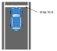
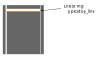
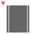

## Category:Stop Line

---

### vm-02-01 Stop line alignment

#### Detail of requirements <!-- omit in toc -->

Place the Linestring (_type:stop_line_) for the stop line on the edge on the side before the white line.

Refer to [Web.Auto Documentation - Creation and edit of a stop point (StopPoint)](https://docs.web.auto/en/user-manuals/vector-map-builder/how-to-use/edit-maps#creation-and-edit-of-a-stop-point-stoppoint) for the method of creation in Vector Map Builder.

#### Preferred vector map <!-- omit in toc -->

#### Incorrect vector map <!-- omit in toc -->

---

### vm-02-02 Stop sign

#### Detail of requirements <!-- omit in toc -->

Where there is no stop line on the road but a stop sign exists, place a Linestring as the stop line next to the sign.

Create a reference from a Lanelet (_subtype:road_) to a Regulatory Element (_subtype:traffic_sign_), and have this Regulatory Element refer to a Linestring (_type:stop_line_) and a Linestring (_type:traffic_sign, subtype:stop_sign)_.

#### Preferred vector map <!-- omit in toc -->

#### Incorrect vector map <!-- omit in toc -->

None in particular.

#### Related Autoware module

- [Stop Line design - Autoware Universe Documentation](https://autowarefoundation.github.io/autoware.universe/main/planning/behavior_velocity_planner/autoware_behavior_velocity_stop_line_module/)