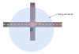
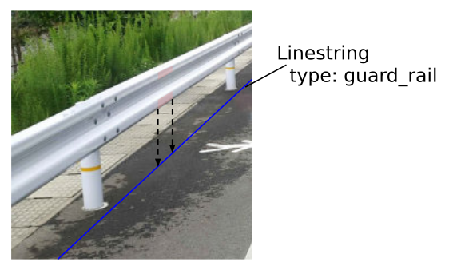
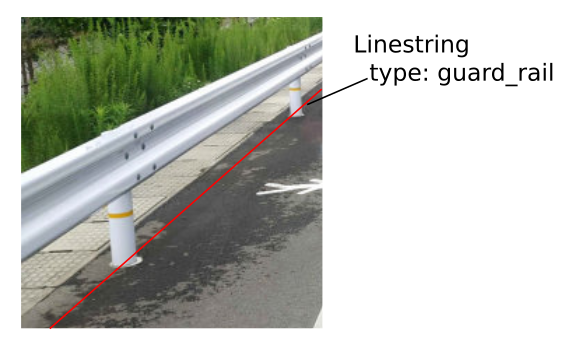

## Category:Others

---

### vm-07-01 Vector Map creation range

#### Detail of requirements <!-- omit in toc -->

Create all Lanelets within the sensor range of the vehicle, even those on roads not driven by the vehicle, including Lanelets that intersect with the vehicle's Lanelet.

However, if the following conditions are met, the range you must create lanelets is 10 meters at least.

- The vehicle drives on the priority lane through the intersection without traffic lights.
- The vehicle drives straight or turn left through the intersection with traffic lights

Refer to [vm-03-04](./category_intersection.md#vm-03-04-lanelet-creation-in-the-intersection) for more about intersection requirements.

##### Behavior of Autoware： <!-- omit in toc -->

Autoware detects approaching vehicles and plans a route to avoid collisions.

##### Caution

Check the range of sensors on your vehicle.

#### Preferred vector map <!-- omit in toc -->

#### Incorrect vector map <!-- omit in toc -->

---

### vm-07-02 Range of detecting pedestrians who enter the road

#### Detail of requirements <!-- omit in toc -->

Autoware's feature for detecting sudden entries from the roadside tracks pedestrians and cyclists beyond the road boundaries, decelerating to prevent collisions when emergence into the road is likely.

Setting up a linestring of the following type instructs Autoware to disregard those positioned outside the line as not posing pop-out risks.

- guard_rail
- wall
- fence

#### Preferred vector map <!-- omit in toc -->

#### Incorrect vector map <!-- omit in toc -->

None in particular.

#### Related Autoware module

- [map_based_prediction - Autoware Universe Documentation](https://autowarefoundation.github.io/autoware.universe/main/perception/autoware_map_based_prediction/)

---

### vm-07-03 Guardrails, guard pipes, fences

#### Detail of requirements <!-- omit in toc -->

When creating a Linestring for guardrails or guard pipes (_type: guard_rail_), position it at the point where the most protruding part on the roadway side is projected vertically onto the ground.

Follow the same position guidelines for Linestrings of fences (_type:fence_).

#### Preferred vector map <!-- omit in toc -->

#### Incorrect vector map <!-- omit in toc -->

#### Related Autoware module

- [Drivable Area design - Autoware Universe Documentation](https://autowarefoundation.github.io/autoware.universe/main/planning/behavior_path_planner/autoware_behavior_path_planner_common/docs/behavior_path_planner_drivable_area_design/)

---

### vm-07-04 Ellipsoidal height

#### Detail of requirements <!-- omit in toc -->

The height of a Point should be based on the ellipsoidal height (WGS84), in meters.

#### Preferred vector map <!-- omit in toc -->

The height of a Point is the distance from the ellipsoidal surface to the ground.

#### Incorrect vector map <!-- omit in toc -->

The height of a Point is Orthometric height, the distance from the Geoid to the ground.
