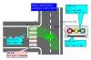

## Category:Traffic Light

---

### vm-04-01 Traffic light basics

#### Detail of requirements <!-- omit in toc -->

When creating traffic lights in a vector map, meet the following requirements:

- Road Lanelet (_subtype:road_). Quantity: one.
- Traffic Light. Multiple instances possible.
  - Traffic light Linestring (_type:traffic_light_).
  - Traffic light bulbs Linestring (_type:light_bulbs_).
  - Stop line Linestring (_type:stop_line_).
- Regulatory element for traffic lights (_subtype:traffic_light_). Referenced by the road Lanelet and references both the traffic light (_traffic_light_, _light_bulbs_) and stop line (_stop_line_). Quantity: one.

Refer to [Web.Auto Documentation - Creation of a traffic light and a stop line](https://docs.web.auto/en/user-manuals/vector-map-builder/how-to-use/edit-maps#creation-of-a-traffic-light-and-a-stop-line) for the method of creation in Vector Map Builder.

Refer to vm-04-02 and vm-04-03 for the specifications of traffic light and traffic light bulb objects.

#### Preferred vector map <!-- omit in toc -->

If there is a crosswalk at the intersection, arrange for the road's Lanelet and the crosswalk's Lanelet to intersect and overlap.

#### Related Autoware module

- [Traffic Light design - Autoware Universe Documentation](https://autowarefoundation.github.io/autoware.universe/main/planning/behavior_velocity_planner/autoware_behavior_velocity_traffic_light_module/)

---

### vm-04-02 Traffic light position and size

#### Detail of requirements <!-- omit in toc -->

Create traffic lights with Linestring.

- _type:traffic_light_
- _subtype:red_yellow_green_ (optional)

Create the Linestring's length (from start to end points) precisely aligned with the traffic light's bottom edge. Ensure the traffic light's positional height is correctly represented in the Linestring's 3D coordinates.

Use _tag:height_ for the traffic light's height, e.g., for 50cm, write _tag:height=0.5_. Note that this height indicates the size of the traffic light, not its position.

##### Supplemental information <!-- omit in toc -->

Autoware currently ignores subtype _red_yellow_green_.

#### Preferred vector map <!-- omit in toc -->

#### Incorrect vector map <!-- omit in toc -->

None in particular.

#### Related Autoware module

- [Traffic Light design - Autoware Universe Documentation](https://autowarefoundation.github.io/autoware.universe/main/planning/behavior_velocity_planner/autoware_behavior_velocity_traffic_light_module/)

---

### vm-04-03 Traffic light lamps

#### Detail of requirements <!-- omit in toc -->

To enable the system to detect the color of traffic lights, the color scheme and arrangement must be accurately created as objects. Indicate the position of the lights with Points. For colored lights, use the _color_ tag to represent the color. For arrow lights, use the _arrow_ tag to indicate the direction.

- _tag: color = red, yellow, green_
- _tag: arrow = up, right, left, up_light, up_left_

Use the Points of the lights when creating a Linestring.

- _type: light_bulbs_

#### Preferred vector map <!-- omit in toc -->

The order of the lights' Points can be 1→2→3→4 or 4→3→2→1, either is acceptable.

#### Incorrect vector map <!-- omit in toc -->

None in particular.

#### Related Autoware module

- [Traffic Light design - Autoware Universe Documentation](https://autowarefoundation.github.io/autoware.universe/main/planning/behavior_velocity_planner/autoware_behavior_velocity_traffic_light_module/)
