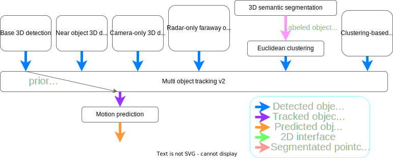
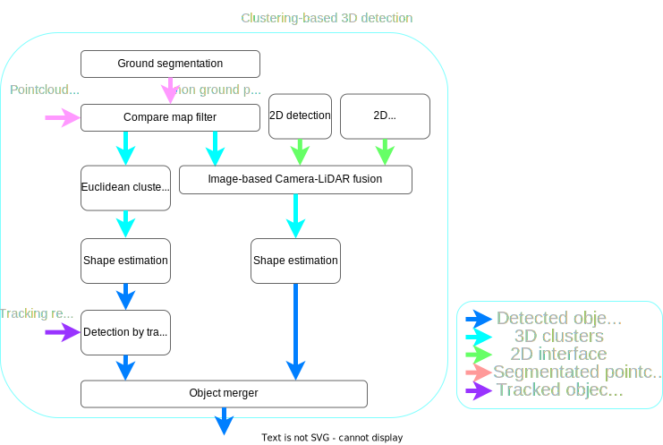
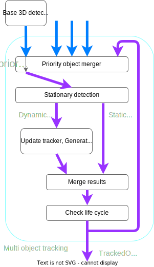
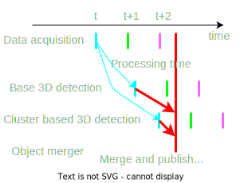
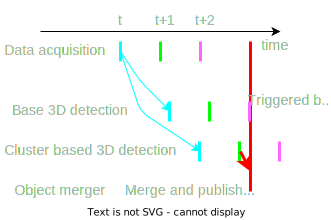

# Perception Component Reference Implementation Design

## Purpose of this document

This document outlines detailed design of the reference implementations. This allows developers and users to understand what is currently available with the Perception Component, how to utilize, expand, or add to its features.

## Whole architecture

This diagram describes the architecture of the reference implementation.

The Perception component consists of the following sub-components:

- **Obstacle Segmentation**: Identifies point clouds originating from obstacles(not only dynamic objects but also static obstacles that should be avoided, such as stationary obstacles) that the ego vehicle should avoid. For example, construction cones are recognized using this module.
- **Occupancy Grid Map**: Detects blind spots (areas where no information is available and where dynamic objects may jump out).
- **Object Recognition**: Recognizes dynamic objects surrounding the ego vehicle in the current frame and predicts their future trajectories.
  - **Detection**: Detects the pose and velocity of dynamic objects such as vehicles and pedestrians.
    - **Detector**: Triggers object detection processing frame by frame.
    - **Interpolator**: Maintains stable object detection. Even if the output from Detector suddenly becomes unavailable, Interpolator uses the output from the Tracking module to maintain the detection results without missing any objects.
  - **Tracking**: Associates detected results across multiple frames.
  - **Prediction**: Predicts trajectories of dynamic objects.
- **Traffic Light Recognition**: Recognizes the colors of traffic lights and the directions of arrow signals.

### Internal interface in the perception component

- **Obstacle Segmentation to Object Recognition**
  - Point Cloud: A Point Cloud observed in the current frame, where the ground and outliers are removed.
- **Obstacle Segmentation to Occupancy Grid Map**
  - Ground filtered Point Cloud: A Point Cloud observed in the current frame, where the ground is removed.
- **Occupancy Grid Map to Obstacle Segmentation**
  - Occupancy Grid Map: This is used for filtering outlier.

## Architecture for object recognition

### Base 3D Detection

Autoware primarily uses ML-based methods for 3D detection, referred to as **Base 3D Detection**.
Available methods include:

- [CenterPoint](https://github.com/autowarefoundation/autoware.universe/tree/main/perception/autoware_lidar_centerpoint)
- [TransFusion-L](https://github.com/autowarefoundation/autoware.universe/tree/main/perception/autoware_lidar_transfusion)
- [BEVFusion-L](https://github.com/autowarefoundation/autoware_universe/tree/main/perception/autoware_bevfusion)
- [Apollo instance segmentation](https://github.com/autowarefoundation/autoware.universe/tree/main/perception/autoware_lidar_apollo_instance_segmentation) + [shape estimation](https://github.com/autowarefoundation/autoware.universe/tree/main/perception/autoware_shape_estimation)

The detection range for `Base 3D Detection` typically falls between 90m and 120m, depending on the specific case.
If you wish to use Camera-LiDAR fusion, models like BEVFusion-CL (the model of Camera-LiDAR fusion) can be integrated.
However, since `Base 3D Detection` is a critical component of the new architecture, stable performance is essential.
Therefore, we do not recommend using Camera-LiDAR fusion methods in environments where sensor data frequently drops.

### Near-Object 3D Detection

As optional method for detection to enhance detection of nearby objects, especially pedestrians and cyclists, we have introduced **Near-Object 3D Detection**.
This can serve as a supplementary detection method alongside `Base 3D Detection`.

We primarily use ML-based methods like CenterPoint for near-object detection, which excels at detecting small objects.
By applying higher-resolution voxel grids in the ML model, we improve detection accuracy for small objects.
The detection range typically falls between 30m and 50m.

### (TBD) Camera-Only 3D Detection

As optional method for detection to improve detection of objects that LiDAR-based methods struggle with, we have introduced **Camera-Only 3D Detection**.
`Camera-Only 3D detection` aims to solve the cases that are difficult to detect with LiDAR-based methods.
For example, `Camera-Only 3D detection` will deal with detection of objects with tree occlusion and long-distance recognition.

Note that we will apply a high-confidence threshold to suppress the impact of false positives in `Camera-Only 3D Detection`.

### Radar-Only Faraway Object 3D Detection

For enhanced detection of distant objects, we use **Radar-Only 3D Detection**.
For more details, see [the document on faraway radar object detection](https://github.com/autowarefoundation/autoware-documentation/blob/main/docs/design/autoware-architecture/perception/reference-implementations/radar-based-3d-detector/faraway-object-detection.md).

### (TBD) 3D Semantic Segmentation

To improve detection of objects that are difficult to detect using traditional 3D detection methods, especially vegetation and traffic cone, we will implement **3D Semantic Segmentation**.
`3D Semantic Segmentation` provides non-ground point clouds and labeled pointcloud for some objects and vegetation.

Available methods include:

- FRNet (TBD)

To integrate with the Autoware interface, we use a euclidean clustering method for processing 3D segmentation outputs.

### Cluster-Based 3D Detection

To enhance detection of objects that LiDAR-based methods may struggle with, we offer **Cluster-Based 3D Detection**.
`Cluster-Based 3D Detection` consists of many nodes, and the pipeline shows as following.

`Cluster-Based 3D Detection` is based on euclidean clustering including roi based pointcloud fusion.
Its process combines non-ground LiDAR point clouds with the results of 2D detection or semantic segmentation.
This can be used as supplementary detection alongside `Base 3D Detection`.

Note that as the data from point clouds and images increase, the processing time also increases.
Therefore, we recommend avoiding this pipeline in situations where processing time is critical or use for only narrow detection range.

### Multi-Object Tracking v2

**Multi-Object Tracking v2** is based on existing [multi_object_tracker](https://github.com/autowarefoundation/autoware.universe/tree/main/perception/autoware_multi_object_tracker) and illustrated below:

The key features are as follows.

- **Priority Object Merger**

`Priority Object Merger` introduces new features compared to the existing [object_merger](https://github.com/autowarefoundation/autoware.universe/tree/main/perception/autoware_object_merger).
`Priority Object Merger` can handle multiple inputs, reducing the need for multiple `object_merger` nodes.
It leads to be easy to debug.

The existing `object_merger` uses approximate synchronization via message filters, introducing time delays.
As the amount of input data increases, which makes the delay, impacting the availability of autonomous driving.
Additionally, if some detections fail, the merger fails to combine the results, reducing availability.

The `Priority Object Merger` eliminates the message filter and uses a priority-based approach for the main detection.
When subscribing to the output of the main detection, it gathers all outputs from the detection pipeline.
It gathers outputs from all detections, ensuring that even if a secondary detection fails, results from other detections can still be merged, improving overall reliability and availability.

- **Stationary detection**

As input data volume increases, processing time also increases.
To optimize performance, we reduce computational cost by incorporating stationary object detection.
