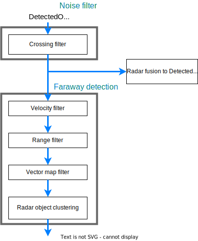

# Radar faraway dynamic objects detection with radar objects

## Overview

This diagram describes the pipeline for radar faraway dynamic object detection.

## Supported function
### Crossing filter

- [radar_crossing_objects_noise_filter](https://github.com/autowarefoundation/autoware.universe/tree/main/perception/radar_crossing_objects_noise_filter)

This package can filter the noise objects crossing to the ego vehicle, which is most likely ghost objects.

### Velocity filter

- [object_velocity_splitter](https://github.com/autowarefoundation/autoware.universe/tree/main/perception/object_velocity_splitter)

Static objects include many noise like the objects reflected from ground.
In many cases for radars, dynamic objects can be detected stably.
To filter static objects, `object_velocity_splitter` can be used.

### Range filter

- [object_range_splitter](https://github.com/autowarefoundation/autoware.universe/tree/main/perception/object_range_splitter)

For some radars, ghost objects sometimes occur for near objects.
To filter these objects, `object_range_splitter` can be used.

### Vector map filter

- [object-lanelet-filter](https://github.com/autowarefoundation/autoware.universe/blob/main/perception/detected_object_validation/object-lanelet-filter.md)

In most cases, vehicles drive in drivable are.
To filter objects that are out of drivable area, `object-lanelet-filter` can be used.
`object-lanelet-filter` filter objects that are out of drivable area defined by vector map.

Note that if you use `object-lanelet-filter` for radar faraway detection, you need to define drivable area in a vector map other than the area where autonomous car run.

### Radar object clustering

- [radar_object_clustering](https://github.com/autowarefoundation/autoware.universe/tree/main/perception/radar_object_clustering)

This package can combine multiple radar detections from one object into one and adjust class and size.
It can suppress splitting objects in tracking module.

## Note
### Parameter tuning

Detection performed only by Radar applies various strong noise processing.
Therefore, there is a trade-off that if you strengthen the noise processing, things that you originally wanted to detect will disappear, and if you weaken it, your self-driving system will be unable to start because the object will be in front of you all the time due to noise.
It is necessary to adjust parameters while paying attention to this trade-off.

### Limitation

- Elevated railway, vehicles for multi-level intersection

If you use 2D radars (The radar can detect in xy-axis 2D coordinate, but can not have z-axis detection) and driving area has elevated railway or vehicles for multi-level intersection, the radar process detects these these and these have a bad influence to planning results.
In addition, for now, elevated railway is detected as vehicle because the radar process doesn't have label classification feature and it leads to unintended behavior.
