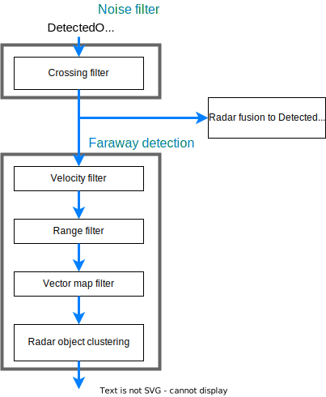

# Radar based 3D detector

## Overview

### Features

Radar based 3D detector aims for the following.

- Detect objects farther than the range of LiDAR-based 3D detection.

Since radar can acquire data from a longer distance than LiDAR (> 100m), when the distance of LiDAR-based 3D detection is insufficient, the radar base 3D detector can be applied.
The detection distance of radar based 3D detection depends on the radar device specification.

- Improve velocity estimation for dynamic objects

Radar can get velocity information and estimate more precise twist information by fused between the objects from LiDAR-based 3D detection radar information.
This can lead to improve for the performance of object tracking/prediction and planning like adaptive cruise control.

### Whole pipeline

Radar based 3D detector with radar objects consists of

- 3D object detection with Radar pointcloud
- Noise filter
- Faraway dynamic 3D object detection
- Radar fusion to LiDAR-based 3D object detection
- Radar object tracking
- Merger of tracked object

### Interface

- Input
    - Message type for pointcloud is `ros-perception/radar_msgs/msg/RadarScan.msg`
    - Message type for radar objects is `autoware_auto_perception_msgs/msg/DetectedObject`.
        - Input objects need to be concatenated.
        - Input objects need to be compensated with ego motion.
        - Input objects need to be transformed to `base_link`.
- Output
    - Tracked objects

## Module

### Radar pointcloud 3D detection

!!! warning

    Under Construction

### Noise filter and radar faraway dynamic 3D object detection

This function filters noise objects and detects faraway (> 100m) dynamic vehicles.
The main idea is that in the case where LiDAR is used, near range can be detected accurately using LiDAR pointcloud and the main role of radar is to detect distant objects that cannot be detected with LiDAR alone.
In detail, please see [this document](faraway-object-detection.md)

### Radar fusion to LiDAR-based 3D object detection

- [radar_fusion_to_detected_object](https://github.com/autowarefoundation/autoware.universe/tree/main/perception/radar_fusion_to_detected_object)

This package contains a sensor fusion module for radar-detected objects and 3D detected objects. The fusion node can:

- Attach velocity to 3D detections when successfully matching radar data. The tracking modules use the velocity information to enhance the tracking results while planning modules use it to execute actions like adaptive cruise control.
- Improve the low confidence 3D detections when corresponding radar detections are found.

### Radar object tracking

!!! warning

    Under Construction

### Merger of tracked object

!!! warning

    Under Construction

## Appendix
### Customize own radar interface

The perception interface of Autoware is defined to `DetectedObjects`, `TrackedObjects`, and `PredictedObjects`, however, other message is defined by own cases. For example, [DetectedObjectWithFeature](https://github.com/tier4/tier4_autoware_msgs/tree/tier4/universe/tier4_perception_msgs/msg/object_recognition) is used by customized message in perception module.

Same as that, you can adjust new radar interface.
For example, `RadarTrack` doesn't have orientation information [from past discussions](https://github.com/ros-perception/radar_msgs/pull/3), especially [this discussion](https://github.com/ros-perception/radar_msgs/pull/3#issuecomment-661599741).
If you want orientation information, you can adapt radar ROS driver to publish directly to `TrackedObject`.
