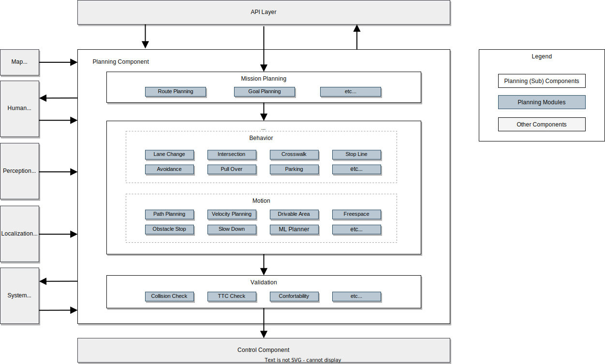
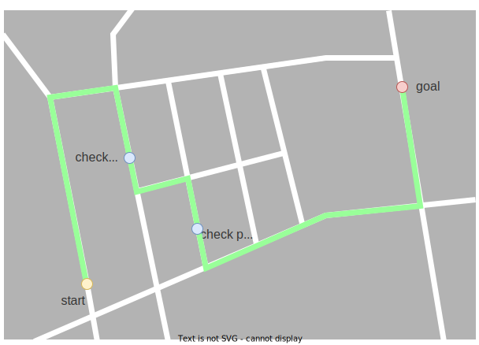

# Planning component design
<!-- 
- discussionsはトレードオフ選定とかにしたい
- サードパーティによって拡張というよりは、誰でも拡張できるって言い回しのほうが良いはず
- mission plannerの使われ方を重点的に考えよう。FMSとして機能が外だしされることがあるから、これは別れてるのよ。
- ハイレベルなデザインと詳細なデザインではなく、アーキテクチャのためのデザイン（要求ベース、これがやりたい）と、アーキテクチャ（詳細なフロー）ができるはず。
- デザインの部分に、ポリシーによる変更がわかるような書き方があると良い。ポリシーA（右側走行）になったときに、いくつかのモジュールが特定の設定で起動する。どう図にするか。。。
- このポリシーに対して、何がどうかわるかという例があるといい。自動運転レベルが変わったときに、HMIとの連携がこう変わって、軌道モジュールがこう変わる、とか。
- ハイレベルに対するユースケースを上げる
- 車両の振る舞いのユースケース
  - 話ゴールやチェくポイント、NGポイントを与えてplanning内部でルートを計算して進む / 渋滞情報を加味したルートを外部から与えて走行する
開発者のユースケース
  - 中の作りの話（実装や設計レベル）：機能の差し替えができていてほしいので（レーンチェンジAとレーンチェンジBとか）、柔軟に変更できる必要があり、各機能はモジュールとして実装される。
 -->

## Context and scope

自動運転システムにおける Planning コンポーネントの役割は、与えられたミッションを満たすために、安全で交通ルールに基づいた自動運転車両の目標軌道（経路と速度）を生成することである。

このドキュメントではAutowareにおけるplanningの要求やデザインをまとめる。これによって、開発者はplanning Componentがどのような考えで設計されているのか、およびそれらをどう拡張させていくのかを理解することができます。

ドキュメントの前半ではハイレベルな要求やデザインを、後半は実際の実装や提供機能について述べる。

## Goals and non-goals

我々の目標は、純粋な自動運転システムの開発ではなく、自動運転"プラットフォーム"の開発である。このプラットフォームでは、誰もが自動運転の機能を自由に拡張できる。

Autowareではこのプラットフォーム観点から [microautonomy architecture](https://autowarefoundation.github.io/autoware-documentation/main/design/autoware-concepts) の概念を提唱しています。Microautonomyとは、適切な機能のモジュール化やインターフェースの明確な定義に基づき、高い拡張性を焦点を当てた自動運転システムの設計コンセプトです。

これを踏まえ、Planning component の設計方針は、世の中のすべての複雑な自動運転のユースケースを解決することではなく（なぜならそれは非常に難しい問題なので）、**ユーザーのニーズに合わせてカスタマイズでき、誰でも容易に機能拡張が可能なPlanning開発プラットフォームを提供すること** に設定されています。我々が提供するプラットフォームが様々なニーズに対する拡張性を獲得した結果、最終的に多くの複雑なユースケースが解決できるようになると信じています。

この方針を明確にするため、以下に Goal と Non-Goal をリスト化します。

**Goals:**

- **自動運転の走行に必要な最低限の基本機能を持つこと**
  - Planning Componentは機能拡張以前に、自動運転のために必須な機能を提供する必要があります。これは走る、止まる、曲がるといった基本計画に加え、比較的安全な状況での車線変更や信号停止などの機能が含まれます。
- **提供機能はモジュール化されており、誰でも機能の再利用や拡張が可能であること** 
  - これはユーザーが期待するODDに対し、拡張機能によって対応できることを意味します。プラグインのような形で誰でも機能拡張ができれば、それぞれのニーズ（Lv4/Lv2自動運転、公道/私道走行、大型車両、小型ロボットなど）にあったシステムが提供できます。
  - ユーザーのニーズには、純粋な自動運転としての性能ではなく、限定されたODD（例えば障害物のない管理された私道）において可能な限り消費電力を下げることなども含まれます。この場合はモジュールをdisableさせることによって、この場合はODDを限定させる代わりに、処理負荷を下げられるようにする必要があります。
- **人間のオペレータによって能力が拡張できること** 
  - オペレータによる補助も機能拡張の一つです。これにより、非常に複雑で困難なユースケースにおいても、人間の補助という機能拡張で対応できることを意味します。ここで具体的なオペレータの種類は定義しません。研究フェーズにおいては車に同乗している人かもしれませんし、自動運転サービス提供者にとっては非常時にのみ繋がる遠隔オペレータかもしれません。

**Non-goals:**

Planning Componentは third-partyのモジュールによって機能拡張されることを想定しています。したがって、以下はAutowareのPlanning Component単体の目標から除外されます。

- ユーザーが必要とする機能の全てをAutoware単独で提供すること 
- 自動運転としての完全な機能と性能
- 人間の性能を常に上回る性能
- 「絶対に衝突しない」という機能

なお、「絶対に衝突しない」といった性能は現在の目標ではありませんが、外部モジュールとの連携や将来の強化によってそのような状態を達成できるようなアーキテクチャを作成することは我々の目標です。そしてこれらの要求は自動運転プラットフォームの視点から来ているものであり、一般的な自動運転システムにおけるPlanning Componentへの要求としては一般的では無いかもしれません。

<!-- ## Requirements

WIP

## Assumptions

WIP -->

## High level design

このダイアグラムはPlanning Componentのハイレベルなアーキテクチャを示している。なお、これは理想的なハイレベルデザインであり、現時点での実装がこれに従っていないこともあることに注意する。実際の詳細な実装は後半を参照のこと。

<!--  -->

Planning コンポーネントはいくつかのサブコンポーネントからなります。

- **Mission Planning**: 地図情報をもとに、自動運転ミッションの設定や現在位置からゴールまでのルートを計算を行います。
- **Planning Modules**: 定められたミッションに対し、目標軌道やウインカーなどの自車の振る舞いの計画を行います。このサブコンポーネントは機能を担当するいくつかのモジュールから成ります。これらのモジュールは便宜上、BehaviorとMotionの2つに分けられています。
  - **Behavior Planner**: 交通ルールや安全を考慮して適切な経路を計算します。
  - **Motion Planner**: Behavior Plannerと連携し、車両運動や乗り心地を考慮した目標軌道を計算します。
- **Validation**: 計算された目標軌道を検証し、安全性の担保や緊急時の振る舞いを担います。

ここでは microautonomy アーキテクチャに従い、モジュール型のシステムフレームワークを採用しています。planningの機能はモジュールとして実装され、これらのモジュールは与えられたユースケースに応じて動的/静的にload/unloadされます。これらには例えば、レーンチェンジ、交差点、横断歩道モジュールなどのモジュールが含まれています。

### Remarkable points

このハイレベルデザインにおいて、Goalsに対する重要な設計として、以下を挙げます。

#### Modulation of each function

ルート生成や車線変更や交差点、横断歩道などPlanningに必要な機能はモジュールとして管理されます。これらのモジュールに対してはある程度共通化されたインターフェースが提供され、それに従うことによって誰でもモジュールの追加や拡張を行うことができます。詳細なインターフェースは後述。

#### Separation of Mission Planning sub-component

Mission Planningの役割は、FMS（Fleet Management System）などの既存サービスの代替になるものです。ハイレベルで定義されたMission Planningのインターフェースに従うことにより、これらthird-party機能との連携を容易に行うことができます。

#### Separation of Validation sub-component

誰でも容易に拡張できるというPlanning Componentの性質の背反として、全ての機能それぞれにおいて期待されるレベルの安全性を担保することは困難です。PlanningのValidation機能は実際に経路計画などを行うモジュールからは分離して管理され、モジュールに任意の変更があった場合にも一定のレベルの安全を担保できるように設計されています。

#### Interface for HMI (Human Machine Interface)

Human Machine Interfaceとの連携は、人間オペレータとの連携を円滑に行うために必要不可欠なものです。このComponent間のインターフェースを介して、同乗オペレータや遠隔監視システムとの連携を可能にします。

#### Trade-offs for the separation of planning and other components

Autowareの全体設計の話ではあるが、Planningを孤立したComponentとして設計することにおいても注意するべきトレードオフが存在します。planning、perception、localization、controlなどのコンポーネントを分離して開発することで、サードパーティ製のコンポーネントとの連携が容易になります。しかし、ここではパフォーマンスと拡張性の間にトレードオフがあります。例えば、perception コンポーネントは理想的には planning コンポーネントが必要とするオブジェクトだけを認識すれば十分ですが、コンポーネントを分離することでそのような密接なコミュニケーションが難しくなり、不要なオブジェクトに対しても処理を実行する必要があります。また、計画と制御を分離すると、計画時に車両の運動性能を考慮することが難しくなるという性能面の欠点があります。これを補うためには、インターフェースの情報量を増やすか、計算負荷を増やすなど対応が必要になります。

## How to extend/corporate with new features (WIP)

Planning Componentのデザインの最も重要な機能の一つが、外部モジュールとの連携です。以下の図に示すように外部の機能を組み込む際にはいくつかの方法があります。

### Planning Componentに新たなモジュールを追加する

ユーザーはモジュールとして作成されたPlanningの機能を置き換えたり、機能追加をすることができます。これは最も一般的な機能の拡張方法です。これによって、求めるODDにおいて不足している機能を追加したり、逆に既存の機能をよりシンプルなものに変更したりすることができます。

ただし、この機能追加を行うためには、各モジュールのインターフェースが適切に整理されている必要があります。2023.11現在ではこのような理想的なモジュールの仕組みは提供されておらず、いくつかの制限を含んでいます。詳細は Reference Implementationの [How to add new modules in the current implementation](#how-to-add-new-modules-in-the-current-implementation) を確認してください。

### Planningのサブコンポーネントを置き換える

いくつかのユーザーは、サブコンポーネントレベルでの連携・拡張を行うことに興味があるでしょう。これは例えば、Mission Planningを既存のFMSサービスと置き換えたり、既存のValidation機能は使いつつ経路生成の機能を third-party製のもの置き換えるといった要求に該当します。

後に説明される [Internal interface in the planning component](#internal-interface-in-the-planning-component) に従えば、サブコンポーネントレベルでの連携・拡張を行うことが可能です。既存のplanningの機能との複雑な連携はできませんが、一部のplanning componentの機能と外部モジュールとの連携が可能に成ります。

### Planning Component全体を置き換える

自動運転のPlanningシステムを開発している企業や研究室などは、自社のPlanning製品をAutowareのPerceptionやControlモジュールと連携させ、自動運転システム全体の評価を行うことに関心があるでしょう。これはPlanning全体を置き換えることによって可能となります。Component間で定義される、おそらく最も堅牢で安定したインターフェースに従えば簡単に置き換えが可能です。ただし、既存のplanningモジュールとの連携はできません。

## Component interface

This section describes the inputs and outputs of the Planning Component and of its internal modules. See the [Planning Component Interface](../../autoware-interfaces/components/planning.md) page for the current implementation.

### Input to the planning component

- **From Map**
  - Vector map: Contains all static information about the environment, including lane connection information for route planning, lane geometry for generating a reference path, and traffic rule-related information.
- **From Perception**
  - Detected object information: Provides real-time information about objects that cannot be known in advance, such as pedestrians and other vehicles. The Planning Component plans maneuvers to avoid collisions with these objects.
  - Detected obstacle information: Supplies real-time information about the location of obstacles, which is more primitive than Detected Object and used for emergency stops and other safety measures.
  - Occupancy map information: Offers real-time information about the presence of pedestrians and other vehicles and occluded area information.
  - Traffic light recognition result: Provides the current state of each traffic light in real time. The Planning Component extracts relevant information for the planned path and determines whether to stop at intersections.
- **From Localization**
  - Vehicle motion information: Includes the ego vehicle's position, velocity, acceleration, and other motion-related data.
- **From System**
  - Operation mode: Indicates whether the vehicle is operating in Autonomous mode.
- **From Human Machine Interface (HMI)**
  - Feature execution: Allows for executing/authorizing autonomous driving operations, such as lane changes or entering intersections, by human operators.
- **From API Layer**
  - Goal: Represents the final position that the Planning Component aims to reach.
  - Checkpoint: Represents a midpoint along the route to the destination. This is used during route calculation.
  - Velocity limit: Sets the maximum speed limit for the vehicle.

### Output from the planning component

- **To Control**
  - Trajectory: Provides a smooth sequence of pose, twist, and acceleration that the Control Component must follow. The trajectory is typically 10 seconds long with a 0.1-second resolution.
  - Turn Signals: Controls the vehicle's turn indicators, such as right, left, hazard, etc. based on the planned maneuvers.
- **To System**
  - Diagnostics: Reports the state of the Planning Component, indicating whether the processing is running correctly and whether a safe plan is being generated.
- **To Human Machine Interface (HMI)**
  - Feature execution availability: Indicates the status of operations that can be executed or are required, such as lane changes or entering intersections.
  - Trajectory candidate: Shows the potential trajectory that will be executed after the user's execution.
- **To API Layer**
  - Planning factors: Provides information about the reasoning behind the current planning behavior. This may include the position of target objects to avoid, obstacles that led to the decision to stop, and other relevant information.

### Internal interface in the planning component

- **Mission Planning to Scenario Planning**
  - Route: Offers guidance for the path that needs to be followed from the starting point to the destination. This path is determined based on information such as lane IDs defined on the map. At the route level, it doesn't explicitly indicate which specific lanes to take, and the route can contain multiple lanes.
- **Behavior Planning to Motion Planning**
  - Path: Provides a rough position and velocity to be followed by the vehicle. These path points are usually defined with an interval of about 1 meter. Although other interval distances are possible, it may impact the precision or performance of the planning component.
  - Drivable area: Defines regions where the vehicle can drive, such as within lanes or physically drivable areas. It assumes that the motion planner will calculate the final trajectory within this defined area.
- **Scenario Planning to Validation**
  - Trajectory: Defines the desired positions, velocities, and accelerations which the Control Component will try to follow. Trajectory points are defined at intervals of approximately 0.1 seconds based on the trajectory velocities.
- **Validation to Control Component**
  - Trajectory: Same as above but with some additional safety considerations.

## Detailed design

### Supported features

| Feature                                      | Description                                                                                                                                                                                                                                                                                                                                                                                                                                                                                                                                                                                                                                                                                                                                                                                                                                        | Requirements                                                                | Figure                                                                          |
| -------------------------------------------- | -------------------------------------------------------------------------------------------------------------------------------------------------------------------------------------------------------------------------------------------------------------------------------------------------------------------------------------------------------------------------------------------------------------------------------------------------------------------------------------------------------------------------------------------------------------------------------------------------------------------------------------------------------------------------------------------------------------------------------------------------------------------------------------------------------------------------------------------------- | --------------------------------------------------------------------------- | ------------------------------------------------------------------------------- |
| Route Planning                               | Plan route from the ego vehicle position to the destination.    Reference implementation is in [Mission Planner](https://autowarefoundation.github.io/autoware.universe/main/planning/mission_planner/), enabled by launching the `mission_planner` node.                                                                                                                                                                                                                                                                                                                                                                                                                                                                                                                                                                                    | - Lanelet map (driving lanelets)                                            |                      |
| Path Planning from Route                     | Plan path to be followed from the given route.     Reference implementation is in [Behavior Path Planner](https://autowarefoundation.github.io/autoware.universe/main/planning/behavior_path_planner/).                                                                                                                                                                                                                                                                                                                                                                                                                                                                                                                                                                                                                                      | - Lanelet map (driving lanelets)                                            |                            |
| Obstacle Avoidance                           | Plan path to avoid obstacles by steering operation.     Reference implementation is in [Avoidance](https://autowarefoundation.github.io/autoware.universe/main/planning/behavior_path_planner/docs/behavior_path_planner_avoidance_design/), [Obstacle Avoidance Planner](https://autowarefoundation.github.io/autoware.universe/main/planning/obstacle_avoidance_planner/). Enable flag in parameter: `launch obstacle_avoidance_planner true`     [Demonstration Video](https://youtu.be/A_V9yvfKZ4E)                                                                                                                                                                                                          | - objects information                                                       |                       |
| Path Smoothing                               | Plan path to achieve smooth steering.     Reference implementation is in [Obstacle Avoidance Planner](https://autowarefoundation.github.io/autoware.universe/main/planning/obstacle_avoidance_planner/).     [Demonstration Video](https://youtu.be/RhyAF26Ppzs)                                                                                                                                                                                                                                                                                                                                                                                                                                                 | - Lanelet map (driving lanelet)                                             |                      |
| Narrow Space Driving                         | Plan path to drive within the drivable area. Furthermore, when it is not possible to drive within the drivable area, stop the vehicle to avoid exiting the drivable area.     Reference implementation is in [Obstacle Avoidance Planner](https://autowarefoundation.github.io/autoware.universe/main/planning/obstacle_avoidance_planner/).     [Demonstration Video](https://youtu.be/URzcLO2E1vY)                                                                                                                                                                                                                                                                                                             | - Lanelet map (high-precision lane boundaries)                              |          |
| Lane Change                                  | Plan path for lane change to reach the destination.     Reference implementation is in [Lane Change](https://autowarefoundation.github.io/autoware.universe/main/planning/behavior_path_planner/docs/behavior_path_planner_lane_change_design/).     [Demonstration Video](https://youtu.be/0jRDGQ84cD4)                                                                                                                                                                                                                                                                                                                                                                                                         | - Lanelet map (driving lanelets)                                            |                            |
| Pull Over                                    | Plan path for pull over to park at the road shoulder.     Reference implementation is in [Goal Planner](https://autowarefoundation.github.io/autoware.universe/main/planning/behavior_path_planner/docs/behavior_path_planner_goal_planner_design/).     Demonstration Videos:   [Simple Pull Over](https://youtu.be/r3-kAmTb4hc)      [Arc Forward Pull Over](https://youtu.be/ornbzkWxRWU)      [Arc Backward Pull Over](https://youtu.be/if-0tG3AkLo)    | - Lanelet map (shoulder lane)                                               |                                |
| Pull Out                                     | Plan path for pull over to start from the road shoulder.     Reference implementation is in [Pull Out Module](https://autowarefoundation.github.io/autoware.universe/main/planning/behavior_path_planner/docs/behavior_path_planner_start_planner_design/#:~:text=WIP-,Path%20Generation,-%23).     Demonstration Video:   [Simple Pull Out](https://youtu.be/xOjnPqoHup4)      [Backward Pull Out](https://youtu.be/iGieijPcPcQ)                                                                                                                                                    | - Lanelet map (shoulder lane)                                               |                                  |
| Path Shift                                   | Plan path in lateral direction in response to external instructions.     Reference implementation is in [Side Shift Module](https://autowarefoundation.github.io/autoware.universe/main/planning/behavior_path_planner/docs/behavior_path_planner_side_shift_design/).                                                                                                                                                                                                                                                                                                                                                                                                                                                                                                                                                                       | - None                                                                      |                              |
| Obstacle Stop                                | Plan velocity to stop for an obstacle on the path.     Reference implementation is in [Obstacle Stop Planner](https://autowarefoundation.github.io/autoware.universe/main/planning/obstacle_stop_planner/), [Obstacle Cruise Planner](https://autowarefoundation.github.io/autoware.universe/main/planning/obstacle_cruise_planner/). `launch obstacle_stop_planner` and enable flag: `TODO`, `launch obstacle_cruise_planner` and enable flag: `TODO`     [Demonstration Video](https://youtu.be/d8IRW_xArcE)                                                                                                                                                                                                   | - objects information                                                       |                        |
| Obstacle Deceleration                        | Plan velocity to decelerate for an obstacle located around the path.     Reference implementation is in [Obstacle Stop Planner](https://autowarefoundation.github.io/autoware.universe/main/planning/obstacle_stop_planner/), [Obstacle Cruise Planner](https://autowarefoundation.github.io/autoware.universe/main/planning/obstacle_cruise_planner/).     [Demonstration Video](https://youtu.be/gvN1otgeaaw)                                                                                                                                                                                                                                                                                                  | - objects information                                                       |                      |
| Adaptive Cruise Control                      | Plan velocity to follow the vehicle driving in front of the ego vehicle.     Reference implementation is in [Obstacle Stop Planner](https://autowarefoundation.github.io/autoware.universe/main/planning/obstacle_stop_planner/), [Obstacle Cruise Planner](https://autowarefoundation.github.io/autoware.universe/main/planning/obstacle_cruise_planner/).                                                                                                                                                                                                                                                                                                                                                                                                                                                                                  | - objects information                                                       |                    |
| Decelerate for cut-in vehicles               | Plan velocity to avoid a risk for cutting-in vehicle to ego lane.     Reference implementation is in [Obstacle Cruise Planner](https://autowarefoundation.github.io/autoware.universe/main/planning/obstacle_cruise_planner/).                                                                                                                                                                                                                                                                                                                                                                                                                                                                                                                                                                                                               | - objects information                                                       |                                      |
| Surround Check at starting                   | Plan velocity to prevent moving when an obstacle exists around the vehicle.     Reference implementation is in [Surround Obstacle Checker](https://autowarefoundation.github.io/autoware.universe/main/planning/surround_obstacle_checker/). Enable flag in parameter: `use_surround_obstacle_check true` in [tier4_planning_component.launch.xml](https://github.com/autowarefoundation/autoware_launch/blob/2850d7f4e20b173fde2183d5323debbe0067a990/autoware_launch/launch/components/tier4_planning_component.launch.xml#L8)     [Demonstration Video](https://youtu.be/bbGgtXN3lC4)                                                                                                                         | - objects information                                                       |                      |
| Curve Deceleration                           | Plan velocity to decelerate the speed on a curve.     Reference implementation is in [Motion Velocity Smoother](https://autowarefoundation.github.io/autoware.universe/main/planning/motion_velocity_smoother/).                                                                                                                                                                                                                                                                                                                                                                                                                                                                                                                                                                                                                             | - None                                                                      |                      |
| Curve Deceleration for Obstacle              | Plan velocity to decelerate the speed on a curve for a risk of obstacle collision around the path.     Reference implementation is in [Obstacle Velocity Limiter](https://autowarefoundation.github.io/autoware.universe/main/planning/obstacle_velocity_limiter/).     [Demonstration Video](https://youtu.be/I-oFgG6kIAs)                                                                                                                                                                                                                                                                                                                                                                                      | - objects information   - Lanelet map (static obstacle)                  |  |
| Crosswalk                                    | Plan velocity to stop or decelerate for pedestrians approaching or walking on a crosswalk.     Reference implementation is in [Crosswalk Module](https://autowarefoundation.github.io/autoware.universe/main/planning/behavior_velocity_crosswalk_module/).     [Demonstration Video](https://youtu.be/tUvthyIL2W8)                                                                                                                                                                                                                                                                                                                                                                                              | - objects information   - Lanelet map (pedestrian crossing)              |                                |
| Intersection Oncoming Vehicle Check          | Plan velocity for turning right/left at intersection to avoid a risk with oncoming other vehicles.     Reference implementation is in [Intersection Module](https://autowarefoundation.github.io/autoware.universe/main/planning/behavior_velocity_intersection_module/).     [Demonstration Video](https://youtu.be/SGD07Hqg4Hk)                                                                                                                                                                                                                                                                                                                                                                                | - objects information   - Lanelet map (intersection lane and yield lane) |                          |
| Intersection Blind Spot Check                | Plan velocity for turning right/left at intersection to avoid a risk with other vehicles or motorcycles coming from behind blind spot.     Reference implementation is in [Blind Spot Module](https://autowarefoundation.github.io/autoware.universe/main/planning/behavior_velocity_blind_spot_module/).     [Demonstration Video](https://youtu.be/oaTCJRafDGA)                                                                                                                                                                                                                                                                                                                                                | - objects information   - Lanelet map (intersection lane)                |                              |
| Intersection Occlusion Check                 | Plan velocity for turning right/left at intersection to avoid a risk with the possibility of coming vehicles from occlusion area.     Reference implementation is in [Intersection Module](https://autowarefoundation.github.io/autoware.universe/main/planning/behavior_velocity_intersection_module/).     [Demonstration Video](https://youtu.be/bAHXMB7kbFc)                                                                                                                                                                                                                                                                                                                                                 | - objects information   - Lanelet map (intersection lane)                |      |
| Intersection Traffic Jam Detection           | Plan velocity for intersection not to enter the intersection when a vehicle is stopped ahead for a traffic jam.     Reference implementation is in [Intersection Module](https://autowarefoundation.github.io/autoware.universe/main/planning/behavior_velocity_intersection_module/).     [Demonstration Video](https://youtu.be/negK4VbrC5o)                                                                                                                                                                                                                                                                                                                                                                   | - objects information   - Lanelet map (intersection lane)                |  |
| Traffic Light                                | Plan velocity for intersection according to a traffic light signal.     Reference implementation is in [Traffic Light Module](https://autowarefoundation.github.io/autoware.universe/main/planning/behavior_velocity_traffic_light_module/).     [Demonstration Video](https://youtu.be/lGA53KljQrM)                                                                                                                                                                                                                                                                                                                                                                                                             | - Traffic light color information                                           |                        |
| Run-out Check                                | Plan velocity to decelerate for the possibility of nearby objects running out into the path.     Reference implementation is in [Run Out Module](https://autowarefoundation.github.io/autoware.universe/main/planning/behavior_velocity_run_out_module/).     [Demonstration Video](https://youtu.be/9IDggldT2t0)                                                                                                                                                                                                                                                                                                                                                                                                | - objects information                                                       |                                    |
| Stop Line                                    | Plan velocity to stop at a stop line.     Reference implementation is in [Stop Line Module](https://autowarefoundation.github.io/autoware.universe/main/planning/behavior_velocity_stop_line_module/).     [Demonstration Video](https://youtu.be/eej9jYt-GSE)                                                                                                                                                                                                                                                                                                                                                                                                                                                   | - Lanelet map (stop line)                                                   |                                |
| Occlusion Spot Check                         | Plan velocity to decelerate for objects running out from occlusion area, for example, from behind a large vehicle.     Reference implementation is in [Occlusion Spot Module](https://autowarefoundation.github.io/autoware.universe/main/planning/behavior_velocity_occlusion_spot_module/).     [Demonstration Video](https://youtu.be/3qs8Ivjh1fs)                                                                                                                                                                                                                                                                                                                                                            | - objects information   - Lanelet map (private/public lane)              |                      |
| No Stop Area                                 | Plan velocity not to stop in areas where stopping is prohibited, such as in front of the fire station entrance.     Reference implementation is in [No Stopping Area Module](https://autowarefoundation.github.io/autoware.universe/main/planning/behavior_velocity_no_stopping_area_module/).                                                                                                                                                                                                                                                                                                                                                                                                                                                                                                                                               | - Lanelet map (no stopping area)                                            |                  |
| Merge from Private Area to Public Road       | Plan velocity for entering the public road from a private driveway to avoid a risk of collision with pedestrians or other vehicles.     Reference implementation is in [Merge from Private Area Module](https://autowarefoundation.github.io/autoware.universe/main/planning/behavior_velocity_intersection_module/).                                                                                                                                                                                                                                                                                                                                                                                                                                                                                                                        | - objects information   - Lanelet map (private/public lane)              | WIP                                                                             |
| Speed Bump                                   | Plan velocity to decelerate for speed bumps.     Reference implementation is in [Speed Bump Module](https://autowarefoundation.github.io/autoware.universe/main/planning/behavior_velocity_speed_bump_module/).     [Demonstration Video](https://youtu.be/FpX3q3YaaCw)                                                                                                                                                                                                                                                                                                                                                                                                                                          | - Lanelet map (speed bump)                                                  |                              |
| Detection Area                               | Plan velocity to stop at the corresponding stop when an object exist in the designated detection area.     Reference implementation is in [Detection Area Module](https://autowarefoundation.github.io/autoware.universe/main/planning/behavior_velocity_detection_area_module/).     [Demonstration Video](https://youtu.be/YzXF4U69lJs)                                                                                                                                                                                                                                                                                                                                                                        | - Lanelet map (detection area)                                              |                      |
| No Drivable Lane                             | Plan velocity to stop before exiting the area designated by ODD (Operational Design Domain) or stop the vehicle if autonomous mode started in out of ODD lane.     Reference implementation is in [No Drivable Lane Module](https://autowarefoundation.github.io/autoware.universe/main/planning/behavior_velocity_no_drivable_lane_module/).                                                                                                                                                                                                                                                                                                                                                                                                                                                                                                | - Lanelet map (no drivable lane)                                            |                  |
| Collision Detection when deviating from lane | Plan velocity to avoid conflict with other vehicles driving in the another lane when the ego vehicle is deviating from own lane.     Reference implementation is in [Out of Lane Module](https://autowarefoundation.github.io/autoware.universe/main/planning/behavior_velocity_out_of_lane_module/).                                                                                                                                                                                                                                                                                                                                                                                                                                                                                                                                        | - objects information   - Lanelet map (driving lane)                     | WIP                                                                             |
| Parking                                      | Plan path and velocity for given goal in parking area.     Reference implementation is in [Free Space Planner](https://autowarefoundation.github.io/autoware.universe/main/planning/freespace_planner/).     [Demonstration Video](https://youtu.be/rAIYmwpNWfA)                                                                                                                                                                                                                                                                                                                                                                                                                                                 | - objects information   - Lanelet map (parking area)                     |                                    |
| Autonomous Emergency Braking (AEB)           | Perform an emergency stop if a collision with an object ahead is anticipated. It is noted that this function is expected as a final safety layer, and this should work even in the event of failures in the Localization or Perception system.     Reference implementation is in [Out of Lane Module](https://autowarefoundation.github.io/autoware.universe/main/planning/behavior_velocity_out_of_lane_module/).                                                                                                                                                                                                                                                                                                                                                                                                                          | - Primitive objects                                                         |                                            |
| Minimum Risk Maneuver (MRM)                  | Provide appropriate MRM (Minimum Risk Maneuver) instructions when a hazardous event occurs. For example, when a sensor trouble found, send an instruction for emergency braking, moderate stop, or pulling over to the shoulder, depending on the severity of the situation.     Reference implementation is in TODO                                                                                                                                                                                                                                                                                                                                                                                                                                                                                                                         | - TODO                                                                      | WIP                                                                             |
| Trajectory Validation                        | Check the planned trajectory is safe. If it is unsafe, take appropriate action, such as modify the trajectory, stop sending the trajectory or report to the autonomous driving system.     Reference implementation is in [Planning Validator](https://autowarefoundation.github.io/autoware.universe/main/planning/planning_validator/).                                                                                                                                                                                                                                                                                                                                                                                                                                                                                                    | - None                                                                      |        |
| Running Lane Map Generation                  | Generate lane map from localization data recorded in manual driving.     Reference implementation is in WIP                                                                                                                                                                                                                                                                                                                                                                                                                                                                                                                                                                                                                                                                                                                                  | - None                                                                      | WIP                                                                             |
| Running Lane Optimization                    | Optimize the centerline (reference path) of the map to make it smooth considering the vehicle kinematics.     Reference implementation is in [Static Centerline Optimizer](https://autowarefoundation.github.io/autoware.universe/main/planning/static_centerline_optimizer/).                                                                                                                                                                                                                                                                                                                                                                                                                                                                                                                                                               | - Lanelet map (driving lanes)                                               | WIP                                                                             |

<!--  -->

### Reference Implementation

The following diagram describes the reference implementation of the Planning component. By adding new modules or extending the functionalities, various ODDs can be supported.

_Note that some implementation does not adhere to the high-level architecture design due to the difficulties of the implementation and require updating._

For more details, please refer to the design documents in each package.

- [_mission_planner_](https://autowarefoundation.github.io/autoware.universe/main/planning/mission_planner/): calculate route from start to goal based on the map information.
- [_behavior_path_planner_](https://autowarefoundation.github.io/autoware.universe/main/planning/behavior_path_planner/): calculates path and drivable area based on the traffic rules.
  - [_lane_following_](https://autowarefoundation.github.io/autoware.universe/main/planning/behavior_path_planner/#lane-following)
  - [_lane_change_](https://autowarefoundation.github.io/autoware.universe/main/planning/behavior_path_planner/#lane-change)
  - [_avoidance_](https://autowarefoundation.github.io/autoware.universe/main/planning/behavior_path_planner/#avoidance)
  - [_pull_over_](https://autowarefoundation.github.io/autoware.universe/main/planning/behavior_path_planner/#pull-over)
  - [_pull_out_](https://autowarefoundation.github.io/autoware.universe/main/planning/behavior_path_planner/#pull-out)
  - _side_shift_
- [_behavior_velocity_planner_](https://autowarefoundation.github.io/autoware.universe/main/planning/behavior_velocity_planner/): calculates max speed based on the traffic rules.
  - [_detection_area_](https://autowarefoundation.github.io/autoware.universe/main/planning/behavior_velocity_detection_area_module/docs/detection-area-design/)
  - [_blind_spot_](https://autowarefoundation.github.io/autoware.universe/main/planning/behavior_velocity_blind_spot_module/docs/blind-spot-design/)
  - [_cross_walk_](https://autowarefoundation.github.io/autoware.universe/main/planning/behavior_velocity_crosswalk_module/docs/crosswalk-design/)
  - [_stop_line_](https://autowarefoundation.github.io/autoware.universe/main/planning/behavior_velocity_stop_line_module/docs/stop-line-design/)
  - [_traffic_light_](https://autowarefoundation.github.io/autoware.universe/main/planning/behavior_velocity_traffic_light_module/docs/traffic-light-design/)
  - [_intersection_](https://autowarefoundation.github.io/autoware.universe/main/planning/behavior_velocity_intersection_module/docs/intersection-design/)
  - [_no_stopping_area_](https://autowarefoundation.github.io/autoware.universe/main/planning/behavior_velocity_no_stopping_area_module/docs/no-stopping-area-design/)
  - [_virtual_traffic_light_](https://autowarefoundation.github.io/autoware.universe/main/planning/behavior_velocity_virtual_traffic_light_module/docs/virtual-traffic-light-design/)
  - [_occlusion_spot_](https://autowarefoundation.github.io/autoware.universe/main/planning/behavior_velocity_occlusion_spot_module/docs/occlusion-spot-design/)
  - [_run_out_](https://autowarefoundation.github.io/autoware.universe/main/planning/behavior_velocity_run_out_module/docs/run-out-design/)
- [_obstacle_avoidance_planner_](https://autowarefoundation.github.io/autoware.universe/main/planning/obstacle_avoidance_planner/): calculate path shape under obstacle and drivable area constraints
- [_surround_obstacle_checker_](https://autowarefoundation.github.io/autoware.universe/main/planning/surround_obstacle_checker/): keeps the vehicle being stopped when there are obstacles around the ego-vehicle. It works only when the vehicle is stopped.
- [_obstacle_stop_planner_](https://autowarefoundation.github.io/autoware.universe/main/planning/obstacle_stop_planner/): When there are obstacles on or near the trajectory, it calculates the maximum velocity of the trajectory points depending on the situation: stopping, slowing down, or adaptive cruise (following the car).
  - [_stop_](https://autowarefoundation.github.io/autoware.universe/main/planning/obstacle_stop_planner/#obstacle-stop-planner_1)
  - [_slow_down_](https://autowarefoundation.github.io/autoware.universe/main/planning/obstacle_stop_planner/#slow-down-planner)
  - [_adaptive_cruise_](https://autowarefoundation.github.io/autoware.universe/main/planning/obstacle_stop_planner/#adaptive-cruise-controller)
- [_costmap_generator_](https://autowarefoundation.github.io/autoware.universe/main/planning/costmap_generator/): generates a costmap for path generation from dynamic objects and lane information.
- [_freespace_planner_](https://autowarefoundation.github.io/autoware.universe/main/planning/freespace_planner/): calculates trajectory considering the feasibility (e.g. curvature) for the freespace scene. Algorithms are described [here](https://autowarefoundation.github.io/autoware.universe/main/planning/freespace_planning_algorithms/).
- _scenario_selector_ : chooses a trajectory according to the current scenario.
- [_external_velocity_limit_selector_](https://autowarefoundation.github.io/autoware.universe/main/planning/external_velocity_limit_selector/): takes an appropriate velocity limit from multiple candidates.
- [_motion_velocity_smoother_](https://autowarefoundation.github.io/autoware.universe/main/planning/motion_velocity_smoother/): calculates final velocity considering velocity, acceleration, and jerk constraints.

### Important information in the current implementation

ハイレベルなデザインと比較したときの重要な違いは、「シナリオレイヤーの導入」と「behavior/motionの明確な分離」です。これらは現時点での性能や実装的な課題から導入されています。これらをハイレベルなデザインとして定義するか、それとも実装の一部として改良していくかは議論の必要があります。

#### Introducing the Scenario Planning layer
There are different requirements for interfaces between driving in well-structured lanes and driving in a free-space area like a parking lot. For example, while Lane Driving can handle routes with map IDs, this is not appropriate for planning in free space. The mechanism that switches planning sub-components at the scenario level (Lane Driving, Parking, etc) enables a flexible design of the interface, however, it has a drawbacks of the reuse of modules across different scenarios.

#### Separation of Behavior and Motion
One of the classic approach to Planning involves dividing it into "Behavior", which decides the action, and "Motion", which determines the final movement. However, this separation implies a trade-off with performance, as performance tends to degrade with increasing separation of functions. For example, Behavior needs to make decisions without prior knowledge of the computations that Motion will eventually perform, which generally results in conservative decision-making. On the other hand, if behavior and motion are integrated, motion performance and decision-making become interdependent, creating challenges in terms of expandability, such as when you wish to extend only the decision-making function to follow a regional traffic rules.

To understand this background, this [previously discussed document](https://github.com/tier4/AutowareArchitectureProposal.proj/blob/main/docs/design/software_architecture/Planning/DesignRationale.md) may be useful.

### How to add new modules in the current implementation

現時点の実装でもモジュールレベルの機能の追加は可能ですが、全ての機能に対して統一的なインターフェースは提供されていません。モジュールレベルでの拡張を行うための、現時点での実装方法について簡単に説明します。

#### Add new modules in behavior_velocity_planner or behavior_path_plnner

[behavior_path_planner](https://autowarefoundation.github.io/autoware.universe/main/planning/behavior_path_planner/) や [behavior_velocity_planner](https://autowarefoundation.github.io/autoware.universe/main/planning/behavior_velocity_planner/) などの ROS nodeは、pluginによるモジュールインターフェースが用意されています。これらの ROS nodeで定義されるモジュールのインターフェースに沿ってモジュールを追加することにより、動的にモジュールのload/unloadが可能となります。具体的なモジュール追加の方法については、各パッケージのドキュメントをご確認ください。

#### Add a new ros node in the planning component

Motion Planningにおいてモジュールを追加する場合は、モジュールをROS Nodeで作成し、planning componentの中に統合する必要があります。現時点の構成は、上流で計算される目標軌道に対して情報を付加する形となっており、その過程に ROS Node を導入することによって機能の拡張を可能とします。

#### Add or replace with scenarios

今の実装には、まとめて複数のモジュールを切り替えるための方法としてシナリオレベルでの切り替えロジックが導入されています。これを用いることによって、新たなシナリオ（例えばhighway drivingなど）の追加が可能と成ります。

実際にシナリオをros nodeなどで作成し、scenario_selectorというros nodeをそのシナリオに対応させれば統合は完了します。このメリットは、他のシナリオ（Lane Drivingなど）の実装に影響を与えずに、大きな新規機能を導入することができます。一方で、既存のplanning moduleレベルでの連携を行うことはできず、シナリオの切り替えによるシナリオレベルでの連携しかできません。

<!-- 
### Important Parameters

| Package                      | Parameter                                                     | Type   | Description                                                                                                        |
| ---------------------------- | ------------------------------------------------------------- | ------ | ------------------------------------------------------------------------------------------------------------------ |
| `obstacle_stop_planner`      | `stop_planner.stop_position.max_longitudinal_margin`          | double | distance between the ego and the front vehicle when stopping (when `cruise_planner_type:=obstacle_stop_planner`)   |
| `obstacle_cruise_planner`    | `common.safe_distance_margin`                                 | double | distance between the ego and the front vehicle when stopping (when `cruise_planner_type:=obstacle_cruise_planner`) |
| `behavior_path_planner`      | `avoidance.avoidance.lateral.lateral_collision_margin`        | double | minimum lateral margin to obstacle on avoidance                                                                    |
| `behavior_path_planner`      | `avoidance.avoidance.lateral.lateral_collision_safety_buffer` | double | additional lateral margin to obstacle if possible on avoidance                                                     |
| `obstacle_avoidance_planner` | `option.enable_outside_drivable_area_stop`                    | bool   | If set true, a stop point will be inserted before the path footprint is outside the drivable area.                 |

### Notation

#### [1] self-crossing road and overlapped

To support the self-crossing road and overlapped road in the opposite direction, each planning module has to meet the [specifications](https://autowarefoundation.github.io/autoware.universe/main/common/motion_utils/)

Currently, the supported modules are as follows.

- lane_following (in behavior_path_planner)
- detection_area (in behavior_velocity_planner)
- stop_line (in behavior_velocity_planner)
- virtual_traffic_light (in behavior_velocity_planner)
- obstacle_avoidance_planner
- obstacle_stop_planner
- motion_velocity_smoother

#### [2] Size of Path Points

Some functions do not support paths with only one point. Therefore, each modules should generate the path with more than two path points. -->
