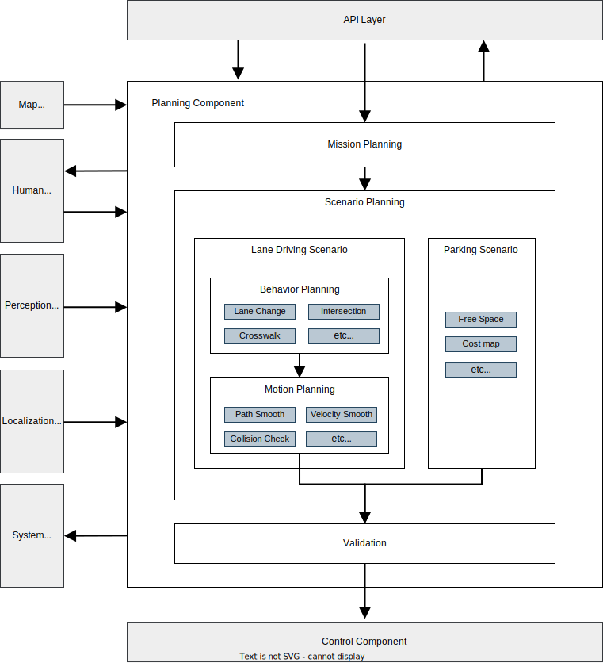
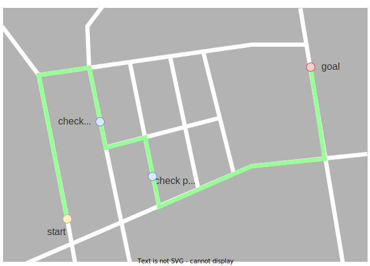

# Planning component design

## Purpose

The Planning Component in autonomous driving systems plays a crucial role in generating a target trajectory (path and speed) for autonomous vehicles. It ensures safety and adherence to traffic rules, fulfilling specific missions.

This document outlines the planning requirements and design within Autoware, aiding developers in comprehending the design and extendibility of the Planning Component.

The document is divided into two parts: the first part discusses high-level requirements and design, and the latter part focuses on actual implementations and functionalities provided.

## Goals and non-goals

Our objective extends beyond merely developing an autonomous driving system. We aim to offer an "autonomous driving platform" where users can enhance autonomous driving functionalities based on their individual needs.

In Autoware, we utilize the [microautonomy architecture](https://autowarefoundation.github.io/autoware-documentation/main/design/autoware-concepts) concept, which emphasizes high extensibility, functional modularity, and clearly defined interfaces.

With this in mind, the design policy for the Planning Component is focused not on addressing every complex autonomous driving scenario (as that is a very challenging problem), but on **providing a customizable and easily extendable Planning development platform**. We believe this approach will allow the platform to meet a wide range of needs, ultimately solving many complex use cases.

To clarify this policy, the Goals and Non-Goals are defined as follows:

**Goals:**

- **The basic functions are provided so that a simple ODD can be defined**
  - Before extending its functionalities, the Planning Component must provide the essential features necessary for autonomous driving. This encompasses basic operations like moving, stopping, and turning, as well as handling lane changes and obstacle avoidance in relatively safe and simple contexts.
- **The functionality is modularized for user-driven extension**
  - The system is designed to adapt to various Operational Design Domains (ODDs) with extended functionalities. Modularization, akin to plug-ins, allows for creating systems tailored to diverse needs, such as different levels of autonomous driving and varied vehicular or environmental applications (e.g., Lv4/Lv2 autonomous driving, public/private road driving, large vehicles, small robots).
  - Reducing functionalities for specific ODDs, like obstacle-free private roads, is also a key aspect. This modular approach allows for reductions in power consumption or sensor requirements, aligning with specific user needs.
- **The capability is extensible with the decision of human operators**
  - Incorporating operator assistance is a critical aspect of functional expansion. It means that the system can adapt to complex and challenging scenarios with human support. The specific type of operator is not defined here. It might be a person accompanying in the vehicle during the prototype development phase or a remote operator connected in emergencies during autonomous driving services.

**Non-goals:**

The Planning Component is designed to be extended with third-party modules. Consequently, the following are not the goals of Autoware's Planning Component:

- To provide all user-required functionalities by default.
- To provide complete functionality and performance characteristic of an autonomous driving system.
- To provide performance that consistently surpasses human capabilities or ensures absolute safety.

These aspects are specific to our vision of an autonomous driving "platform" and may not apply to a typical autonomous driving Planning Component.

## High level design

This diagram illustrates the high-level architecture of the Planning Component. This represents an idealized design, and current implementations might vary. Further details on implementations are provided in the latter sections of this document.

Following the principles of microautonomy architecture, we have adopted a modular system framework. The functions within the Planning domain are implemented as modules, dynamically or statically adaptable according to specific use cases. This includes modules for lane changes, intersection handling, and pedestrian crossings, among others.

The Planning Component comprises several sub-components:

- **Mission Planning**: This module calculates routes from the current location to the destination, utilizing map data. Its functionality is similar to that of Fleet Management Systems (FMS) or car navigation route planning.
- **Planning Modules**: These modules plans the vehicle's behavior for the assigned mission, including target trajectory, blinker signaling, etc. They are divided into Behavior and Motion categories:
  - **Behavior**: Focuses on calculating safe and rule-compliant routes, managing decisions for lane changes, intersection entries, and stoppings at a stop line.
  - **Motion**: Works in cooperate with Behavior modules to determine the vehicle's trajectory, considering its motion and ride comfort. It includes lateral and longitudinal planning for route shaping and speed calculation.
- **Validation**: Ensures the safety and appropriateness of the planned trajectories, with capabilities for emergency response. In cases where a planned trajectory is unsuitable, it triggers emergency protocols or generates alternative paths.

### Highlights

Key aspects of this high-level design include:

#### Modulation of each function

Essential Planning functions, such as route generation, lane changes, and intersection management, are modularized. These modules come with standardized interfaces, enabling easy addition or modification. More details on these interfaces will be discussed in subsequent sections. You can see the details about how to enable/disable each module in [the implementation documentation of Planning](https://autowarefoundation.github.io/autoware.universe/main/planning/#how-to-enable-or-disable-planning-module).

#### Separation of Mission Planning sub-component

Mission Planning serves as a substitute for functions typically found in existing services like FMS (Fleet Management System). Adherence to defined interfaces in the high-level design facilitates easy integration with third-party services.

#### Separation of Validation sub-component

Given the extendable nature of the Planning Component, ensuring consistent safety levels across all functions is challenging. Therefore, the Validation function is managed independently from the core planning modules, maintaining a baseline of safety even for arbitrary changes of the planning modules.

#### Interface for HMI (Human Machine Interface)

The HMI is designed for smooth cooperation with human operators. These interfaces enable coordination between the Planning Component and operators, whether in-vehicle or remote.

#### Trade-offs for the separation of planning and other components

In Autoware's overarching design, the separation of components like Planning, Perception, Localization, and Control facilitates cooperation with third-party modules. However, this separation entails trade-offs between performance and extensibility. For instance, the Perception component might process unnecessary objects due to its separation from Planning. Similarly, separating planning and control can pose challenges in accounting for vehicle dynamics during planning. To mitigate these issues, we might need to enhance interface information or increase computational efforts.

## Customize features

A significant feature of the Planning Component design is its ability to integrate with external modules. The diagram below shows various methods for incorporating external functionalities.

### 1. Adding New Modules to the Planning Component

Users can augment or replace existing Planning functionalities with new modules. This approach is commonly used for extending features, allowing for the addition of capabilities absent in the desired ODD or simplification of existing features.

However, adding these functionalities requires well-organized module interfaces. As of November 2023, an ideal modular system is not fully established, presenting some limitations. For more information, please refer to the Reference Implementation section [Customize features in the current implementation](#customize-features-in-the-current-implementation) and [the implementation documentation of Planning](https://autowarefoundation.github.io/autoware.universe/main/planning/#how-to-enable-or-disable-planning-module).

### 2. Replacing Sub-components of Planning

Collaboration and extension at the sub-component level may interest some users. This could involve replacing Mission Planning with an existing FMS service or incorporating a third-party trajectory generation module while utilizing the existing Validation functionality.

Adhering to the [Internal interface in the planning component](#internal-interface-in-the-planning-component), collaboration and extension at this level are feasible. While complex coordination with existing Planning features may be limited, it allows for integration between certain Planning Component functionalities and external modules.

### 3. Replacing the Entire Planning Component

Organizations or research entities developing autonomous driving Planning systems might be interested in integrating their proprietary Planning solutions with Autoware's Perception or Control modules. This can be achieved by replacing the entire Planning system, following the robust and stable interfaces defined between components. It is important to note, however, that direct coordination with existing Planning modules might not be possible.

## Component interface

This section describes the inputs and outputs of the Planning Component and of its internal modules. See the [Planning Component Interface](../../autoware-interfaces/components/planning.md) page for the current implementation.

### Input to the planning component

- **From Map**
  - Vector map: Contains all static information about the environment, including lane connection information for route planning, lane geometry for generating a reference path, and traffic rule-related information.
- **From Perception**
  - Detected object information: Provides real-time information about objects that cannot be known in advance, such as pedestrians and other vehicles. The Planning Component plans maneuvers to avoid collisions with these objects.
  - Detected obstacle information: Supplies real-time information about the location of obstacles, which is more primitive than Detected Object and used for emergency stops and other safety measures.
  - Occupancy map information: Offers real-time information about the presence of pedestrians and other vehicles and occluded area information.
  - Traffic light recognition result: Provides the current state of each traffic light in real time. The Planning Component extracts relevant information for the planned path and determines whether to stop at intersections.
- **From Localization**
  - Vehicle motion information: Includes the ego vehicle's position, velocity, acceleration, and other motion-related data.
- **From System**
  - Operation mode: Indicates whether the vehicle is operating in Autonomous mode.
- **From Human Machine Interface (HMI)**
  - Feature execution: Allows for executing/authorizing autonomous driving operations, such as lane changes or entering intersections, by human operators.
- **From API Layer**
  - Destination (Goal): Represents the final position that the Planning Component aims to reach.
  - Checkpoint: Represents a midpoint along the route to the destination. This is used during route calculation.
  - Velocity limit: Sets the maximum speed limit for the vehicle.

### Output from the planning component

- **To Control**
  - Trajectory: Provides a smooth sequence of pose, twist, and acceleration that the Control Component must follow. The trajectory is typically 10 seconds long with a 0.1-second resolution.
  - Turn Signals: Controls the vehicle's turn indicators, such as right, left, hazard, etc. based on the planned maneuvers.
- **To System**
  - Diagnostics: Reports the state of the Planning Component, indicating whether the processing is running correctly and whether a safe plan is being generated.
- **To Human Machine Interface (HMI)**
  - Feature execution availability: Indicates the status of operations that can be executed or are required, such as lane changes or entering intersections.
  - Trajectory candidate: Shows the potential trajectory that will be executed after the user's execution.
- **To API Layer**
  - Planning factors: Provides information about the reasoning behind the current planning behavior. This may include the position of target objects to avoid, obstacles that led to the decision to stop, and other relevant information.

### Internal interface in the planning component

- **Mission Planning to Scenario Planning**
  - Route: Offers guidance for the path that needs to be followed from the starting point to the destination. This path is determined based on information such as lane IDs defined on the map. At the route level, it doesn't explicitly indicate which specific lanes to take, and the route can contain multiple lanes.
- **Behavior Planning to Motion Planning**
  - Path: Provides a rough position and velocity to be followed by the vehicle. These path points are usually defined with an interval of about 1 meter. Although other interval distances are possible, it may impact the precision or performance of the planning component.
  - Drivable area: Defines regions where the vehicle can drive, such as within lanes or physically drivable areas. It assumes that the motion planner will calculate the final trajectory within this defined area.
- **Scenario Planning to Validation**
  - Trajectory: Defines the desired positions, velocities, and accelerations which the Control Component will try to follow. Trajectory points are defined at intervals of approximately 0.1 seconds based on the trajectory velocities.
- **Validation to Control Component**
  - Trajectory: Same as above but with some additional safety considerations.

## Detailed design

### Supported features

| Feature                                      | Description                                                                                                                                                                                                                                                                                                                                                                                                                                                                                                                                       | Requirements                                                                | Figure                                                                          | Demonstration                                                                                                                                                                                                                                                                                                                                                                                                                                                                                                                                                                 |
| -------------------------------------------- | ------------------------------------------------------------------------------------------------------------------------------------------------------------------------------------------------------------------------------------------------------------------------------------------------------------------------------------------------------------------------------------------------------------------------------------------------------------------------------------------------------------------------------------------------- | --------------------------------------------------------------------------- | ------------------------------------------------------------------------------- | ----------------------------------------------------------------------------------------------------------------------------------------------------------------------------------------------------------------------------------------------------------------------------------------------------------------------------------------------------------------------------------------------------------------------------------------------------------------------------------------------------------------------------------------------------------------------------- |
| Route Planning                               | Plan route from the ego vehicle position to the destination.    Reference implementation is in [Mission Planner](https://autowarefoundation.github.io/autoware.universe/main/planning/autoware_mission_planner/), enabled by launching the `mission_planner` node.                                                                                                                                                                                                                                                                          | - Lanelet map (driving lanelets)                                            |                      |
| Path Planning from Route                     | Plan path to be followed from the given route.     Reference implementation is in [Behavior Path Planner](https://autowarefoundation.github.io/autoware.universe/main/planning/behavior_path_planner/autoware_behavior_path_planner/).                                                                                                                                                                                                                                                                                                      | - Lanelet map (driving lanelets)                                            |                            |
| Obstacle Avoidance                           | Plan path to avoid obstacles by steering operation.     Reference implementation is in [Static Avoidance Module](https://autowarefoundation.github.io/autoware.universe/main/planning/behavior_path_planner/autoware_behavior_path_static_obstacle_avoidance_module/), [Path Optimizer](https://autowarefoundation.github.io/autoware.universe/main/planning/autoware_path_optimizer/). Enable flag in parameter: `launch path_optimizer true`                                                                                              | - objects information                                                       |                       | [Demonstration Video](https://youtu.be/A_V9yvfKZ4E)                                                                                                                                                                                                                                                                                                                                                                                                     |
| Path Smoothing                               | Plan path to achieve smooth steering.     Reference implementation is in [Path Optimizer](https://autowarefoundation.github.io/autoware.universe/main/planning/autoware_path_optimizer/).                                                                                                                                                                                                                                                                                                                                                   | - Lanelet map (driving lanelet)                                             |                      | [Demonstration Video](https://youtu.be/RhyAF26Ppzs)                                                                                                                                                                                                                                                                                                                                                                                                     |
| Narrow Space Driving                         | Plan path to drive within the drivable area. Furthermore, when it is not possible to drive within the drivable area, stop the vehicle to avoid exiting the drivable area.     Reference implementation is in [Path Optimizer](https://autowarefoundation.github.io/autoware.universe/main/planning/autoware_path_optimizer/).                                                                                                                                                                                                               | - Lanelet map (high-precision lane boundaries)                              |          | [Demonstration Video](https://youtu.be/URzcLO2E1vY)                                                                                                                                                                                                                                                                                                                                                                                                     |
| Lane Change                                  | Plan path for lane change to reach the destination.     Reference implementation is in [Lane Change](https://autowarefoundation.github.io/autoware.universe/main/planning/behavior_path_planner/autoware_behavior_path_lane_change_module/).                                                                                                                                                                                                                                                                                                | - Lanelet map (driving lanelets)                                            |                            | [Demonstration Video](https://youtu.be/0jRDGQ84cD4)                                                                                                                                                                                                                                                                                                                                                                                                     |
| Pull Over                                    | Plan path for pull over to park at the road shoulder.     Reference implementation is in [Goal Planner](https://autowarefoundation.github.io/autoware.universe/main/planning/behavior_path_planner/autoware_behavior_path_goal_planner_module/).                                                                                                                                                                                                                                                                                            | - Lanelet map (shoulder lane)                                               |                                | Demonstration Videos:   [Simple Pull Over](https://youtu.be/r3-kAmTb4hc)      [Arc Forward Pull Over](https://youtu.be/ornbzkWxRWU)      [Arc Backward Pull Over](https://youtu.be/if-0tG3AkLo)    |
| Pull Out                                     | Plan path for pull over to start from the road shoulder.     Reference implementation is in [Start Planner](https://autowarefoundation.github.io/autoware.universe/main/planning/behavior_path_planner/autoware_behavior_path_start_planner_module/).                                                                                                                                                                                                                                                                                       | - Lanelet map (shoulder lane)                                               |                                  | Demonstration Video:   [Simple Pull Out](https://youtu.be/xOjnPqoHup4)      [Backward Pull Out](https://youtu.be/iGieijPcPcQ)                                                                                                                                                                                               |
| Path Shift                                   | Plan path in lateral direction in response to external instructions.     Reference implementation is in [Side Shift Module](https://autowarefoundation.github.io/autoware.universe/main/planning/behavior_path_planner/autoware_behavior_path_side_shift_module/).                                                                                                                                                                                                                                                                          | - None                                                                      |                              |
| Obstacle Stop                                | Plan velocity to stop for an obstacle on the path.     Reference implementation is in [Obstacle Stop Planner](https://autowarefoundation.github.io/autoware.universe/main/planning/obstacle_stop_planner/), [Obstacle Cruise Planner](https://autowarefoundation.github.io/autoware.universe/main/planning/autoware_obstacle_cruise_planner/). `launch obstacle_stop_planner` and enable flag: `TODO`, `launch obstacle_cruise_planner` and enable flag: `TODO`                                                                             | - objects information                                                       |                        | [Demonstration Video](https://youtu.be/d8IRW_xArcE)                                                                                                                                                                                                                                                                                                                                                                                                     |
| Obstacle Deceleration                        | Plan velocity to decelerate for an obstacle located around the path.     Reference implementation is in [Obstacle Stop Planner](https://autowarefoundation.github.io/autoware.universe/main/planning/obstacle_stop_planner/), [Obstacle Cruise Planner](https://autowarefoundation.github.io/autoware.universe/main/planning/autoware_obstacle_cruise_planner/).                                                                                                                                                                            | - objects information                                                       |                      | [Demonstration Video](https://youtu.be/gvN1otgeaaw)                                                                                                                                                                                                                                                                                                                                                                                                     |
| Adaptive Cruise Control                      | Plan velocity to follow the vehicle driving in front of the ego vehicle.     Reference implementation is in [Obstacle Stop Planner](https://autowarefoundation.github.io/autoware.universe/main/planning/obstacle_stop_planner/), [Obstacle Cruise Planner](https://autowarefoundation.github.io/autoware.universe/main/planning/autoware_obstacle_cruise_planner/).                                                                                                                                                                        | - objects information                                                       |                    |
| Decelerate for cut-in vehicles               | Plan velocity to avoid a risk for cutting-in vehicle to ego lane.     Reference implementation is in [Obstacle Cruise Planner](https://autowarefoundation.github.io/autoware.universe/main/planning/autoware_obstacle_cruise_planner/).                                                                                                                                                                                                                                                                                                     | - objects information                                                       |                                      |
| Surround Check at starting                   | Plan velocity to prevent moving when an obstacle exists around the vehicle.     Reference implementation is in [Surround Obstacle Checker](https://autowarefoundation.github.io/autoware.universe/main/planning/autoware_surround_obstacle_checker/). Enable flag in parameter: `use_surround_obstacle_check true` in [tier4_planning_component.launch.xml](https://github.com/autowarefoundation/autoware_launch/blob/2850d7f4e20b173fde2183d5323debbe0067a990/autoware_launch/launch/components/tier4_planning_component.launch.xml#L8) < | - objects information                                                       |                      | [Demonstration Video](https://youtu.be/bbGgtXN3lC4)                                                                                                                                                                                                                                                                                                                                                                                                     |
| Curve Deceleration                           | Plan velocity to decelerate the speed on a curve.     Reference implementation is in [Motion Velocity Smoother](https://autowarefoundation.github.io/autoware.universe/main/planning/autoware_velocity_smoother/).                                                                                                                                                                                                                                                                                                                          | - None                                                                      |                      |
| Curve Deceleration for Obstacle              | Plan velocity to decelerate the speed on a curve for a risk of obstacle collision around the path.     Reference implementation is in [Obstacle Velocity Limiter](https://autowarefoundation.github.io/autoware.universe/main/planning/motion_velocity_planner/autoware_motion_velocity_obstacle_velocity_limiter_module/).                                                                                                                                                                                                                 | - objects information   - Lanelet map (static obstacle)                  |  | [Demonstration Video](https://youtu.be/I-oFgG6kIAs)                                                                                                                                                                                                                                                                                                                                                                                                     |
| Crosswalk                                    | Plan velocity to stop or decelerate for pedestrians approaching or walking on a crosswalk.     Reference implementation is in [Crosswalk Module](https://autowarefoundation.github.io/autoware.universe/main/planning/behavior_velocity_planner/autoware_behavior_velocity_crosswalk_module/).                                                                                                                                                                                                                                              | - objects information   - Lanelet map (pedestrian crossing)              |                                | [Demonstration Video](https://youtu.be/tUvthyIL2W8)                                                                                                                                                                                                                                                                                                                                                                                                     |
| Intersection Oncoming Vehicle Check          | Plan velocity for turning right/left at intersection to avoid a risk with oncoming other vehicles.     Reference implementation is in [Intersection Module](https://autowarefoundation.github.io/autoware.universe/main/planning/behavior_velocity_planner/autoware_behavior_velocity_intersection_module/).                                                                                                                                                                                                                                | - objects information   - Lanelet map (intersection lane and yield lane) |                          | [Demonstration Video](https://youtu.be/SGD07Hqg4Hk)                                                                                                                                                                                                                                                                                                                                                                                                     |
| Intersection Blind Spot Check                | Plan velocity for turning right/left at intersection to avoid a risk with other vehicles or motorcycles coming from behind blind spot.     Reference implementation is in [Blind Spot Module](https://autowarefoundation.github.io/autoware.universe/main/planning/behavior_velocity_planner/autoware_behavior_velocity_blind_spot_module/).                                                                                                                                                                                                | - objects information   - Lanelet map (intersection lane)                |                              | [Demonstration Video](https://youtu.be/oaTCJRafDGA)                                                                                                                                                                                                                                                                                                                                                                                                     |
| Intersection Occlusion Check                 | Plan velocity for turning right/left at intersection to avoid a risk with the possibility of coming vehicles from occlusion area.     Reference implementation is in [Intersection Module](https://autowarefoundation.github.io/autoware.universe/main/planning/behavior_velocity_planner/autoware_behavior_velocity_intersection_module/).                                                                                                                                                                                                 | - objects information   - Lanelet map (intersection lane)                |      | [Demonstration Video](https://youtu.be/bAHXMB7kbFc)                                                                                                                                                                                                                                                                                                                                                                                                     |
| Intersection Traffic Jam Detection           | Plan velocity for intersection not to enter the intersection when a vehicle is stopped ahead for a traffic jam.     Reference implementation is in [Intersection Module](https://autowarefoundation.github.io/autoware.universe/main/planning/behavior_velocity_planner/autoware_behavior_velocity_intersection_module/).                                                                                                                                                                                                                   | - objects information   - Lanelet map (intersection lane)                |  | [Demonstration Video](https://youtu.be/negK4VbrC5o)                                                                                                                                                                                                                                                                                                                                                                                                     |
| Traffic Light                                | Plan velocity for intersection according to a traffic light signal.     Reference implementation is in [Traffic Light Module](https://autowarefoundation.github.io/autoware.universe/main/planning/behavior_velocity_planner/autoware_behavior_velocity_traffic_light_module/).                                                                                                                                                                                                                                                             | - Traffic light color information                                           |                        | [Demonstration Video](https://youtu.be/lGA53KljQrM)                                                                                                                                                                                                                                                                                                                                                                                                     |
| Run-out Check                                | Plan velocity to decelerate for the possibility of nearby objects running out into the path.     Reference implementation is in [Run Out Module](https://autowarefoundation.github.io/autoware.universe/main/planning/behavior_velocity_planner/autoware_behavior_velocity_run_out_module/).                                                                                                                                                                                                                                                | - objects information                                                       |                                    | [Demonstration Video](https://youtu.be/9IDggldT2t0)                                                                                                                                                                                                                                                                                                                                                                                                     |
| Stop Line                                    | Plan velocity to stop at a stop line.     Reference implementation is in [Stop Line Module](https://autowarefoundation.github.io/autoware.universe/main/planning/behavior_velocity_planner/autoware_behavior_velocity_stop_line_module/).                                                                                                                                                                                                                                                                                                   | - Lanelet map (stop line)                                                   |                                | [Demonstration Video](https://youtu.be/eej9jYt-GSE)                                                                                                                                                                                                                                                                                                                                                                                                     |
| Occlusion Spot Check                         | Plan velocity to decelerate for objects running out from occlusion area, for example, from behind a large vehicle.     Reference implementation is in [Occlusion Spot Module](https://autowarefoundation.github.io/autoware.universe/main/planning/behavior_velocity_planner/autoware_behavior_velocity_occlusion_spot_module/).                                                                                                                                                                                                            | - objects information   - Lanelet map (private/public lane)              |                      | [Demonstration Video](https://youtu.be/3qs8Ivjh1fs)                                                                                                                                                                                                                                                                                                                                                                                                     |
| No Stop Area                                 | Plan velocity not to stop in areas where stopping is prohibited, such as in front of the fire station entrance.     Reference implementation is in [No Stopping Area Module](https://autowarefoundation.github.io/autoware.universe/main/planning/behavior_velocity_planner/autoware_behavior_velocity_no_stopping_area_module/).                                                                                                                                                                                                           | - Lanelet map (no stopping area)                                            |                  |
| Merge from Private Area to Public Road       | Plan velocity for entering the public road from a private driveway to avoid a risk of collision with pedestrians or other vehicles.     Reference implementation is in [Merge from Private Area Module](https://autowarefoundation.github.io/autoware.universe/main/planning/behavior_velocity_planner/autoware_behavior_velocity_intersection_module/).                                                                                                                                                                                    | - objects information   - Lanelet map (private/public lane)              | WIP                                                                             |
| Speed Bump                                   | Plan velocity to decelerate for speed bumps.     Reference implementation is in [Speed Bump Module](https://autowarefoundation.github.io/autoware.universe/main/planning/behavior_velocity_planner/autoware_behavior_velocity_speed_bump_module/).                                                                                                                                                                                                                                                                                          | - Lanelet map (speed bump)                                                  |                              | [Demonstration Video](https://youtu.be/FpX3q3YaaCw)                                                                                                                                                                                                                                                                                                                                                                                                     |
| Detection Area                               | Plan velocity to stop at the corresponding stop when an object exist in the designated detection area.     Reference implementation is in [Detection Area Module](https://autowarefoundation.github.io/autoware.universe/main/planning/behavior_velocity_planner/autoware_behavior_velocity_detection_area_module/).                                                                                                                                                                                                                        | - Lanelet map (detection area)                                              |                      | [Demonstration Video](https://youtu.be/YzXF4U69lJs)                                                                                                                                                                                                                                                                                                                                                                                                     |
| No Drivable Lane                             | Plan velocity to stop before exiting the area designated by ODD (Operational Design Domain) or stop the vehicle if autonomous mode started in out of ODD lane.     Reference implementation is in [No Drivable Lane Module](https://autowarefoundation.github.io/autoware.universe/main/planning/behavior_velocity_planner/autoware_behavior_velocity_no_drivable_lane_module/).                                                                                                                                                            | - Lanelet map (no drivable lane)                                            |                  |
| Collision Detection when deviating from lane | Plan velocity to avoid conflict with other vehicles driving in the another lane when the ego vehicle is deviating from own lane.     Reference implementation is in [Out of Lane Module](https://autowarefoundation.github.io/autoware.universe/main/planning/motion_velocity_planner/autoware_motion_velocity_out_of_lane_module/).                                                                                                                                                                                                        | - objects information   - Lanelet map (driving lane)                     | WIP                                                                             |
| Parking                                      | Plan path and velocity for given goal in parking area.     Reference implementation is in [Free Space Planner](https://autowarefoundation.github.io/autoware.universe/main/planning/autoware_freespace_planner/).                                                                                                                                                                                                                                                                                                                           | - objects information   - Lanelet map (parking area)                     |                                    | [Demonstration Video](https://youtu.be/rAIYmwpNWfA)                                                                                                                                                                                                                                                                                                                                                                                                     |
| Autonomous Emergency Braking (AEB)           | Perform an emergency stop if a collision with an object ahead is anticipated. It is noted that this function is expected as a final safety layer, and this should work even in the event of failures in the Localization or Perception system.     Reference implementation is in [Out of Lane Module](https://autowarefoundation.github.io/autoware.universe/main/planning/motion_velocity_planner/autoware_motion_velocity_out_of_lane_module/).                                                                                          | - Primitive objects                                                         |                                            |
| Minimum Risk Maneuver (MRM)                  | Provide appropriate MRM (Minimum Risk Maneuver) instructions when a hazardous event occurs. For example, when a sensor trouble found, send an instruction for emergency braking, moderate stop, or pulling over to the shoulder, depending on the severity of the situation.     Reference implementation is in TODO                                                                                                                                                                                                                        | - TODO                                                                      | WIP                                                                             |
| Trajectory Validation                        | Check the planned trajectory is safe. If it is unsafe, take appropriate action, such as modify the trajectory, stop sending the trajectory or report to the autonomous driving system.     Reference implementation is in [Planning Validator](https://autowarefoundation.github.io/autoware.universe/main/planning/autoware_planning_validator/).                                                                                                                                                                                          | - None                                                                      |        |
| Running Lane Map Generation                  | Generate lane map from localization data recorded in manual driving.     Reference implementation is in WIP                                                                                                                                                                                                                                                                                                                                                                                                                                 | - None                                                                      | WIP                                                                             |
| Running Lane Optimization                    | Optimize the centerline (reference path) of the map to make it smooth considering the vehicle kinematics.     Reference implementation is in [Static Centerline Optimizer](https://autowarefoundation.github.io/autoware.universe/main/planning/autoware_static_centerline_generator/).                                                                                                                                                                                                                                                     | - Lanelet map (driving lanes)                                               | WIP                                                                             |

<!--  -->

### Reference Implementation

The following diagram describes the reference implementation of the Planning component. By adding new modules or extending the functionalities, various ODDs can be supported.

_Note that some implementation does not adhere to the high-level architecture design due to the difficulties of the implementation and require updating._

For more details, please refer to the design documents in each package.

- [_mission_planner_](https://autowarefoundation.github.io/autoware.universe/main/planning/autoware_mission_planner/): calculate route from start to goal based on the map information.
- [_behavior_path_planner_](https://autowarefoundation.github.io/autoware.universe/main/planning/behavior_path_planner/autoware_behavior_path_planner/): calculates path and drivable area based on the traffic rules.
  - [_lane_following_](https://autowarefoundation.github.io/autoware.universe/main/planning/behavior_path_planner/autoware_behavior_path_planner#lane-following)
  - [_lane_change_](https://autowarefoundation.github.io/autoware.universe/main/planning/behavior_path_planner/autoware_behavior_path_lane_change_module/)
  - [_static_obstacle_avoidance_](https://autowarefoundation.github.io/autoware.universe/main/planning/behavior_path_planner/autoware_behavior_path_static_obstacle_avoidance_module/)
  - [_pull_over_](https://autowarefoundation.github.io/autoware.universe/main/planning/behavior_path_planner/autoware_behavior_path_goal_planner_module/)
  - [_pull_out_](https://autowarefoundation.github.io/autoware.universe/main/planning/behavior_path_planner/autoware_behavior_path_start_planner_module/)
  - [_side_shift_](https://autowarefoundation.github.io/autoware.universe/main/planning/behavior_path_planner/autoware_behavior_path_side_shift_module/)
- [_behavior_velocity_planner_](https://autowarefoundation.github.io/autoware.universe/main/planning/behavior_velocity_planner/autoware_behavior_velocity_planner/): calculates max speed based on the traffic rules.
  - [_detection_area_](https://autowarefoundation.github.io/autoware.universe/main/planning/behavior_velocity_planner/autoware_behavior_velocity_detection_area_module/)
  - [_blind_spot_](https://autowarefoundation.github.io/autoware.universe/main/planning/behavior_velocity_planner/autoware_behavior_velocity_blind_spot_module/)
  - [_cross_walk_](https://autowarefoundation.github.io/autoware.universe/main/planning/behavior_velocity_planner/autoware_behavior_velocity_crosswalk_module/)
  - [_stop_line_](https://autowarefoundation.github.io/autoware.universe/main/planning/behavior_velocity_planner/autoware_behavior_velocity_stop_line_module/)
  - [_traffic_light_](https://autowarefoundation.github.io/autoware.universe/main/planning/behavior_velocity_planner/autoware_behavior_velocity_traffic_light_module/)
  - [_intersection_](https://autowarefoundation.github.io/autoware.universe/main/planning/behavior_velocity_planner/autoware_behavior_velocity_intersection_module/)
  - [_no_stopping_area_](https://autowarefoundation.github.io/autoware.universe/main/planning/behavior_velocity_planner/autoware_behavior_velocity_no_stopping_area_module/)
  - [_virtual_traffic_light_](https://autowarefoundation.github.io/autoware.universe/main/planning/behavior_velocity_planner/autoware_behavior_velocity_virtual_traffic_light_module/)
  - [_occlusion_spot_](https://autowarefoundation.github.io/autoware.universe/main/planning/behavior_velocity_planner/autoware_behavior_velocity_occlusion_spot_module/)
  - [_run_out_](https://autowarefoundation.github.io/autoware.universe/main/planning/behavior_velocity_planner/autoware_behavior_velocity_run_out_module/)
- [_obstacle_avoidance_planner_](https://autowarefoundation.github.io/autoware.universe/main/planning/behavior_path_planner/autoware_behavior_path_dynamic_obstacle_avoidance_module/): calculate path shape under obstacle and drivable area constraints
- [_surround_obstacle_checker_](https://autowarefoundation.github.io/autoware.universe/main/planning/autoware_surround_obstacle_checker/): keeps the vehicle being stopped when there are obstacles around the ego-vehicle. It works only when the vehicle is stopped.
- [_obstacle_stop_planner_](https://autowarefoundation.github.io/autoware.universe/main/planning/obstacle_stop_planner/): When there are obstacles on or near the trajectory, it calculates the maximum velocity of the trajectory points depending on the situation: stopping, slowing down, or adaptive cruise (following the car).
  - [_stop_](https://autowarefoundation.github.io/autoware.universe/main/planning/obstacle_stop_planner/#obstacle-stop-planner_1)
  - [_slow_down_](https://autowarefoundation.github.io/autoware.universe/main/planning/obstacle_stop_planner/#slow-down-planner)
  - [_adaptive_cruise_](https://autowarefoundation.github.io/autoware.universe/main/planning/obstacle_stop_planner/#adaptive-cruise-controller)
- [_costmap_generator_](https://autowarefoundation.github.io/autoware.universe/main/planning/autoware_costmap_generator): generates a costmap for path generation from dynamic objects and lane information.
- [_freespace_planner_](https://autowarefoundation.github.io/autoware.universe/main/planning/autoware_freespace_planner/): calculates trajectory considering the feasibility (e.g. curvature) for the freespace scene. Algorithms are described [here](https://autowarefoundation.github.io/autoware.universe/main/planning/autoware_freespace_planning_algorithms/).
- _scenario_selector_ : chooses a trajectory according to the current scenario.
- [_external_velocity_limit_selector_](https://autowarefoundation.github.io/autoware.universe/main/planning/autoware_external_velocity_limit_selector/): takes an appropriate velocity limit from multiple candidates.
- [_motion_velocity_smoother_](https://autowarefoundation.github.io/autoware.universe/main/planning/motion_velocity_planner/autoware_motion_velocity_planner_node/): calculates final velocity considering velocity, acceleration, and jerk constraints.

### Important information in the current implementation

An important difference compared to the high-level design is the "introduction of the scenario layer" and the "clear separation of behavior and motion." These are introduced due to current performance and implementation challenges. Whether to define these as part of the high-level design or to improve them as part of the implementation is a matter of discussion.

#### Introducing the Scenario Planning layer

There are different requirements for interfaces between driving in well-structured lanes and driving in a free-space area like a parking lot. For example, while Lane Driving can handle routes with map IDs, this is not appropriate for planning in free space. The mechanism that switches planning sub-components at the scenario level (Lane Driving, Parking, etc) enables a flexible design of the interface, however, it has a drawbacks of the reuse of modules across different scenarios.

#### Separation of Behavior and Motion

One of the classic approach to Planning involves dividing it into "Behavior", which decides the action, and "Motion", which determines the final movement. However, this separation implies a trade-off with performance, as performance tends to degrade with increasing separation of functions. For example, Behavior needs to make decisions without prior knowledge of the computations that Motion will eventually perform, which generally results in conservative decision-making. On the other hand, if behavior and motion are integrated, motion performance and decision-making become interdependent, creating challenges in terms of expandability, such as when you wish to extend only the decision-making function to follow a regional traffic rules.

To understand this background, this [previously discussed document](https://github.com/tier4/AutowareArchitectureProposal.proj/blob/main/docs/design/software_architecture/Planning/DesignRationale.md) may be useful.

### Customize features in the current implementation

While it is possible to add module-level functionalities in the current implementation, a unified interface for all functionalities is not provided. Here's a brief explanation of the methods of extending at the module level in the current implementation.

#### Add new modules in behavior_velocity_planner or behavior_path_planner

ROS nodes such as [behavior_path_planner](https://autowarefoundation.github.io/autoware.universe/main/planning/behavior_path_planner/autoware_behavior_path_planner/) and [behavior_velocity_planner](https://autowarefoundation.github.io/autoware.universe/main/planning/behavior_velocity_planner/autoware_behavior_velocity_planner/) have a module interface available through plugins. By adding modules in accordance with the module interfaces defined in these ROS nodes, dynamic loading/unloading of modules becomes possible. For specific methods of adding modules, please refer to the documentation of each package.

#### Add a new ros node in the planning component

When adding modules in Motion Planning, it is necessary to create the module as a ROS Node and integrate it into the planning component. The current configuration involves adding information to the target trajectory calculated upstream, and the introduction of a ROS Node in this process allows for the expansion of functionality.

#### Add or replace with scenarios

The current implementation has introduced a scenario-level switching logic as a method for collectively switching multiple modules. This allows for the addition of new scenarios (e.g., highway driving).

By creating a scenario as a ros node and aligning the scenario_selector ros node with it, the integration is complete. The benefit of this is that you can introduce significant new functionalities without affecting the implementation of other scenarios (like Lane Driving). However, it only allows for scenario-level coordination through scenario switching and does not enable coordination at the existing planning module level.

<!--
### Important Parameters

| Package                      | Parameter                                                     | Type   | Description                                                                                                        |
| ---------------------------- | ------------------------------------------------------------- | ------ | ------------------------------------------------------------------------------------------------------------------ |
| `obstacle_stop_planner`      | `stop_planner.stop_position.max_longitudinal_margin`          | double | distance between the ego and the front vehicle when stopping (when `cruise_planner_type:=obstacle_stop_planner`)   |
| `obstacle_cruise_planner`    | `common.safe_distance_margin`                                 | double | distance between the ego and the front vehicle when stopping (when `cruise_planner_type:=obstacle_cruise_planner`) |
| `behavior_path_planner`      | `avoidance.avoidance.lateral.lateral_collision_margin`        | double | minimum lateral margin to obstacle on avoidance                                                                    |
| `behavior_path_planner`      | `avoidance.avoidance.lateral.lateral_collision_safety_buffer` | double | additional lateral margin to obstacle if possible on avoidance                                                     |
| `obstacle_avoidance_planner` | `option.enable_outside_drivable_area_stop`                    | bool   | If set true, a stop point will be inserted before the path footprint is outside the drivable area.                 |

### Notation

#### [1] self-crossing road and overlapped

To support the self-crossing road and overlapped road in the opposite direction, each planning module has to meet the [specifications](https://autowarefoundation.github.io/autoware.universe/main/common/motion_utils/)

Currently, the supported modules are as follows.

- lane_following (in behavior_path_planner)
- detection_area (in behavior_velocity_planner)
- stop_line (in behavior_velocity_planner)
- virtual_traffic_light (in behavior_velocity_planner)
- obstacle_avoidance_planner
- obstacle_stop_planner
- motion_velocity_smoother

#### [2] Size of Path Points

Some functions do not support paths with only one point. Therefore, each modules should generate the path with more than two path points. -->
