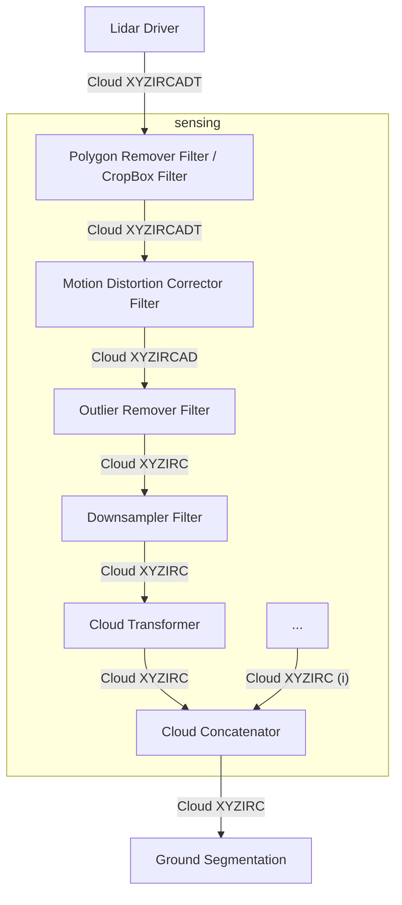

# Point cloud pre-processing design

## Overview

Point cloud pre-processing is a collection of modules that apply some primitive pre-processing to the raw sensor data.

This pipeline covers the flow of data from drivers to the perception stack.

## Recommended processing pipeline

## List of modules

The modules used here are from [pointcloud_preprocessor package](https://github.com/autowarefoundation/autoware.universe/tree/main/sensing/pointcloud_preprocessor).

For details about the modules, see [the following table](https://github.com/autowarefoundation/autoware.universe/tree/main/sensing/pointcloud_preprocessor#inner-workings--algorithms).

It is recommended that these modules are used in a single container as components. For details see [ROS2 Composition](https://docs.ros.org/en/rolling/Tutorials/Intermediate/Composition.html)

## Point cloud fields

In the ideal case, the driver is expected to output a point cloud with the `PointXYZIRCADT` point type.

| name              | datatype  | derived | description                                                                  |
|-------------------|-----------|---------|------------------------------------------------------------------------------|
| `X`               | `FLOAT32` | `false` | X position                                                                   |
| `Y`               | `FLOAT32` | `false` | Y position                                                                   |
| `Z`               | `FLOAT32` | `false` | Z position                                                                   |
| `I` (intensity)   | `UINT8`   | `false` | Measured reflectivity, intensity of the point                                |
| `R` (return type) | `UINT8`   | `false` | Laser return type for dual return lidars                                     |
| `C` (channel)     | `UINT16`  | `false` | Vertical channel id of the laser that measured the point                     |
| `A` (azimuth)     | `FLOAT32` | `true`  | `atan2(Y, X)`, Horizontal angle from the front of the lidar to the point     |
| `D` (distance)    | `FLOAT32` | `true`  | `hypot(X, Y, Z)`, Euclidean distance of the point to lidar                   |
| `T` (time)        | `UINT32`  | `false` | Nanoseconds passed since the time of the header when this point was measured |

!!! note

    `A (azimuth)` and `D (distance)` fields are derived fields.
    They are provided by the driver to reduce the computational load on some parts of the perception stack.

!!! note

    If the `Motion Distortion Corrector Filter` won't be used, the `T (time)` field can be omitted, `PointXYZIRCAD` point type can be used.

!!! warning

    Autoware will support conversion from `PointXYZI` to `PointXYZIRC` or `PointXYZIRCAD` (while channel is set to 0) for prototyping purposes.
    However, this conversion is not recommended for production use since it's not efficient.

### Intensity

We will use following ranges for intensity, compatible with [the VLP16 User Manual](https://usermanual.wiki/Pdf/VLP16Manual.1719942037/view):

Quoting from the VLP-16 User Manual:

> For each laser measurement, a reflectivity byte is returned in addition to distance.
> Reflectivity byte values are segmented into two ranges, allowing software to distinguish diffuse reflectors
> (e.g. tree trunks, clothing) in the low range from retroreflectors (e.g. road signs, license plates) in the high range.
> A retroreflector reflects light back to its source with a minimum of scattering.
> The VLP-16 provides its own light, with negligible separation between transmitting laser and receiving detector, so
> retroreflecting surfaces pop with reflected IR light compared to diffuse reflectors that tend to scatter reflected energy.
>
> - Diffuse reflectors report values from 0 to 100 for reflectivities from 0% to 100%.
> - Retroreflectors report values from 101 to 255, where 255 represents an ideal reflection.

In a typical point cloud without retroreflectors, all intensity points will be between 0 and 100.

[Retroreflective Gradient road sign, Image Source](https://commons.wikimedia.org/wiki/File:Retroreflective_Gradient_road_sign.jpg)

But in a point cloud with retroreflectors, the intensity points will be between 0 and 255.

#### Intensity mapping for other lidar brands

##### Hesai PandarXT16

[Hesai Pandar XT16 User Manual](https://www.oxts.com/wp-content/uploads/2021/01/Hesai-PandarXT16_User_Manual.pdf)

This lidar has 2 modes for reporting reflectivity:

- Linear mapping
- Non-linear mapping

If you are using linear mapping mode, you should map from [0, 255] to [0, 100] when constructing the point cloud.

If you are using non-linear mapping mode, you should map (hesai to autoware)

- [0, 251] to [0, 100] and
- [252, 254] to [101, 255]

when constructing the point cloud.

##### Livox Mid-70

[Livox Mid-70 User Manual](https://terra-1-g.djicdn.com/65c028cd298f4669a7f0e40e50ba1131/Download/Mid-70/new/Livox%20Mid-70%20User%20Manual_EN_v1.2.pdf)

This lidar has 2 modes for reporting reflectivity similar to Velodyne VLP-16, only the ranges are slightly different.

You should map (livox to autoware)

- [0, 150] to [0, 100] and
- [151, 255] to [101, 255]

when constructing the point cloud.

##### RoboSense RS-LiDAR-16

[RoboSense RS-LiDAR-16 User Manual](https://cdn.robosense.cn/20200723161715_42428.pdf)

No mapping required, same as Velodyne VLP-16.

##### Ouster OS-1-64

[Software User Manual v2.0.0 for all Ouster sensors](https://data.ouster.io/downloads/software-user-manual/software-user-manual-v2p0.pdf)

In the manual it is stated:

> Reflectivity [16 bit unsigned int] - sensor Signal Photons measurements are scaled based on measured range and sensor sensitivity at that range, providing an indication of target reflectivity. Calibration of this measurement has not currently been rigorously implemented, but this will be updated in a future firmware release.

So it is advised to map the 16 bit reflectivity to [0, 100] range.

##### Leishen CH64W

[I couldn't get the english user manual, link of website](http://www.lslidar.com/en/down)

In a user manual I was able to find it says:

> Byte 7 represents echo strength, and the value range is 0-255. (Echo strength can reflect
> the energy reflection characteristics of the measured object in the actual measurement
> environment. Therefore, the echo strength can be used to distinguish objects with
> different reflection characteristics.)

So it is advised to map the [0, 255] to [0, 100] range.

### Return type

Various lidars support multiple return modes. Velodyne lidars support **Strongest** and **Last** return modes.

In the `PointXYZIRCT` and `PointXYZIRC` types, `R` field represents return mode with an `UINT8`.

| R (return type) | Description          |
| --------------- | -------------------- |
| `0`             | Unknown / Not Marked |
| `1`             | Strongest            |
| `2`             | Last                 |

### Channel

The channel field is used to identify the vertical channel of the laser that measured the point.
In various lidar manuals or literature, it can also be called _laser id_, _ring_, _laser line_.

For Velodyne VLP-16, there are 16 channels. Default order of channels in drivers are generally in firing order.

In the `PointXYZIRCT` and `PointXYZIRC` types, `C` field represents the vertical channel id with an `UINT16`.

#### Solid state and petal pattern lidars

!!! warning

    This section is subject to change. Following are suggestions and open for discussion.

For solid state lidars that have lines, assign row number as the channel id.

For petal pattern lidars, you can keep channel 0.

### Time

In lidar point clouds, each point measurement can have its individual time stamp.
This information can be used to eliminate the motion blur that is caused by the movement of the lidar during the scan.

#### Point cloud header time

The header contains a [Time field](https://github.com/ros2/rcl_interfaces/blob/rolling/builtin_interfaces/msg/Time.msg).
The time field has 2 components:

| Field     | Type     | Description                                       |
| --------- | -------- | ------------------------------------------------- |
| `sec`     | `int32`  | Unix time (seconds elapsed since January 1, 1970) |
| `nanosec` | `uint32` | Nanoseconds elapsed since the `sec` field         |

The header of the point cloud message is expected to have the time of the earliest point it has.

!!! note

    The `sec` field is `int32` in ROS2 humble. The largest value it can represent is 2^31 seconds, it is subject to
    year 2038 problems. We will wait for actions on ROS2 community side.

    **More info at:** https://github.com/ros2/rcl_interfaces/issues/85

#### Individual point time

Each `PointXYZIRCT` point type has the `T` field for representing the nanoseconds passed since the first-shot point of the point cloud.

To calculate exact time each point was shot, the `T` nanoseconds are added to the header time.

!!! note

    The `T` field is `uint32` type. The largest value it can represent is 2^32 nanoseconds, which equates to roughly
    4.29 seconds. Usual point clouds don't last more than 100ms for full cycle. So this field should be enough.
