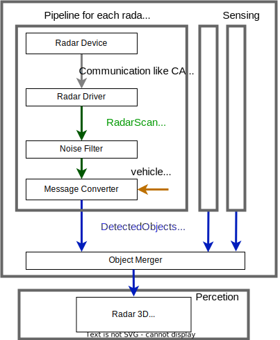

# Radar objects data pre-processing design

## Overview

### Pipeline

This diagram describes the pre-process pipeline for radar objects.



### Interface

- Input
  - Radar data from device
  - Twist information of ego vehicle motion
- Output
  - Merged radar objects information

### Note

- The radar pre-process package filter noise through the `ros-perception/radar_msgs/msg/RadarTrack.msg` message type with sensor coordinate.
- It is recommended to change the coordinate system from each sensor to base_link with message converter.
- If there are multiple radar objects, the object merger package concatenate these objects.

## Input

Autoware uses radar objects data type as [radar_msgs/msg/RadarTracks.msg](https://github.com/ros-perception/radar_msgs/blob/ros2/msg/RadarTracks.msg).
In detail, please see [Data message for radars](supported-functions/data-message.md).

## Supported functions
### Device driver for radars

Autoware support `ros-perception/radar_msgs/msg/RadarScan.msg` and `autoware_auto_perception_msgs/msg/TrackedObjects.msg` for Radar drivers.

In detail, please see [Device driver for radars](supported-functions/device-driver.md).

### Noise filter

- [radar_tracks_noise_filter](https://github.com/autowarefoundation/autoware.universe/tree/main/sensing/radar_tracks_noise_filter)

Radar can detect x-axis velocity as doppler velocity, but cannot detect y-axis velocity. Some radar can estimate y-axis velocity inside the device, but it sometimes lack precision. This package treats these objects as noise by y-axis threshold filter.

### Message converter

- [radar_tracks_msgs_converter](https://github.com/autowarefoundation/autoware.universe/tree/main/perception/radar_tracks_msgs_converter)

This package converts from `radar_msgs/msg/RadarTracks` into `autoware_auto_perception_msgs/msg/DetectedObject` with ego vehicle motion compensation and coordinate transform.

### Object merger

- [object_merger](https://github.com/autowarefoundation/autoware.universe/tree/main/perception/object_merger)

This package can merge 2 topics of `autoware_auto_perception_msgs/msg/DetectedObject`.

- [simple_object_merger](https://github.com/autowarefoundation/autoware.universe/tree/main/perception/simple_object_merger)

This package can merge simply multiple topics of `autoware_auto_perception_msgs/msg/DetectedObject`.
Different from [object_merger](https://github.com/autowarefoundation/autoware.universe/tree/main/perception/object_merger), this package doesn't use association algorithm and can merge with low calculation cost.

- [topic_tools](https://github.com/ros-tooling/topic_tools)

If a vehicle has 1 radar, the topic relay tool in `topic_tools` can be used.
Example is as below.

```xml
<launch>
  <group>
    <push-ros-namespace namespace="radar"/>
    <group>
      <push-ros-namespace namespace="front_center"/>
      <include file="$(find-pkg-share example_launch)/launch/ars408.launch.xml">
        <arg name="interface" value="can0" />
      </include>
    </group>
    <node pkg="topic_tools" exec="relay" name="radar_relay" output="log" args="front_center/detected_objects detected_objects"/>
  </group>
</launch>
```

## Appendix
### Discussion

Radar architecture design is discussed as below.

- [Discussion 2531](https://github.com/orgs/autowarefoundation/discussions/2531)
- [Discussion 2532](https://github.com/orgs/autowarefoundation/discussions/2532).
