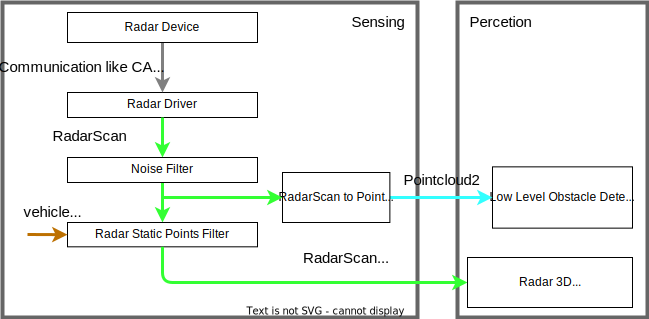

# Radar pointcloud data pre-processing design

## Overview

### Pipeline

This diagram describes the pre-process pipeline for radar pointcloud.

### Interface

- Input
  - Radar data from device
  - Twist information of ego vehicle motion
- Output
  - Dynamic radar pointcloud (`ros-perception/radar_msgs/msg/RadarScan.msg`)
  - Noise filtered radar pointcloud (`sensor_msgs/msg/Pointcloud2.msg`)

### Note

- In the sensing layer, the radar pre-process packages filter noise through the `ros-perception/radar_msgs/msg/RadarScan.msg` message type with sensor coordinate.
- For use of radar pointcloud data by LiDAR packages, we would like to propose a converter for creating `sensor_msgs/msg/Pointcloud2.msg` from `ros-perception/radar_msgs/msg/RadarScan.msg`.

## Supported functions

### Data message for radars

Autoware uses radar objects data type as [radar_msgs/msg/RadarScan.msg](https://github.com/ros-perception/radar_msgs/blob/ros2/msg/RadarScan.msg).
In detail, please see [Data message for radars](supported-functions/data-message.md).

### Device driver for radars

Autoware support `ros-perception/radar_msgs/msg/RadarScan.msg` and `autoware_auto_perception_msgs/msg/TrackedObjects.msg` for Radar drivers.

In detail, please see [Device driver for radars](supported-functions/device-driver.md).

### Basic noise filter

- [radar_threshold_filter](https://github.com/autowarefoundation/autoware.universe/tree/main/sensing/radar_threshold_filter)

This package removes pointcloud noise with low amplitude, edge angle, too near pointcloud by threshold.

### Filter to static/dynamic pointcloud

- [radar_static_pointcloud_filter](https://github.com/autowarefoundation/autoware.universe/tree/main/sensing/radar_static_pointcloud_filter)

This package extract static/dynamic radar pointcloud by using doppler velocity and ego motion.
The static radar pointcloud use for localization like NDT scan matching, and the dynamic radar pointcloud use for dynamic object detection.

### Message converter from RadarScan to Pointcloud2

- [radar_scan_to_pointcloud2](https://github.com/autowarefoundation/autoware.universe/tree/main/sensing/radar_scan_to_pointcloud2)

For convenient use of radar pointcloud within existing LiDAR packages, we suggest a `radar_scan_to_pointcloud2_convertor` package for conversion from `ros-perception/radar_msgs/msg/RadarScan.msg` to `sensor_msgs/msg/Pointcloud2.msg`.

|            |           LiDAR package           |                 Radar package                 |
| :--------: | :-------------------------------: | :-------------------------------------------: |
|  message   | `sensor_msgs/msg/Pointcloud2.msg` | `ros-perception/radar_msgs/msg/RadarScan.msg` |
| coordinate |             (x, y, z)             |                   (r, θ, φ)                   |
|   value    |             intensity             |          amplitude, doppler velocity          |

For considered use cases,

- Use [pointcloud_preprocessor](https://github.com/autowarefoundation/autoware.universe/tree/main/sensing/pointcloud_preprocessor) for radar scan.
- Apply obstacle segmentation like [ground segmentation](https://github.com/autowarefoundation/autoware.universe/tree/main/perception/ground_segmentation) to radar points for LiDAR-less (camera + radar) systems.

## Appendix

### Discussion

Radar architecture design is discussed as below.

- [Discussion 2531](https://github.com/orgs/autowarefoundation/discussions/2531)
- [Discussion 2532](https://github.com/orgs/autowarefoundation/discussions/2532).
