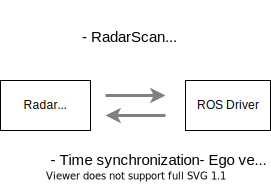
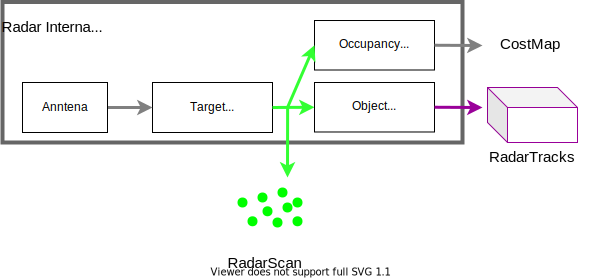

# Device driver for radars

## Interface for radar devices

The radar driver converts the communication data from radars to ROS2 topics.
The following communication types are considered:

- CAN
- CAN-FD
- Ethernet

## Software Interface

Autoware support `ros-perception/radar_msgs/msg/RadarScan.msg` and `autoware_auto_perception_msgs/msg/TrackedObjects.msg` for Radar drivers.

ROS driver receive the data from radar devices.

- Scan (pointcloud)
- Tracked objects
- Diagnostics results

The ROS drivers receives the following data from the radar device.

- Time synchronization
- Ego vehicle status, which often need for tracked objects calculation

## Radar driver example

- [ARS408 driver](https://github.com/tier4/ars408_driver)
