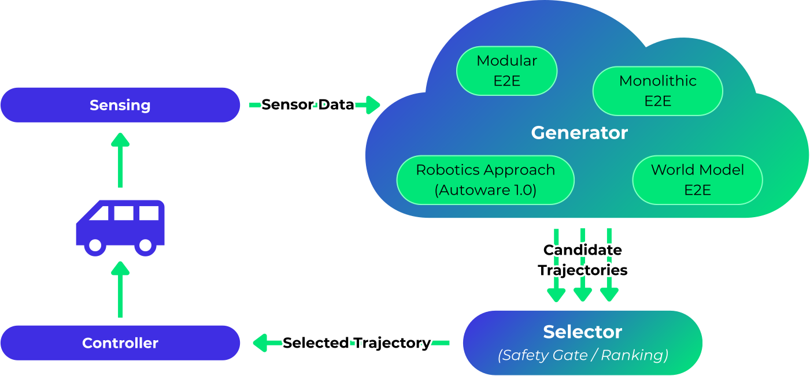

# Autoware concepts

The concept of Autoware revolves around providing an open and flexible platform to accelerate the development and deployment of autonomous driving systems. Below is an extended explanation of its key principles.

**See also:**

- [Open Source Philosophy](../../contributing/open-source-philosophy.md)
- [Autoware System Capabilities](../autoware-system-capabilities.md)

## Microautonomy Architecture: conceptual Overview

**Microautonomy architecture** is the way Autoware breaks down “autonomous driving” into many small, replaceable
capabilities rather than one monolithic stack.
Each capability (e.g., object detection, behavior planning, lane-level routing) is a module with clear inputs and
outputs, so systems can be composed like building blocks for different vehicles and use cases.

!!! question "What is _microautonomy architecture_?"

    In short, it’s a **component-based autonomy design** where driving behaviors are built by _composing many small autonomy modules_ instead of relying on a single, fixed pipeline.
    This makes it easy to mix, match, and upgrade parts without rewriting the whole system.

Autoware’s modules are connected through well-defined interfaces, which allows you to **swap or extend individual
components** while keeping the rest of the system intact. For example, you can replace the default object detection with
a custom neural network specialized in construction cones, and the downstream tracking, planning, and control modules
still work as before.

!!! example "Composability example"

    - Start with the default perception pipeline
    - Plug in a dedicated detector for special targets (e.g., cones, forklifts)
    - Keep the same planner and controller. They just see “objects”, regardless of how they were detected

At a high level, these interfaces come in two flavors:

- **Internal component interfaces** connect modules inside Autoware (e.g., perception → planning → control).
- **External AD APIs** expose Autoware’s capabilities to the outside world (e.g., fleet management, cloud services,
  infotainment).

!!! success "Why this matters for developers and partners"

    - You can **reuse** core Autoware modules and only customize what’s unique to your product.
    - You can **incrementally evolve** your stack (swap one module at a time).
    - Partners can **collaborate around shared, stable interfaces**, contributing components that plug into a common
      ecosystem.

## Generator - Selector architecture: conceptual overview

Traditional autonomous driving follows a fixed pipeline:

> **Sensing → Perception → Localization → Planning → Trajectory**

This works well for rule-based planners, but newer approaches like E2E or diffusion models don’t fit neatly into that structure.
They may skip or replace parts of the pipeline, making integration difficult.

To support both classical and modern approaches, we **abstracted away the front half of the pipeline**.

### Generators: Flexible trajectory producers

A **Generator** is any module that outputs trajectories. It could be one or more:

- rule-based or optimization planners using perception and maps
- E2E models using raw sensor input
- learned or sampling-based planners

Generators can reuse Autoware’s sensing, perception, localization, and control. Or bypass them.
Multiple generators can run in parallel.

### Selector: Safety + final choice

The **Selector** receives candidate trajectories and:

- **Safety-checks** them (e.g., rule compliance, drivable area)
- **Ranks and selects** the best one based on context or driving policies

!!! tip "This enables:"

    * Seamless integration of both robotics-based and E2E planners
    * Safe use of black-box models through explicit checks
    * Flexible experimentation with new planning methods
    * Robust decision-making by comparing multiple trajectory proposals

## Core & Universe repository model

Autoware’s software ecosystem is organized into two layers: **Autoware Core** and **Autoware Universe**.
Together, they balance **quality assurance** with **community-driven innovation**.

### Autoware Core: The quality-assured base

[**Autoware Core**](https://github.com/autowarefoundation/autoware_core) contains the foundational packages maintained by the Autoware Foundation (AWF).
These packages follow strict development standards—unit tests, integration tests, performance validation, and on-vehicle testing.
Core serves as the **stable, production-ready platform** that users can rely on for building autonomous driving systems.

!!! success "Core provides:"

    - A vetted, reliable foundation
    - Consistent APIs and behavior
    - Maintained, tested, and versioned releases

### Autoware Universe: The community innovation layer

[**Autoware Universe**](https://github.com/autowarefoundation/autoware_universe) is a broader collection of open-source packages contributed by individuals, companies, and research groups.
These packages are owned and maintained by their original authors, who set their own quality and development practices.

Contributions can take two forms:

- merged directly into the Universe repository hosted by AWF, or
- hosted externally and listed as part of the Universe ecosystem.

Universe acts as a **sandbox for experimentation**, allowing new ideas, algorithms, and hardware adaptations to be shared quickly.

!!! example "Universe enables:"

    - Rapid prototyping and experimentation
    - A place for sharing specialized modules
    - An entry point for contributions from the global community

Promising packages from Autoware Universe may be **adopted into Autoware Core** when they demonstrate sufficient maturity, stability, and usefulness.
This creates a natural pipeline from innovation → standardization → production.

!!! info

    Find more details in [🔗 Repository Structure](../versioning_and_repositories/repository-structure.md) documentation.
