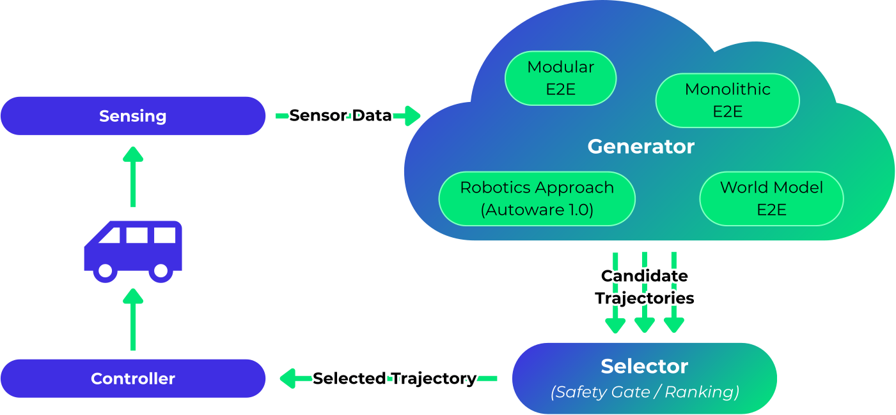

# Autoware concepts

The concept of Autoware revolves around providing an open and flexible platform to accelerate the development and deployment of autonomous driving systems. Below is an extended explanation of its key principles.

**See also:**

- [Open Source Philosophy](../../contributing/open-source-philosophy.md)
- [Autoware System Capabilities](../autoware-system-capabilities.md)

## 🧩 Microautonomy architecture: Conceptual overview

Autoware is designed with a **modular** and **flexible** architecture, enabling seamless adaptation to a wide range of requirements and use cases. Its well-defined interface design facilitates efficient inter-component communication, allowing for the smooth integration of new features and functionalities.

For instance, users can replace the default object detection module with a custom neural network tailored for specific tasks, such as identifying construction cones in a work zone. This ability to swap or enhance individual modules without disrupting the rest of the system underscores Autoware’s flexibility and robustness.

At the core of the microautonomy architecture is its interface design, which is categorized into internal and external interfaces. Internal [**Component Interfaces**](../autoware-interfaces/components/) connect components across different modules within Autoware, facilitating coordinated behavior. External interfaces called [**Autonomous Driving (AD) API**](../autoware-interfaces/ad-api/) expose Autoware’s capabilities to external applications, such as infotainment systems and cloud services.

This architecture is made possible through collaboration with AWF partners, who both contribute to and benefit from the clearly defined and standardized interfaces.

## 🔀 Generator - selector architecture: Conceptual overview

## 🌌 Core & Universe repository model

Autoware consists of packages managed by the Autoware Foundation as well as open-source contributions outside the foundation.

The packages maintained by the Autoware Foundation (AWF) are referred to as **Autoware Core**, and maintained under the AWF GitHub organization. These packages are developed and released according to quality standards set by AWF, which include unit tests, integration tests, and real-world testing. The users are expected to use the Core packages as the base platform for their autonomous driving systems.

In contrast, **Autoware Universe** is a collection of OSS packages that are independently developed and maintained by external individuals, companies, and research institutions. These packages are owned and managed by their original authors, who follow their own criteria for code quality and functionality. Authors have the option to either directly merge their contributions into the Autoware Universe repository hosted by the Autoware Foundation or register their own repositories as part of the Universe repository list. Autoware Universe packages may be ported to Autoware Core if their functionality and maturity are recognized by the Autoware Foundation.

With this two-tier package management, the Autoware Foundation ensures a quality-assured base platform by Autoware Core, while also fostering a collaborative ecosystem where third-party developers can easily share their contributions with the community under Autoware Universe.
