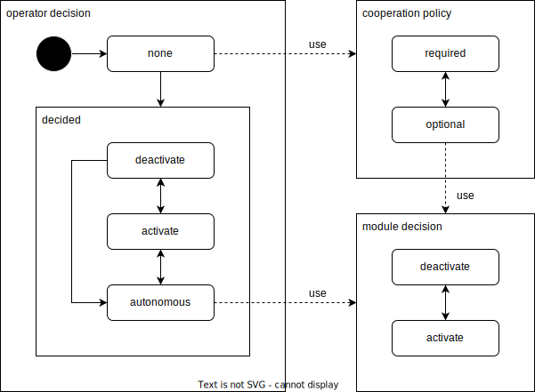

# Cooperation

## Related API

- {{ link_ad_api('/api/planning/velocity_factors') }}
- {{ link_ad_api('/api/planning/steering_factors') }}
- {{ link_ad_api('/api/planning/cooperation/set_commands') }}
- {{ link_ad_api('/api/planning/cooperation/set_policies') }}
- {{ link_ad_api('/api/planning/cooperation/get_policies') }}

## Description

Request to cooperate (RTC) is a feature that the operator supports the decision in autonomous driving mode.
The planning component manages each situation that requires decision as a scene.
Autoware usually drives the vehicle using its own decisions, but the operator may prefer to make their decisions in experiments and complex situations.

Each scene has an ID that doesn't change until the scene is completed or canceled.
The operator can override the decision of the target scene using this ID.
In practice, the user interface application can hides the specification of the ID and provides an abstracted interface to the operator.

For example, in the situation in the diagram below, change lanes twice and turn left at the intersection.
There are three scenes and each has a decision to change or keep the lane, turn left or wait.
Here Autoware decides not to change lanes a second time due to the obstacle, so the vehicle will stop there.

## Architecture

Modules that support RTC use the merged decisions shown in the following architecture instead of their own module decisions.
These modules provides [cooperation status](../types/autoware_adapi_v1_msgs/msg/CooperationStatus.md) in [velocity factors or steering factors](./planning-factors.md),
and can receive the operator decision and cooperation policy.
The cooperation policy is used when there is no operator decision and has a default value set by the system settings.

The merged decision is determined from the module decision, operator decision, and cooperation policy.

## Decisions

| Name               | Values                                 |
| ------------------ | -------------------------------------- |
| merged decision    | deactivate, activate                   |
| module decision    | deactivate, activate                   |
| operator decision  | deactivate, activate, autonomous, none |
| cooperation policy | required, optional                     |

The module decision is either deactivate or activate. The operator decision is also evaluated in one of these.
Its meaning depends on the module and is shown in the table below.
These decisions are designed to assign behavior to activate that is considered high risk.

| Factor Type     | Deactivate    | Activate        |
| --------------- | ------------- | --------------- |
| velocity (stop) | stop          | pass            |
| steering (path) | keep the path | change the path |

The operator decision is actually either deactivate, activate, autonomous, or none.
If the operator selects deactivate or activate, the module decision is ignored and the operator decision is used instead.
If the operator selects autonomous, the module decision is used.
The none is the initial value of the operator decision and means that the operator has not selected any decision.
If the operator decision is none, it is evaluated according to the cooperation policies set for each module type.

The cooperation policy is either required or optional, and is initialized by system settings.
The required policy evaluates none decision as deactivate to minimize risk.
Therefore, the operator decision is required to continue driving.
The optional policy evaluates none decision as autonomous to continue driving.
This allows the vehicle to drive without the operator decision.
The cooperation policies can also be changed by the operator.
Note that this setting is common per module, so changing it will affect all scenes in the same module.

## Examples

This is an example of cooperation for lane change module. The behaviors by the combination of decisions are as follows.

| Operator decision | Policy   | Module decision | Description                                                                                                    |
| ----------------- | -------- | --------------- | -------------------------------------------------------------------------------------------------------------- |
| deactivate        | -        | -               | The operator instructs to keep lane regardless the module decision. So it keeps lane by operator decision.     |
| activate          | -        | -               | The operator instructs to change lane regardless the module decision. So it changes lane by operator decision. |
| autonomous        | -        | deactivate      | The operator instructs to follow the module decision. So it keeps lane by module decision.                     |
| autonomous        | -        | activate        | The operator instructs to follow the module decision. So it changes lane by module decision.                   |
| none              | required | -               | The required policy is used because no operator instruction. So it keeps lane the same as deactivate.          |
| none              | optional | deactivate      | The optional policy is used because no operator instruction. So it keeps lane by module decision.              |
| none              | optional | activate        | The optional policy is used because no operator instruction. So it change lane by module decision.             |
