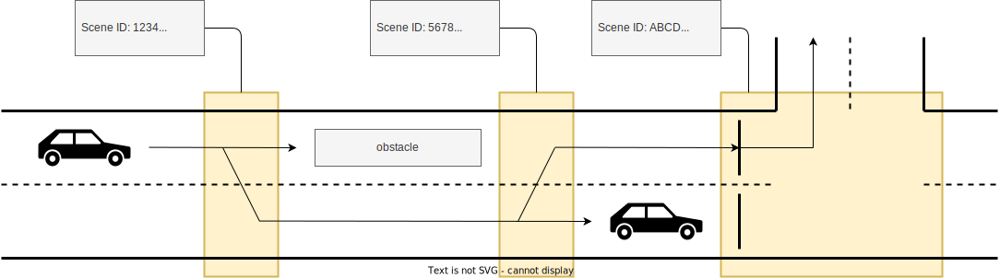
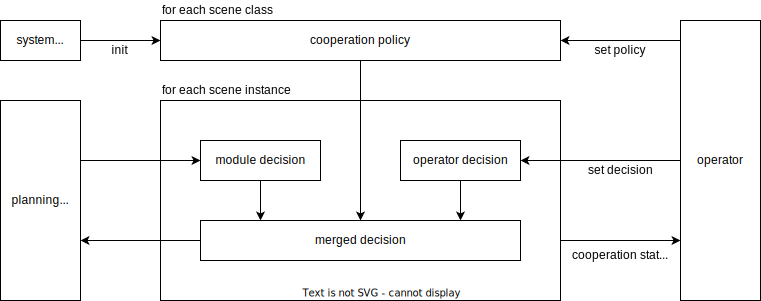

# Cooperation

## Related API

- {{ link_ad_api('/api/planning/velocity_factors') }}
- {{ link_ad_api('/api/planning/steering_factors') }}
- {{ link_ad_api('/api/planning/cooperation/set_commands') }}
- {{ link_ad_api('/api/planning/cooperation/set_policies') }}
- {{ link_ad_api('/api/planning/cooperation/get_policies') }}

## Description

Request to cooperate (RTC) is a feature that enables a human operator to support the decision in autonomous driving mode.
Autoware usually drives the vehicle using its own decisions, but the operator may prefer to make their decisions in experiments and complex situations.

The planning component manages each situation that requires decision as a scene.
Each scene has an ID that doesn't change until the scene is completed or canceled.
The operator can override the decision of the target scene using this ID.
In practice, the user interface application can hides the specification of the ID and provides an abstracted interface to the operator.

For example, in the situation in the diagram below, change lanes twice and turn left at the intersection.
There are three scenes and each has a decision to change or keep the lane, turn left or wait.
Here Autoware decides not to change lanes a second time due to the obstacle, so the vehicle will stop there.
Using RTC, the operator can override these decisions to continue driving the vehicle to the goal.

## Architecture

Modules that support RTC have the operator decision and cooperation policy in addition to the module decision as shown below.
These modules use the merged decision that is determined by these values when planning vehicle behavior.
See decisions section for details of these values.
The cooperation policy is used when there is no operator decision and has a default value set by the system settings.
If the module supports RTC, these information are available in [velocity factors or steering factors](./planning-factors.md) as [cooperation status](../types/autoware_adapi_v1_msgs/msg/CooperationStatus.md).

## Sequence

This is an example sequence that overrides the scene decision to force a lane change. It is for the second scene in the diagram in the architecture section.
Here let's assume the cooperation policy is set to optional, see the decisions section described later for details.

1. A planning module creates a scene instance with unique ID when approaching a place where a lane change is needed.
2. The scene instance generates the module decision from the current situation. In this case, the module decision is not to do a lane change due to the obstacle.
3. The scene instance generates the merged decision. At this point, there is no operator decision yet, so it is based on the module decision.
4. The scene instance plans the vehicle to keep the lane according to the merged decision.
5. The scene instance sends a cooperation status.
6. The operator receives the cooperation status.
7. The operator sends a cooperation command to override the module decision and to do a lane change.
8. The scene instance receives the cooperation command and update the operator decision.
9. The scene instance updates the module decision from the current situation.
10. The scene instance updates the merged decision. It is based on the operator decision received.
11. The scene instance plans the vehicle to change the lane according to the merged decision.

## Decisions

The merged decision is determined by the module decision, operator decision, and cooperation policy, each of which takes the value shown in the table below.

| Status             | Values                                 |
| ------------------ | -------------------------------------- |
| merged decision    | deactivate, activate                   |
| module decision    | deactivate, activate                   |
| operator decision  | deactivate, activate, autonomous, none |
| cooperation policy | required, optional                     |

The meanings of these values are as follows. Note that the cooperation policy is common per module, so changing it will affect all scenes in the same module.

| Value      | Description                                                                                |
| ---------- | ------------------------------------------------------------------------------------------ |
| deactivate | An operator/module decision to plan vehicle behavior with priority on safety.              |
| activate   | An operator/module decision to plan vehicle behavior with priority on driving.             |
| autonomous | An operator decision that follows the module decision.                                     |
| none       | An initial value for operator decision, indicating that there is no operator decision yet. |
| required   | A policy that requires the operator decision to continue driving.                          |
| optional   | A policy that does not require the operator decision to continue driving.                  |

The following flow is how the merged decision is determined.

## Examples

This is an example of cooperation for lane change module. The behaviors by the combination of decisions are as follows.

| Operator decision | Policy   | Module decision | Description                                                                                                                     |
| ----------------- | -------- | --------------- | ------------------------------------------------------------------------------------------------------------------------------- |
| deactivate        | -        | -               | The operator instructs to keep lane regardless the module decision. So the vehicle keeps the lane by the operator decision.     |
| activate          | -        | -               | The operator instructs to change lane regardless the module decision. So the vehicle changes the lane by the operator decision. |
| autonomous        | -        | deactivate      | The operator instructs to follow the module decision. So the vehicle keeps the lane by the module decision.                     |
| autonomous        | -        | activate        | The operator instructs to follow the module decision. So the vehicle changes the lane by the module decision.                   |
| none              | required | -               | The required policy is used because no operator instruction. So the vehicle keeps the lane by the cooperation policy.           |
| none              | optional | deactivate      | The optional policy is used because no operator instruction. So the vehicle keeps the lane by the module decision.              |
| none              | optional | activate        | The optional policy is used because no operator instruction. So the vehicle change the lane by the module decision.             |
