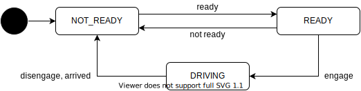

# Driving feature

## Description

This feature manages whether the vehicle is driving or can start driving.
The user can use this function to check if the vehicle can start driving and instruct it to depart.

## States

The state transition for driving state is illustrated in the diagram below.
The vehicle holds a stop when the state is not DRIVING.
During normal operation, the flow of driving state transitions is as follows:

1. Driving state is initialized as NOT_READY
2. State transitions to READY when Autoware components are launched successfully and is ready to start driving.
3. The state becomes DRIVING if the engage API is called and the vehicle starts driving.
4. When the vehicle reaches its destination, the state transitions returns to NOT_READY.
5. The state can be manually returned to NOT_READY whenever disengage API is called

| State     | Description                                     |
| --------- | ----------------------------------------------- |
| NOT_READY | The vehicle is not ready to start driving.      |
| READY     | The vehicle is ready to start driving           |
| DRIVING   | The vehicle is driving towards the destination. |

## Related API

- /api/driving/state
- /api/driving/engage
