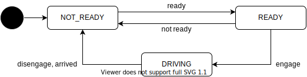

# Driving API

## Description

The driving feature manages whether the vehicle is driving or can start driving.
The vehicle holds a stop when the state is not DRIVING.
This state is mainly used to show the users whether the vehicle can start driving and to implement an HMI for departure.

## Driving State

The state transition for driving state is illustrated in the diagram below.
In a normal operation, this state will transition as follows:

1. Driving state is initialized as NOT_READY
2. State transitions to READY when Autoware components are launched successfully and is ready to start driving.
3. The state becomes DRIVING if the engage API is called and the vehicle starts driving.
4. When the vehicle reaches to the destination, the state returns to NOT_READY.
5. The state can be manually returned to NOT_READY whenever disengage API is called

| State     | Description                                       |
| --------- | ------------------------------------------------- |
| NOT_READY | The vehicle cannot start driving for some reason. |
| READY     | The vehicle is ready to start driving             |
| DRIVING   | The vehicle is driving toward the destination.    |

## Related API

- /api/driving/state
- /api/driving/engage
