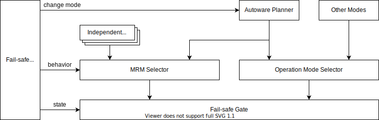
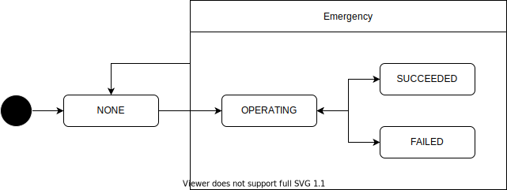

# Fail-safe

## Related API

- {{ link_ad_api('/api/fail_safe/rti_state') }}
- {{ link_ad_api('/api/fail_safe/mrm_state') }}
- {{ link_ad_api('/api/fail_safe/mrm_description') }}
- {{ link_ad_api('/api/fail_safe/mrm_request/send') }}
- {{ link_ad_api('/api/fail_safe/mrm_request/list') }}

## Description

This API manages the behavior related to the abnormality of the vehicle.
It provides the state of Request to Intervene (RTI), Minimal Risk Maneuver (MRM) and Minimal Risk Condition (MRC).
As shown below, Autoware has the gate to switch between the command during normal operation and the command during abnormal operation.
For safety, Autoware switches the operation to MRM when an abnormality is detected.
Since the required behavior differs depending on the situation, MRM is implemented in various places as a specific mode in a normal module or as an independent module.
The fail-safe module selects the behavior of MRM according to the abnormality and switches the gate output to that command.

## RTI state

The RTI state indicates whether RTI is requested. If for some reason autonomous driving cannot continue, Autoware will request a change to manual driving. As a side note, RTI is sometimes called Take Over Request (TOR).

## MRM state

The MRM state indicates whether MRM is operating and its current behavior.
This state also provides success or failure of the operation. Generally, MRM will switch to another behavior if it fails.

| State     | Description                                                |
| --------- | ---------------------------------------------------------- |
| NONE      | MRM is not operating.                                      |
| OPERATING | MRM is operating because an abnormality has been detected. |
| SUCCEEDED | MRM succeeded. The vehicle is in a safe condition.         |
| FAILED    | MRM failed. The vehicle is still in an unsafe condition.   |

**[v1.9.0] Deprecated: Use the MRM behavior ID instead of following constants.**
There is a dependency between MRM behaviors. For example, it switches from a comfortable stop to a emergency stop, but not the other way around.
This is service dependent. Autoware supports the following transitions by default.

| State            | Description                                                               |
| ---------------- | ------------------------------------------------------------------------- |
| NONE             | MRM is not operating or is operating but no special behavior is required. |
| COMFORTABLE_STOP | The vehicle will stop quickly with a comfortable deceleration.            |
| EMERGENCY_STOP   | The vehicle will stop immediately with as much deceleration as possible.  |
| PULL_OVER        | The vehicle will stop after moving to the side of the road.               |

## MRM description

Autoware supports various MRM implementation to provide appropriate behavior for each use case.
Therefore, use this API when detailed information about MRM behavior is required. The MRM behavior ID listed by this API is used in MRM state API.

## MRM request

MRM request is a feature that triggers MRM from an application, and is mainly used when the application wants to transition the vehicle to a safe state by detecting an abnormality. When an MRM request is sent, Autoware attempts to operate the MRM. To distinguish requests from multiple applications, an MRM request must include a user name as an identifier.

Since MRM has multiple behaviors, this feature provides a selection strategy. Please refer to the table below for supported strategies.
If there are multiple requests, the strategy with the highest priority will be used.
Note that when Autoware detects an abnormality, it may not be able to operate according to the MRM request strategy.

| Strategy | Description                                                |
| -------- | ---------------------------------------------------------- |
| CANCEL   | Cancel the MRM request associated with the specified user. |
| DELEGATE | Delegate the selection of MRM behavior to Autoware.        |
