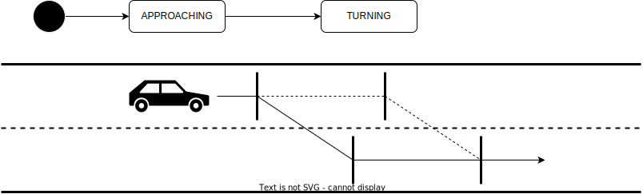

# Planning factors

## Related API

- {{ link_ad_api('/api/planning/velocity_factors') }}
- {{ link_ad_api('/api/planning/steering_factors') }}

## Description

This API manages the planned behavior of the vehicle.
Applications can notify the vehicle behavior to the people around and visualize it for operator and passengers.

## Velocity factors

The velocity factors is an array of information on the behavior that the vehicle stops or slows down.
Each factor has a behavior type which is described below.
Some behavior types have sequence and details as additional information.

| Behavior                    | Description                                                                         |
| --------------------------- | ----------------------------------------------------------------------------------- |
| surrounding-obstacle        | There are obstacles immediately around the vehicle.                                 |
| route-obstacle              | There are obstacles along the route ahead.                                          |
| intersection                | There are obstacles in other lanes in the path.                                     |
| crosswalk                   | There are obstacles on the crosswalk.                                               |
| rear-check                  | There are obstacles behind that would be in a human driver's blind spot.            |
| user-defined-attention-area | There are obstacles in the predefined attention area.                               |
| no-stopping-area            | There is not enough space beyond the no stopping area.                              |
| stop-sign                   | A stop by a stop sign.                                                              |
| traffic-signal              | A stop by a traffic signal.                                                         |
| v2x-gate-area               | A stop by a gate area. It has enter and leave as sequences and v2x type as details. |
| merge                       | A stop before merging lanes.                                                        |
| sidewalk                    | A stop before crossing the sidewalk.                                                |
| lane-change                 | A lane change.                                                                      |
| avoidance                   | A path change to avoid an obstacle in the current lane.                             |
| emergency-operation         | A stop by emergency instruction from the operator.                                  |

Each factor also provides status, poses in the base link frame, and distance from that pose.
As the vehicle approaches the stop position, this factor appears with a status of APPROACHING.
And when the vehicle reaches that position and stops, the status will be STOPPED.
The pose indicates the stop position, or the base link if the stop position cannot be calculated.

## Steering factors

The steering factors is an array of information on the maneuver that requires use of turn indicators, such as turning left or right.
Each factor has a behavior type which is described below and steering direction.
Some behavior types have sequence and details as additional information.

| Behavior            | Description                                                                 |
| ------------------- | --------------------------------------------------------------------------- |
| intersection        | A turning left or right at an intersection.                                 |
| lane-change         | A lane change.                                                              |
| avoidance           | A path change to avoid an obstacle. It has a sequence of change and return. |
| start-planner       | T.B.D.                                                                      |
| goal-planner        | T.B.D.                                                                      |
| emergency-operation | A path change by emergency instruction from the operator.                   |

Each factor also provides status, poses in the base link frame, and distances from that poses.
As the vehicle approaches the position to start steering, this factor appears with a status of APPROACHING.
And when the vehicle reaches that position, the status will be TURNING.
The poses indicate the start and end position of the section where the status is TURNING.

In cases such as lane change and avoidance, the vehicle will start steering at any position in the range depending on the situation.
For these types, the section where the status is TURNING will be updated dynamically and the poses will follow that.

