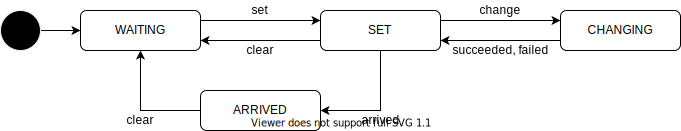

# Routing

## Related API

- {{ link_ad_api('/api/routing/state') }}
- {{ link_ad_api('/api/routing/route') }}
- {{ link_ad_api('/api/routing/clear_route') }}
- {{ link_ad_api('/api/routing/set_route_points') }}
- {{ link_ad_api('/api/routing/set_route') }}
- {{ link_ad_api('/api/routing/change_route_points') }}
- {{ link_ad_api('/api/routing/change_route') }}

## Description

This API manages destination and waypoints. Note that waypoints are not like stops and just points passing through.
In other words, Autoware does not support the route with multiple stops, the application needs to split it up and switch them.
There are two ways to set the route. The one is a generic method that uses pose, another is a map-dependent.

## States

| State    | Description                                        |
| -------- | -------------------------------------------------- |
| UNSET    | The route is not set. Waiting for a route request. |
| SET      | The route is set.                                  |
| ARRIVED  | The vehicle has arrived at the destination.        |
| CHANGING | Trying to change the route.                        |

## Options

The route set and change APIs have route options that allow applications to choose several behaviors regarding route planning.
See the sections below for supported options and details.

### allow_goal_modification

**[v1.1.0]** Autoware tries to look for an alternate goal when goal is unreachable (e.g., when there is an obstacle on the given goal). When setting a route from the API, applications can choose whether they allow Autoware to adjust goal pose in such situation. When set false, Autoware may get stuck until the given goal becomes reachable.

### allow_while_using_route

**[v1.6.0]** This option only affects the route change APIs. Autoware accepts new route even while the vehicle is using the current route. The APIs fail if it cannot safely transition to new route. When set false, the APIs always fail when the vehicle is using the route.
