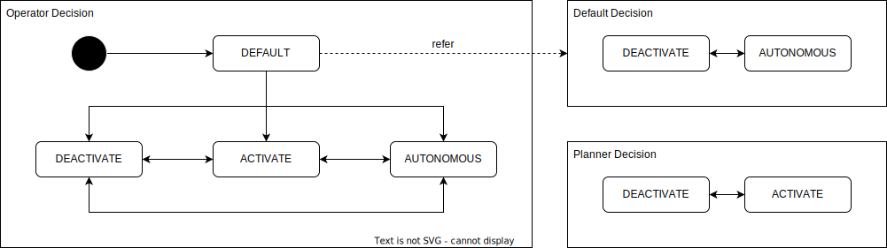

# Cooperation API

- {{ link_ad_api('/api/planning/cooperation/set_decisions') }}
- {{ link_ad_api('/api/planning/cooperation/set_defaults') }}
- {{ link_ad_api('/api/planning/cooperation/get_defaults') }}

## Description

This API manages cooperation between an operator and Autoware.

The cooperation module receives a decision from the planning module and returns behavior to be performed.
This behavior is determined from the operator and Autoware decisions.
The operator receives the current status and makes decisions based on that.
Also, the operator can choose the default behavior when undecided.

## Decision states

There are three decision state.

## Decision events

The final decision event is used for the behavior state transitions and is determined from the operator and Autoware state as follows.

|            | DEFAULT DEACTIVATE | DEACTIVATE | ACTIVATE | AUTONOMOUS | DEFAULT AUTONOMOUS |
| :--------: | :-------------------: | :--------: | :------: | :--------: | :-------------------: |
| DEACTIVATE |      deactivate       | deactivate | activate | deactivate |      deactivate       |
|  ACTIVATE  |      deactivate       | deactivate | activate |  activate  |       activate        |
