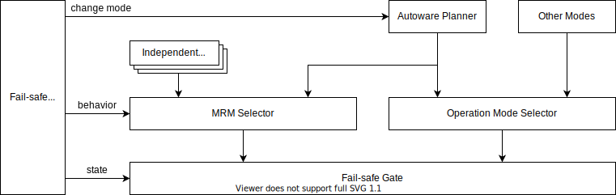
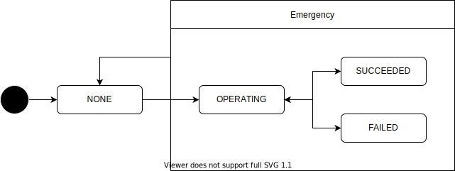

# Fail-safe API

- {{ link_ad_api('/api/fail_safe/mrm_state') }}

## Description

This API manages the behavior related to the abnormality of the vehicle.
It provides the state of Request to Intervene (RTI), Minimal Risk Maneuver (MRM) and Minimal Risk Condition (MRC).
As shown below, Autoware has the gate to switch between the command during normal operation and the command during abnormal operation.
For safety, Autoware switches the operation to MRM when an abnormality is detected.
Since the required behavior differs depending on the situation, MRM is implemented in various places as a specific mode in a normal module or as an independent module.
The fail-safe module selects the behavior of MRM according to the abnormality and switches the gate output to that command.

## States

The MRM state indicates whether MRM is operating. This state also provides success or failure.
Generally, MRM will switch to another behavior if it fails.

| State     | Description                                                |
| --------- | ---------------------------------------------------------- |
| NONE      | MRM is not operating.                                      |
| OPERATING | MRM is operating because an abnormality has been detected. |
| SUCCEEDED | MRM succeeded. The vehicle is in a safe condition.         |
| FAILED    | MRM failed. The vehicle is still in an unsafe condition.   |

## Behavior

There is a dependency between MRM behaviors. For example, it switches from a comfortable stop to a emergency stop, but not the other way around.
This is service dependent. Autoware supports the following transitions by default.

| State            | Description                                                               |
| ---------------- | ------------------------------------------------------------------------- |
| NONE             | MRM is not operating or is operating but no special behavior is required. |
| COMFORTABLE_STOP | The vehicle will stop quickly with a comfortable deceleration.            |
| EMERGENCY_STOP   | The vehicle will stop immediately with as much deceleration as possible.  |
