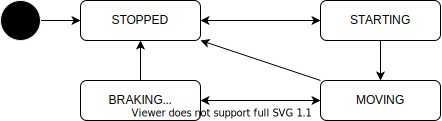

# Motion API

- {{ link_ad_api('/api/motion/state') }}
- {{ link_ad_api('/api/motion/accept_start') }}

## Description

This API manages the current behavior of the vehicle.
Applications can notify the vehicle behavior to the people around and visualize it for operator and passengers.

## States

The motion state manages the stop and start of the vehicle.
Once the vehicle has stopped, the state will be STOPPED.
After this, when the vehicle tries to start (is still stopped), the state will be STARTING.
In this state, calling the start API changes the state to MOVING and the vehicle starts.
This mechanism can add processing such as announcements before the vehicle starts.
Depending on the configuration, the state may transition directly from STOPPED to MOVING.

| State            | Description                                     |
| ---------------- | ----------------------------------------------- |
| STOPPED          | The vehicle is stopped.                         |
| STARTING         | The vehicle is stopped, but is trying to start. |
| MOVING           | The vehicle is moving.                          |
| BRAKING (T.B.D.) | The vehicle is decelerating strongly.           |
