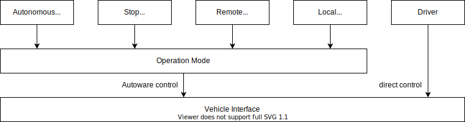
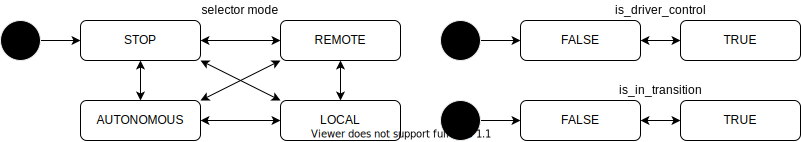

# Operation Mode

- {{ link_ad_api('/api/operation/mode/notice') }}
- {{ link_ad_api('/api/operation/mode/change') }}

## Description

As shown below, Autoware has five operation modes, driver, local, remote, stop and autonomous.
Driver mode is supported on some vehicles that have an interface to operate directly, such as steering and pedals, etc.
The other modes are controlled by software. Typically, local mode is a joystick and remote mode is web application.
Stop mode is used to stop the vehicle when changing modes. Autonomous mode is for driving with Autoware.

## Mode

The selector mode indicates the command source during software control.
The flag `is_driver_control` indicates whether direct control by the driver is enabled.

Since Autoware may not be able to guarantee safety, such as switching to autonomous mode during overspeed.
There is the flag `is_in_transition` for this situation and it will be true when changing modes.
The operator who changed the mode should ensure safety while this flag is true. The flag will be false when the mode change is complete.

### Selector

| Name       | Description                                                |
| ---------- | ---------------------------------------------------------- |
| STOP       | The stop command is selected to stop the vehicle.          |
| AUTONOMOUS | The autonomous command is selected for autonomous driving. |
| LOCAL      | The local command is selected.                             |
| REMOTE     | The remote command is selected.                            |

### Variables

| Name              | Type | Description                                      |
| ----------------- | ---- | ------------------------------------------------ |
| is_driver_control | bool | True if direct control by the driver is enabled. |
| is_in_transition  | bool | True if the operation mode is in transition.     |
