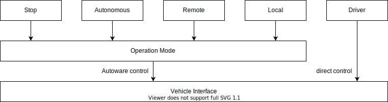

# Operation Mode

- {{ link_ad_api('/api/operation_mode/state') }}
- {{ link_ad_api('/api/operation_mode/change_to_autonomous') }}
- {{ link_ad_api('/api/operation_mode/change_to_stop') }}
- {{ link_ad_api('/api/operation_mode/change_to_local') }}
- {{ link_ad_api('/api/operation_mode/change_to_remote') }}
- {{ link_ad_api('/api/operation_mode/enable_autoware_control') }}
- {{ link_ad_api('/api/operation_mode/disable_autoware_control') }}

## Description

As shown below, Autoware assumes that the vehicle interface has two modes, Autoware control and direct control.
In direct control mode, the vehicle is operated using devices such as steering and pedals.
If the vehicle does not support direct control mode, it is always treated as Autoware control mode.
Autoware control mode has four operation modes.

| Mode       | Description                                                                   |
| ---------- | ----------------------------------------------------------------------------- |
| Stop       | Keep the vehicle stopped.                                                     |
| Autonomous | Autonomously control the vehicle.                                             |
| Local      | Manually control the vehicle from nearby with some device such as a joystick. |
| Remote     | Manually control the vehicle from a web application on the cloud.             |

## States

### Autoware control flag

The flag `is_in_autoware_control` indicates if the vehicle is controlled by Autoware.
The engage and disengage APIs can be used if the mode can be switched by software.
These APIs will always fail if the vehicle does not support mode switching or is switched by hardware.

### Operation mode and change flags

The state `operation_mode` indicates what command is used when Autoware control is enabled.
The flags `change_to_*` can be used to check if it is possible to transition to each mode.

### Transition flag

Since Autoware may not be able to guarantee safety, such as switching to autonomous mode during overspeed.
There is the flag `is_in_transition` for this situation and it will be true when changing modes.
The operator who changed the mode should ensure safety while this flag is true. The flag will be false when the mode change is complete.
