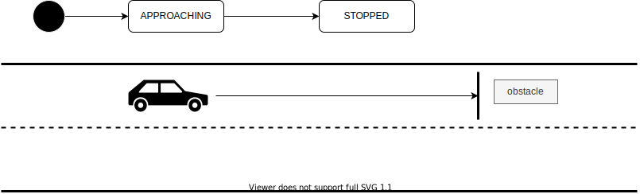
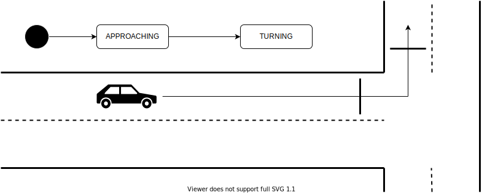
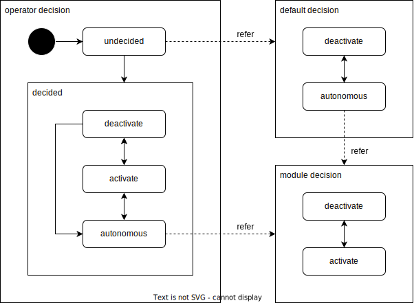

# Planning API

- {{ link_ad_api('/api/planning/velocity_factors') }}
- {{ link_ad_api('/api/planning/steering_factors') }}
- {{ link_ad_api('/api/planning/cooperation/set_decisions') }}
- {{ link_ad_api('/api/planning/cooperation/set_defaults') }}
- {{ link_ad_api('/api/planning/cooperation/get_defaults') }}

## Description

This API manages the planned behavior of the vehicle.
Applications can notify the vehicle behavior to the people around and visualize it for operator and passengers.
Also provides status and commands for modules that cooperation with operators.

## Velocity factors

The velocity factors is an array of information on the behavior that the vehicle stops or slows down.
Each factor has a module name, pose in the base link, distance, status, and detailed data depending on its type.
As the vehicle approaches the stop position, this factor appears with a status of APPROACHING.
And when the vehicle reaches that position and stops, the status will be STOPPED.
The pose indicates the stop position or the base link if the stop position cannot be calculated.

## Steering factors

The steering factors is an array of information on the maneuver that requires use of turn indicators, such as turning left or right.
Each factor has a module name, poses in the base link, distances, status, and detailed data depending on its type.
As the vehicle approaches the position to start steering, this factor appears with a status of APPROACHING.
And when the vehicle reaches that position, the status will be TURNING.
The pose indicates the start position when APPROACHING and the end position when TURNING.

In cases such as lane change and avoidance, the vehicle will start steering at any position in the range depending on the situation.
As the vehicle approaches the start position of the range, this factor appears with a status of APPROACHING.
And when the vehicle reaches that position, the status will be TRYING.
Then, when it is possible, the vehicle will start steering and the status will be TURNING.
The pose indicates the start of the range (A) when APPROACHING and the end of the range (B) when TRYING.
The position to end steering (C to D) for TURNING depends on the position to start steering.

## Cooperation

Some planning modules can receive the operator's decision and reflect it in their behavior.
These modules have their own decisions, but use the the merged decision of theirs and operator's.
The operator can check the module's decision and override the decision if necessary.

The modules that support cooperation have their own decisions that is either deactivate or activate.
Its meaning depends on the module and is shown in the table below.
The merged decision will also be either of these, and the module will decide the behavior using it.

| Module Group | Module Type | Deactivate    | Activate        |
| ------------ | ----------- | ------------- | --------------- |
| velocity     | slow down   | slow down     | pass            |
| velocity     | stop        | stop          | pass            |
| steering     | path change | keep the path | change the path |

The operator's decision is either deactivate, activate, autonomous, or undecided.
If the operator selects deactivate or activate, the module's decision is ignored and the operator's is used instead.
If the operator selects autonomous, the module's decision is used.
The undecided is the initial state of the operator's decision and is replaced with the system default when merging.
The operator can also override the default decision to use when undecided.

