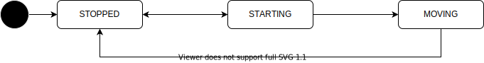
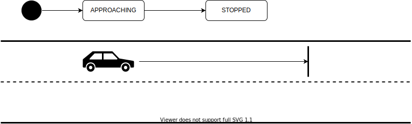
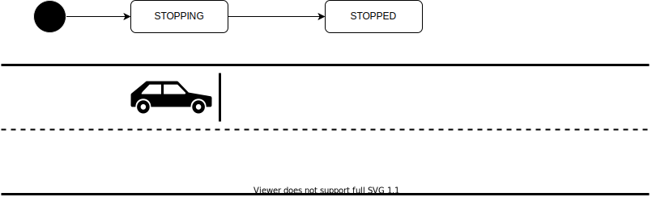
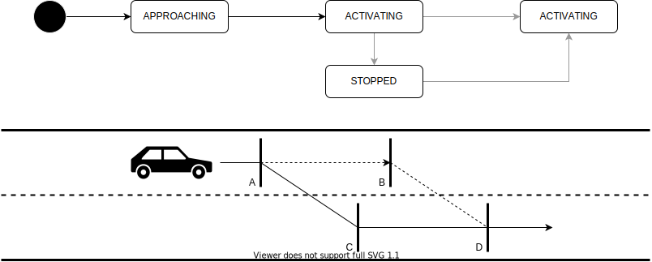

# Planning API

- {{ link_ad_api('/api/planning/allow_start') }}
- {{ link_ad_api('/api/planning/state') }}
- {{ link_ad_api('/api/planning/factors') }}

## Description

This API manages the behavior that the vehicle plans.
Applications can notify the vehicle behavior to the people around and visualize it for operator and passengers.

## States

The planning state manages the stop and start of the vehicle.
Once the vehicle has stopped, the state will be STOPPED.
After this, when the vehicle tries to start (is still stopped), the state will be STARTING.
In this state, calling the start API changes the state to MOVING and the vehicle starts.
This mechanism can add processing such as announcements before the vehicle starts.
Depending on the configuration, the state may transition directly from STOPPED to MOVING.

| State    | Description                                     |
| -------- | ----------------------------------------------- |
| STOPPED  | The vehicle is stopped.                         |
| STARTING | The vehicle is stopped, but is trying to start. |
| MOVING   | The vehicle is moving.                          |

## Factors

The planning factors is an array of information on the behavior that the vehicle plans.
Each factor has a type (shown below), pose, distance from the vehicle head to that pose, status, and detailed data depending on its type.
See the description of each behavior below for pose and status. And see the description of factor types for detailed data.

| Factor Type                 | Behavior         | Description                                                              |
| --------------------------- | ---------------- | ------------------------------------------------------------------------ |
| SURROUNDING_OBSTACLE        | immediate stop   | There are obstacles immediately around the vehicle.                      |
| ROUTE_OBSTACLE              | planned stop     | There are obstacles along the route ahead.                               |
| INTERSECTION                | planned stop     | There are obstacles in other lanes in the path.                          |
| CROSSWALK                   | planned stop     | There are obstacles on the crosswalk.                                    |
| REAR_CHECK                  | planned stop     | There are obstacles behind that would be in a human driver's blind spot. |
| USER_DEFINED_DETECTION_AREA | planned stop     | There are obstacles in the predefined detection area.                    |
| NO_STOPPING_AREA            | planned stop     | There is not enough space beyond the no stopping area.                   |
| STOP_SIGN                   | planned stop     | A stop by a stop sign.                                                   |
| TRAFFIC_SIGNAL              | planned stop     | A stop by a traffic signal.                                              |
| V2I_GATE_CONTROL            | planned stop     | A stop by a V2I gate.                                                    |
| FROM_PRIVATE_ROAD           | planned stop     | A stop before merging from private area.                                 |
| SIDEWALK                    | planned stop     | A stop before crossing the sidewalk.                                     |
| LANE_CHANGE                 | lane change      | A lane change.                                                           |
| AVOIDANCE1                  | lane change      | A lane change to avoid an obstacle in the current lane.                  |
| AVOIDANCE2                  | lane change      | A lane change to return to the original lane after avoiding an obstacle. |
| DIRECTION_CHANGE            | direction change | A direction change such as turning left or right.                        |
| EMERGENCY_STOP_OPERATION    | T.B.D.           | A stop by emergency instruction from the operator.                       |

### Planned stop

The planned stop is a ordinary and predictable stop at the target position.
As the vehicle approaches the stop position, this factor appears with a status of APPROACHING.
And when the vehicle reaches that position and stops, the status will be STOPPED.
The pose always indicates the stop position.

### Immediate stop

The immediate stop does not have a specified stop position.
Usually the vehicle stop as soon as possible under the permitted conditions.
This factor will appear with a status of STOPPING when a stop is needed.
And when the vehicle stops, the status will be STOPPED.
The pose indicates the vehicle head or the predicted stop position if possible.

### Direction change

The direction change is a maneuver that requires use of turn indicators, such as when turning left or right.
As the vehicle approaches the position to start steering, this factor appears with a status of APPROACHING.
And when the vehicle reaches that position, the status will be ACTIVATED.
The pose indicates the start position when APPROACHING and the end position when ACTIVATED.

### Lane change

The lane change is basically the same as the direction change.
But the vehicle will start steering at any position in the range depending on the situation.
As the vehicle approaches the start position of the range, this factor appears with a status of APPROACHING.
And when the vehicle reaches that position, the status will be ACTIVATING.
Then, when it is possible to change lanes, the vehicle will start steering and the status will be ACTIVATED.
If the vehicle reaches the end position of the range, it will stop and the status will be STOPPED.
The pose indicates the start of the range (A) when APPROACHING and the end of the range (B) when ACTIVATING or STOPPED.
The position to end steering (C and D) for ACTIVATED depends on the position to start steering.

