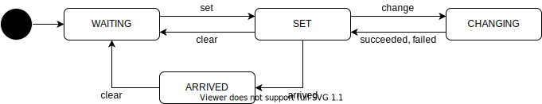

# Route API

- {{ link_ad_api('/api/routing/state') }}
- {{ link_ad_api('/api/routing/route') }}
- {{ link_ad_api('/api/routing/set_route_points') }}
- {{ link_ad_api('/api/routing/set_route') }}
- {{ link_ad_api('/api/routing/clear_route') }}

## Description

This API manages destination and waypoints. Note that waypoints are not like stops and just points passing through.
In other words, Autoware does not support the route with multiple stops, the application needs to split it up and switch them.
There are two ways to set the route. The one is a generic method that uses pose, another is a map-dependent.

## States

| State    | Description                                        |
| -------- | -------------------------------------------------- |
| UNSET    | The route is not set. Waiting for a route request. |
| SET      | The route is set.                                  |
| ARRIVED  | The vehicle has arrived at the destination.        |
| CHANGING | Trying to change the route. Not implemented yet.   |

## Goal modification

Autoware tries to look for an alternate goal when goal is unreachable (e.g., when there is an obstacle on the given goal). When setting a route from the API, applications can choose whether they allow Autoware to adjust goal pose in such situation. When set false, Autoware may get stuck until the given goal becomes reachable.

| Option                  | Description                       |
| ----------------------- | --------------------------------- |
| allow_goal_modification | If true, allow goal modification. |
